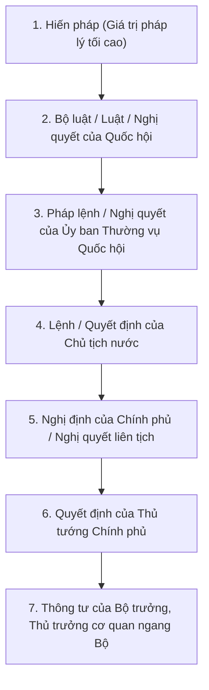
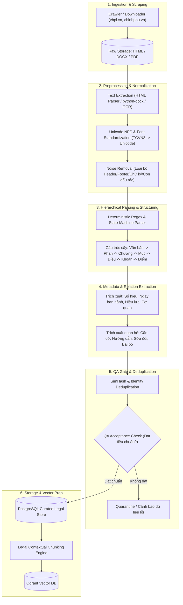

# VietLegal AI — Kiến trúc & Quy trình Legal Data Pipeline
## (Vietnamese Legal Data Engineering & Quality Assurance Specification)

Tài liệu này đặc tả toàn bộ quy trình thu thập, tiền xử lý, bóc tách cấu trúc, chuẩn hóa siêu dữ liệu (metadata), quản lý phiên bản/hiệu lực và kiểm định chất lượng dữ liệu pháp luật Việt Nam phục vụ hệ thống **VietLegal AI (Advanced RAG)**.

---

## 1. Nguồn dữ liệu Pháp luật Việt Nam & Chiến lược Lựa chọn

Trong lĩnh vực pháp lý, tính **chính danh (legitimacy)** và **tính xác thực (authenticity)** của văn bản là yếu tố sống còn. Dưới đây là phân tích các nguồn dữ liệu tại Việt Nam:

| Nguồn dữ liệu | Đơn vị chủ quản | Ưu điểm | Nhược điểm / Rủi ro | Đánh giá & Khuyến nghị |
| :--- | :--- | :--- | :--- | :--- |
| **Cơ sở dữ liệu Quốc gia về VBQPPL** (`vbpl.vn`) | Bộ Tư pháp | • Cực kỳ chính thống.<br>• Có sơ đồ văn bản (sửa đổi, bổ sung, hết hiệu lực).<br>• Dữ liệu định dạng HTML có cấu trúc chuẩn. | • Server thi thoảng phản hồi chậm hoặc timeout.<br>• Một số văn bản cũ chỉ có file scan PDF chất lượng kém. | **Nguồn chính (Primary Source)** cho văn bản cấp Trung ương và sơ đồ hiệu lực. |
| **Cổng Thông tin điện tử Chính phủ** (`vanban.chinhphu.vn`) | Văn phòng Chính phủ | • Nguồn chuẩn xác tuyệt đối các Nghị định, Quyết định của Chính phủ, Thủ tướng.<br>• Tốc độ tải ổn định, có file Word (.doc/.docx). | • Không chuyên sâu về tra cứu sơ đồ liên kết văn bản như Bộ Tư pháp. | **Nguồn bổ trợ (Secondary Source)** để tải bản gốc dạng DOCX. |
| **Công báo điện tử** (`congbao.chinhphu.vn`) | Văn phòng Chính phủ | • Bản công báo là căn cứ pháp lý chính thức cao nhất để đối chiếu. | • Đa số lưu trữ dạng PDF scan từng trang. | Dùng để đối chiếu chéo (Ground Truth Verification) khi có sai lệch. |
| **Thư Viện Pháp Luật / LuatVietnam** | Doanh nghiệp tư nhân | • Cực kỳ đầy đủ, cập nhật nhanh, sơ đồ hiệu lực trực quan. | • Có bản quyền thương mại (Terms of Service khắt khe), chặn cào dữ liệu (WAF/Cloudflare). | **Không khuyến khích cào trực tiếp số lượng lớn** để tránh vi phạm bản quyền. Chỉ nên dùng để tham khảo cấu trúc metadata. |

### Khuyến nghị cho dự án VietLegal AI:
- **Chiến lược Thu thập**:
  - Giai đoạn MVP: Xây dựng pipeline tải và bóc tách dữ liệu từ **vbpl.vn** kết hợp file Word `.docx` tải từ **Cổng TTĐT Chính phủ**.
  - Không cào dàn trải 100.000 văn bản ngay lập tức. Tập trung **Curated High-Value Corpus**: 10-20 Luật/Bộ luật và các Nghị định hướng dẫn then chốt (Lao động, Dân sự, Doanh nghiệp, Đất đai, Giao thông).

---

## 2. Phân cấp Giá trị Pháp lý & Cấu trúc Văn bản

Hệ thống phải mã hóa thứ bậc hiệu lực văn bản theo **Luật Ban hành văn bản quy phạm pháp luật 2015 (sửa đổi, bổ sung 2020)**:



### Nguyên tắc giải quyết xung đột pháp luật áp dụng vào Logic RAG:
1. **Lex Superior (Thứ bậc hiệu lực)**: Văn bản cấp trên có hiệu lực cao hơn văn bản cấp dưới. Nếu Thông tư trái với Nghị định hoặc Luật $\rightarrow$ Áp dụng quy định của Luật.
2. **Lex Posterior (Thời gian ban hành)**: Các văn bản cùng cơ quan ban hành, quy định cùng một vấn đề $\rightarrow$ Áp dụng văn bản ban hành sau.
3. **Lex Specialis (Luật chung vs. Luật chuyên ngành)**: Luật chuyên ngành được ưu tiên áp dụng so với luật chung (Ví dụ: Tranh chấp hợp đồng lao động ưu tiên Bộ luật Lao động so với Bộ luật Dân sự).

---

## 3. Quy trình Tổng thể Legal Data Pipeline



---

## 4. Chi tiết Kỹ thuật Tiền Xử lý (Preprocessing & Normalization)

### 4.1. Chuẩn hóa Bảng mã & Font chữ (Encoding & Font Normalization)
- **Vấn đề**: Các văn bản pháp luật cũ trước năm 2005 thường dùng bảng mã **TCVN3 (ABC)** hoặc **VNI-Windows**, gây lỗi hiển thị ký tự (font rác) và vector embedding nhận diện sai hoàn toàn.
- **Giải pháp**:
  - Dùng module `unicodedata.normalize('NFC', text)` để chuyển toàn bộ về chuẩn **Unicode Dựng sẵn (NFC)** (tránh lỗi tổ hợp `a` + dấu `\u0300`).
  - Áp dụng bảng ánh xạ chuyển đổi tự động từ TCVN3/VNI sang Unicode cho các văn bản cổ.
  - Chuẩn hóa khoảng trắng (`\u00A0` non-breaking spaces $\rightarrow$ standard space ` `) và dấu câu tiếng Việt.

### 4.2. Trích xuất văn bản từ đa định dạng (Multi-format Extraction)
1. **HTML (vbpl.vn / chinhphu.vn)**:
   - Dùng `BeautifulSoup4` kết hợp `lxml`.
   - Thuật toán bóc tách tập trung vào các thẻ chứa nội dung chính (`div.content`, `div.toanvan`, `table`), loại bỏ toàn bộ thanh điều hướng (`nav`), quảng cáo, bình luận, menu chân trang.
2. **File Word (.docx / .doc)**:
   - File `.docx`: Dùng `python-docx` để đọc tuần tự các đoạn văn (`paragraphs`) và bảng biểu (`tables`). Lưu giữ thông tin định dạng in đậm (thường là tiêu đề Điều/Khoản) để hỗ trợ parser nhận diện cấu trúc.
   - File `.doc` (Word 97-2003 cũ): Chuyển đổi sang `.docx` thông qua LibreOffice CLI (`soffice --headless --convert-to docx`).
3. **File PDF & Chiến lược OCR**:
   - **Text-based PDF**: Dùng `PyMuPDF (fitz)` hoặc `pdfplumber` để trích xuất text kèm toạ độ và font size (hỗ trợ phân biệt tiêu đề chương/điều).
   - **Scanned PDF (Scan ảnh)**:
     - Khuyến cáo: Chỉ áp dụng khi không thể tìm được file Word/HTML.
     - Quy trình OCR: Preprocessing ảnh (Deskewing căn thẳng dòng, Denoising khử nhiễu, Binarization nhị phân hóa) $\rightarrow$ Đưa qua **PaddleOCR (hỗ trợ mô hình tiếng Việt rất tốt)** hoặc **Tesseract (lang='vie')**.
     - Giữ lại confidence score của từng trang. Nếu `avg_confidence < 0.85` $\rightarrow$ Đánh dấu cờ cần người kiểm duyệt thủ công (Human-in-the-loop).

### 4.3. Loại bỏ Nhiễu & Nội dung Thừa (Boilerplate Removal)
Văn bản pháp luật Việt Nam luôn có những phần cố định không mang giá trị ngữ nghĩa cho bài toán RAG tra cứu nội dung:
- **Cần loại bỏ khỏi nội dung chunk tra cứu**:
  - Tiêu ngữ: *"CỘNG HÒA XÃ HỘI CHỦ NGHĨA VIỆT NAM / Độc lập - Tự do - Hạnh phúc"*.
  - Nơi nhận: *"Nơi nhận: Như Điều ..., Thủ tướng Chính phủ, Lưu: VT, ..."*.
  - Chức danh và chữ ký cuối văn bản: *"CHỦ TỊCH QUỐC HỘI / (Đã ký) / Vương Đình Huệ"*.
  - Số trang ở đầu/chân trang: *"Trang 1/45"*.
- **Cần giữ lại nhưng lưu vào Metadata riêng**:
  - Số ký hiệu văn bản (*45/2019/QH14*).
  - Ngày ký ban hành (*Hà Nội, ngày 20 tháng 11 năm 2019*).
  - Căn cứ ban hành (*Căn cứ Hiến pháp nước Cộng hòa xã hội chủ nghĩa Việt Nam;...*).

---

## 5. Thuật toán Bóc tách Cấu trúc Phân cấp (Hierarchical Parser)

Văn bản quy phạm pháp luật Việt Nam tuân theo cấu trúc cú pháp có quy luật nghiêm ngặt:
$$\text{Phần} \rightarrow \text{Chương} \rightarrow \text{Mục} \rightarrow \text{Tiểu mục} \rightarrow \text{Điều} \rightarrow \text{Khoản} \rightarrow \text{Điểm}$$

### 5.1. Bảng Regex Nhận diện Cấu trúc Chuẩn:

```python
import re

PATTERNS = {
    "part": re.compile(r"^(PHẦN\s+THỨ\s+[A-ZÂĂĐÊÔƠƯ\s]+|PHẦN\s+[IVXLCDM]+)[\s.:\n\-]+(.*)$", re.IGNORECASE),
    "chapter": re.compile(r"^(CHƯƠNG\s+[IVXLCDM\d]+)[\s.:\n\-]+(.*)$", re.IGNORECASE),
    "section": re.compile(r"^(MỤC\s+\d+)[\s.:\n\-]+(.*)$", re.IGNORECASE),
    "article": re.compile(r"^Điều\s+(\d+)[\s.:\-]+(.*)$", re.IGNORECASE),
    "clause": re.compile(r"^(\d+)\.\s+(.*)$"),  # Khoản 1, Khoản 2,...
    "point": re.compile(r"^([a-zđ])\)\s+(.*)$"),  # Điểm a, Điểm b,...
}
```

### 5.2. Máy trạng thái phân tích cú pháp (Deterministic State Machine Parser)
Để tránh nhầm lẫn khi trong nội dung câu văn có nhắc đến chữ *"theo quy định tại Điều 10"*, Parser phải chạy theo dạng **Line-by-line State Machine**:
1. Đọc từng dòng text.
2. Kiểm tra match regex từ mức cao nhất (Phần $\rightarrow$ Chương $\rightarrow$ Mục $\rightarrow$ Điều).
3. Khi gặp `Điều X`: Chốt toàn bộ nội dung của `Điều X-1`, khởi tạo một Object `ArticleNode` mới.
4. Khi trong một Điều có các dòng bắt đầu bằng `1.`, `2.`: Gom thành danh sách `ClauseNode`.
5. Khi trong một Khoản có `a)`, `b)`: Gom thành danh sách `PointNode`.

### 5.3. Xử lý các Tình huống Dị biệt (Edge Cases):
- **Điều luật bị bãi bỏ**: Một số luật sửa đổi bãi bỏ các điều của luật cũ. Parser phải nhận diện chuỗi regex:
  `r"Điều\s+(\d+)\.\s+\(được\s+bãi\s+bỏ\s+bởi.*?\)"` để gán trạng thái `status: "BAI_BO"`.
- **Điều luật được sửa đổi, bổ sung**: Cập nhật nội dung mới nhất kèm trường `amended_by_doc_id` và lưu vết nội dung cũ.
- **Bảng biểu / Biểu mẫu đính kèm (Phụ lục)**: Lưu riêng thành dạng bảng Markdown hoặc JSON cấu trúc, không xé vụn văn bản làm gãy cột.

---

## 6. Thiết kế Metadata Schema & Quản lý Phiên bản (Versioning & Temporal Tracking)

### 6.1. Metadata Cấp Văn bản (Document-Level Metadata)
Lưu trữ toàn diện thuộc tính pháp lý của toàn văn:

```json
{
  "doc_id": "bllđ_45_2019_qh14",
  "official_number": "45/2019/QH14",
  "title": "Bộ luật Lao động năm 2019",
  "short_title": "Bộ luật Lao động 2019",
  "doc_type": "BO_LUAT",
  "issuer": "Quốc hội",
  "signer": "Nguyễn Thị Kim Ngân",
  "issue_date": "2019-11-20",
  "effective_date": "2021-01-01",
  "expiry_date": null,
  "status": "CON_HIEU_LUC",
  "source_url": "https://vbpl.vn/TW/Pages/vbpq-toanvan.aspx?ItemID=140306",
  "relations": {
    "replaces": ["bllđ_10_2012_qh13"],
    "amended_by": [],
    "guided_by": [
      "nd_145_2020_nd_cp",
      "nd_135_2020_nd_cp",
      "nd_12_2022_nd_cp"
    ],
    "guides": []
  },
  "version": 1,
  "created_at": "2026-09-07T10:00:00Z"
}
```

### 6.2. Metadata Cấp Điều / Chunk (Chunk-Level Metadata cho RAG)
Mỗi chunk khi đẩy vào Vector DB phải mang đầy đủ thông tin ngữ cảnh để LLM trích dẫn chính xác và áp dụng bộ lọc (Metadata Filtering):

```json
{
  "chunk_id": "bllđ_45_2019_qh14_d25",
  "doc_id": "bllđ_45_2019_qh14",
  "doc_title": "Bộ luật Lao động 2019",
  "official_number": "45/2019/QH14",
  "chapter": "Chương III: Hợp đồng lao động",
  "section": "Mục 1: Giao kết hợp đồng lao động",
  "article_number": 25,
  "article_title": "Thời gian thử việc",
  "status": "CON_HIEU_LUC",
  "effective_date": "2021-01-01",
  "scope_tags": ["lao_dong", "thu_viec", "hop_dong_lao_dong"],
  "context_header": "Văn bản: Bộ luật Lao động 2019 (Số 45/2019/QH14). Chương III: Hợp đồng lao động. Điều 25: Thời gian thử việc.",
  "content": "Thời gian thử việc do hai bên thỏa thuận căn cứ vào tính chất và mức độ phức tạp của công việc nhưng chỉ được thử việc một lần đối với một công việc và bảo đảm điều kiện sau đây:\n1. Không quá 180 ngày đối với công việc của người quản lý doanh nghiệp theo quy định của Luật Doanh nghiệp, Luật Quản lý, sử dụng vốn nhà nước đầu tư vào sản xuất, kinh doanh tại doanh nghiệp;\n2. Không quá 60 ngày đối với công việc có chức danh nghề nghiệp cần trình độ chuyên môn, kỹ thuật từ cao đẳng trở lên;\n3. Không quá 30 ngày đối với công việc có chức danh nghề nghiệp cần trình độ chuyên môn, kỹ thuật trung cấp, công nhân kỹ thuật, nhân viên nghiệp vụ;\n4. Không quá 06 ngày làm việc đối với công việc khác."
}
```

### 6.3. Cơ chế Quản lý Phiên bản & Thời gian (Temporal Validity)
- **Bài toán**: Người dùng hỏi: *"Vụ tai nạn lao động xảy ra tháng 05/2020 áp dụng quy định nào?"* $\rightarrow$ Không thể dùng Bộ luật Lao động 2019 (vì đến 01/01/2021 mới có hiệu lực), mà phải dùng Bộ luật Lao động 2012!
- **Giải pháp**:
  - Trường `effective_date` (Ngày có hiệu lực) và `expiry_date` (Ngày hết hiệu lực).
  - Khi người dùng cung cấp mốc thời gian sự việc, RAG Service lọc qua metadata:
    $$\text{effective\_date} \le \text{event\_date} \le \text{COALESCE}(\text{expiry\_date}, '9999-12-31')$$

---

## 7. Phát hiện Trùng lặp & Kiểm tra Chất lượng (Deduplication & QA Gate)

### 7.1. Cơ chế Phát hiện Dữ liệu Trùng lặp (Deduplication)
1. **Trùng lặp Định danh (Exact Identity Match)**:
   - Dựa trên cặp khóa duy nhất: `(official_number, doc_type, issuer)`.
   - Ví dụ: Không thể tồn tại 2 văn bản cùng mang số hiệu `45/2019/QH14`. Nếu xuất hiện lần 2 $\rightarrow$ Kích hoạt quy trình kiểm tra phiên bản sửa đổi (Update/Version Bump).
2. **Trùng lặp Nội dung Gần đúng (Near-duplicate Detection)**:
   - Áp dụng thuật toán **SimHash** hoặc **MinHash LSH** đối với văn bản quy phạm pháp luật tải từ nhiều nguồn khác nhau (ví dụ: cùng một văn bản nhưng nguồn A có thêm dấu gạch ngang, nguồn B không có).
   - Nếu độ tương đồng Jaccard $> 0.98$ $\rightarrow$ Giữ nguồn chính thức (`chinhphu.vn` hoặc `vbpl.vn`), loại bỏ bản thứ cấp.

---

### 7.2. Tiêu chí Dữ liệu "Đủ Sạch & Đủ Chất Lượng" để đưa vào RAG (QA Acceptance Criteria)

Một văn bản / chunk chỉ được phép chuyển vào Vector DB và Production Store khi vượt qua **100% các tiêu chí** sau:

| Mã tiêu chí | Tên tiêu chí | Ngưỡng chấp nhận (Threshold) | Cách kiểm tra tự động |
| :--- | :--- | :--- | :--- |
| **QA-01** | **Unicode Integrity** | 100% ký tự thuộc chuẩn Unicode NFC, không chứa ký tự font lỗi (``, ô vuông, mã lỗi TCVN3). | Regex scanning các ký tự rác; hàm giải mã bảng mã. |
| **QA-02** | **Structure Completeness** | Toàn bộ các Điều luật (`article_number`) phải tăng liên tục, không bị nhảy cóc (Ví dụ: có Điều 1, 2, 4 mà thiếu Điều 3 $\rightarrow$ Flag lỗi). | Kiểm tra tính liên tục của dãy số: $A_{n+1} - A_n = 1$. |
| **QA-03** | **Length & Substance Check** | Mỗi Điều/Khoản phải có độ dài $\ge 20$ ký tự và $\le 4000$ ký tự. Không được chứa chunk rỗng. | `assert 20 <= len(chunk_text) <= 4000` |
| **QA-04** | **Metadata Grounding** | Bắt buộc phải có đầy đủ 5 trường cơ sở: `official_number`, `title`, `issuer`, `issue_date`, `status`. | Pydantic Schema Validation (`None` ở các trường này sẽ raise `ValidationError`). |
| **QA-05** | **Noise Free Ratio** | Không chứa các chuỗi rác như *"Trang X/Y"*, tiêu ngữ quốc hiệu thừa, dấu gạch nối ngắt dòng do PDF scan (`tự do - \n hạnh phúc`). | Regex assertion check. |
| **QA-06** | **Legal Hierarchy Anchor** | Mỗi chunk luôn mang tiền tố ngữ cảnh (Context Header) nêu rõ tên văn bản và số Điều. | Kiểm tra format chuỗi chunk có khớp template chuẩn hay không. |

---

## 8. Cấu trúc Thư mục & Định dạng Lưu trữ Đề xuất

### 8.1. Cấu trúc Thư mục Dự án (`data_pipeline/`)

```bash
vietlegal-ai/
├── data/
│   ├── 01_raw/                      # Dữ liệu gốc tải về (bảo tồn nguyên trạng)
│   │   ├── html/                   # vd: bllđ_2019.html
│   │   ├── docx/                   # vd: bllđ_2019.docx
│   │   └── pdf/                    # vd: nd_100_2019_scan.pdf
│   │
│   ├── 02_extracted/               # Text thô sau khi trích xuất và chuẩn hóa Unicode
│   │   └── bllđ_2019.txt
│   │
│   ├── 03_parsed/                  # Dữ liệu dạng cây JSON (Phần -> Chương -> Điều)
│   │   └── bllđ_2019.json
│   │
│   ├── 04_curated_chunks/          # Danh sách Chunks chuẩn sẵn sàng cho Embedding
│   │   └── bllđ_2019_chunks.jsonl
│   │
│   └── 05_quarantine/              # Dữ liệu bị lỗi trong QA Gate cần xem lại thủ công
│       └── error_logs.json
│
├── src/
│   └── pipeline/
│       ├── __init__.py
│       ├── crawlers/               # Scraper tải văn bản từ vbpl / chinhphu
│       │   ├── vbpl_crawler.py
│       │   └── chinhphu_crawler.py
│       ├── extractors/             # Bộ trích xuất HTML, DOCX, OCR PDF
│       │   ├── docx_extractor.py
│       │   ├── html_extractor.py
│       │   └── ocr_extractor.py
│       ├── normalizers/            # Chuẩn hóa encoding, Unicode NFC, xóa boilerplate
│       │   ├── text_normalizer.py
│       │   └── encoding_fixer.py
│       ├── parsers/                # Bộ tách cấu trúc phân cấp Điều/Khoản/Điểm
│       │   └── legal_hierarchical_parser.py
│       ├── chunking/               # Tạo chunk có gắn Context Header
│       │   └── contextual_chunker.py
│       ├── validators/             # QA Gate kiểm tra tính toàn vẹn và chất lượng
│       │   ├── schema_validator.py
│       │   └── qa_gate.py
│       └── loaders/                # Đẩy dữ liệu vào PostgreSQL & Qdrant
│           ├── postgres_loader.py
│           └── qdrant_loader.py
│
├── configs/
│   ├── target_documents.yaml       # Danh mục các văn bản luật ưu tiên thu thập
│   └── qa_thresholds.yaml          # Ngưỡng và tham số kiểm định chất lượng
│
└── requirements.txt
```

---

### 8.2. Định dạng File JSON Cấu trúc Văn bản (`03_parsed/bllđ_2019.json`)

```json
{
  "document_info": {
    "doc_id": "bllđ_45_2019_qh14",
    "official_number": "45/2019/QH14",
    "title": "Bộ luật Lao động năm 2019",
    "doc_type": "BO_LUAT",
    "issuer": "Quốc hội",
    "issue_date": "2019-11-20",
    "effective_date": "2021-01-01",
    "status": "CON_HIEU_LUC"
  },
  "structure": [
    {
      "chapter_number": "Chương I",
      "chapter_title": "Những quy định chung",
      "articles": [
        {
          "article_number": 1,
          "article_title": "Phạm vi điều chỉnh",
          "clauses": [
            {
              "clause_number": 1,
              "text": "Bộ luật Lao động quy định tiêu chuẩn lao động; quyền, nghĩa vụ, trách nhiệm của người lao động...",
              "points": []
            }
          ]
        },
        {
          "article_number": 2,
          "article_title": "Đối tượng áp dụng",
          "clauses": [
            {
              "clause_number": 1,
              "text": "Người lao động, người học nghề, người tập nghề và người làm việc không có quan hệ lao động.",
              "points": []
            },
            {
              "clause_number": 2,
              "text": "Người sử dụng lao động.",
              "points": []
            }
          ]
        }
      ]
    }
  ]
}
```

---

## 9. Chiến lược Cập nhật Dữ liệu Tự động (Incremental Ingestion & Synchronization)

Hệ thống pháp luật có tính biến động liên tục (văn bản mới sửa đổi hoặc thay thế văn bản cũ). Pipeline duy trì cơ chế **CDC / Cron Sync**:

1. **Scheduled Monitoring (Định kỳ hàng tuần)**:
   - Worker chạy quét RSS / API thông báo văn bản mới của `vanban.chinhphu.vn` và `vbpl.vn`.
2. **Xác định Quan hệ Tác động (Impact Assessment)**:
   - Khi có văn bản mới (Ví dụ: Luật Đất đai 2024 thay thế Luật Đất đai 2013):
     - Pipeline cập nhật `status: 'HET_HIEU_LUC'` và điền `expiry_date` cho bản cũ trong PostgreSQL & Qdrant Payload.
     - Nạp và nhúng toàn văn bản mới với `status: 'CON_HIEU_LUC'`.
3. **Invalidation Cache & Re-indexing**:
   - Gửi tín hiệu xóa Semantic Cache (Redis) cho các câu hỏi liên quan đến lĩnh vực vừa có luật mới ban hành.
   - Ghi nhận nhật ký audit log trong hệ thống để phục vụ truy xuất nguồn gốc.
