# KẾ HOẠCH TRIỂN KHAI PHASE 3: CLOUD DEPLOYMENT (REVISED)

> **Dự án**: VietLegal AI — Trợ lý Trí tuệ Nhân tạo Pháp luật Việt Nam  
> **Giai đoạn**: Phase 3 — Cloud Deployment (Triển khai hệ thống lên Internet)  
> **Trạng thái**: 📋 Dự thảo kế hoạch kỹ thuật đã hiệu chỉnh theo phản biện của Mentor (Zero-Code)  
> **Mục tiêu**: Đưa hệ thống lên môi trường Internet thực tế, chứng minh kiến trúc hoạt động End-to-End với chi phí $0 hoặc thấp nhất, đảm bảo tính ổn định và kiểm soát rủi ro.

---

## 1. Kiến Trúc Mục Tiêu Đã Chốt Của Phase 3

Hệ thống tuân thủ nguyên tắc **tách biệt rủi ro**, giữ đúng phạm vi CPU RAG ở Phase 3 và **chưa bật GPU Serverless** (dành riêng cho Phase 4):

```
                                INTERNET
                                   │
                                   ▼
                            React / Vercel
                           (Hobby Plan: $0)
                                   │
                                 HTTPS
                                   ▼
                           FastAPI Backend
                       (CPU / Docker ≥ 4GB RAM)
                                   │
                        ┌──────────┼──────────┐
                        ▼          ▼          ▼
                     Qdrant     Supabase    Gemini
                     Cloud        Cloud       API
                   (Managed)  (PostgreSQL)  (Flash Lite)
                                   │
                                   │
                            Phase 4 mới thêm
                                   ▼
                           Remote GPU Reranker
```

---

## 2. Re-Plan Backend Hosting (Yêu Cầu Tối Thiểu: $\ge$ 4GB RAM & Docker)

Do mô hình `BAAI/bge-m3` nặng ~2.2GB, khi nạp vào bộ nhớ CPU tiến trình backend chiếm từ **`2.6GB - 3.0GB RAM`**. Các PaaS Free Tier 512MB (Render, Koyeb) chắc chắn bị **OOM Kill (Exit 137)**.  
Dưới đây là 2 nhánh phương án tuyển chọn đáp ứng đúng tiêu chí của Mentor:

| Tiêu chí | **Nhánh A.1: Google Cloud Run** *(Serverless $0)* | **Nhánh A.2: Oracle Cloud Always Free** *(12GB RAM $0)* | **Nhánh B: Low-Cost VPS** *(Chắc chắn nhất)* |
| :--- | :--- | :--- | :--- |
| **Chi phí** | **$0 / tháng** (Trong hạn mức Free Tier) | **$0 / tháng** (Trọn đời) | **~90.000 - 150.000 VNĐ / tháng** |
| **Cấu hình phần cứng** | 1-2 vCPU, **4 GB RAM** | 2 OCPU (ARM Ampere), **12 GB RAM** | 2 vCPU, **4 GB - 8 GB RAM**, 40GB NVMe |
| **Cơ chế Free Tier thực tế** | **360.000 GiB-seconds memory / tháng** + 2 triệu requests/tháng miễn phí. Với cấu hình 4GB RAM, được **90.000 giây (~25 giờ) active compute** mỗi tháng. Scale to zero khi không có request $\rightarrow$ hoàn toàn $0. | Miễn phí cố định **2 OCPU / 12 GB RAM / 200 GB Storage** (Policy OCI cập nhật 2026). Chạy 24/7 liên tục không bị tính phí. | Thuê VPS trả trước (Hetzner Cloud CX22 ~3.5€/tháng, OVHcloud, hoặc VPS Việt Nam Vietnix/TinoHost). |
| **Khả năng chạy Docker** | ✅ Docker Container Native (Deploy trực tiếp [Dockerfile.backend](file:///d:/%C4%90i%20l%C3%A0m/VietLegal%20AI/Dockerfile.backend)) | ✅ Cài Docker & Docker Compose chạy 24/7 | ✅ Tái sử dụng **100%** [docker-compose.yml](file:///d:/%C4%90i%20l%C3%A0m/VietLegal%20AI/docker-compose.yml) của Phase 2 |
| **Độ trễ / Cold Start** | ⚠️ Cold Start: ~20-30s khi container scale từ 0 lên để nạp model PyTorch. | ❌ Không có Cold Start (Server chạy 24/7). Ping từ Singapore/Tokyo về VN ~40-60ms. | ❌ Không có Cold Start (Server chạy 24/7). Ping nội địa VN < 10ms nếu dùng VPS trong nước. |
| **Độ phức tạp thiết lập** | 🟢 Thấp: Chỉ cần Google Cloud CLI hoặc Web Console kết nối Container Registry. | 🟡 Trung bình: Cần thẻ thanh toán quốc tế xác minh tài khoản OCI Always Free. | 🟢 Rất thấp: SSH vào VPS, `git clone` và `docker compose up -d`. |

### 📌 Đề xuất lựa chọn Backend:
- **Nếu anh muốn trải nghiệm 100% chi phí $0**: Chọn **Google Cloud Run (Nhánh A.1)** cho giai đoạn test và demo ban đầu.
- **Nếu anh muốn hệ thống phản hồi tức thì 100% thời gian (Không Cold Start) với chi phí nhỏ như cốc cafe**: Chọn **Low-Cost VPS 4GB RAM (Nhánh B)**. Đây là phương án “bất bại” vì đã được chứng minh hoạt động hoàn hảo 100% qua Docker Compose ở Phase 2.

---

## 3. Đánh Giá Dung Lượng Qdrant Cloud (Managed Cluster)

Mentor lưu ý rất chính xác: *“Không chỉ tính raw vector, mà phải tính cả vector storage + payload + HNSW index + RAM + disk”*.

### Bảng tính toán tài nguyên thực tế cho Qdrant Cloud:

| Thành phần | Hiện tại (7.093 vectors) | Khi mở rộng (50.000 vectors) | Ngưỡng Free Tier của Qdrant Cloud |
| :--- | :--- | :--- | :--- |
| **Vector Storage (1024-dim, FP32)** | $7.093 \times 1024 \times 4 \text{ bytes} \approx \mathbf{29 \text{ MB}}$ | $50.000 \times 1024 \times 4 \approx \mathbf{204 \text{ MB}}$ | Thoải mái |
| **Payload Data (Văn bản pháp luật)** | $\approx \mathbf{60 \text{ MB}}$ | $\approx \mathbf{420 \text{ MB}}$ | Thoải mái |
| **HNSW Index (Graph bộ nhớ)** | $\approx \mathbf{15 \text{ MB}}$ | $\approx \mathbf{110 \text{ MB}}$ | Nằm trong RAM |
| **Tổng RAM sử dụng** | $\approx \mathbf{110 \text{ MB}}$ | $\approx \mathbf{480 \text{ MB}}$ | **Giới hạn: 1.0 GB RAM** (Hiện dùng ~11%, scale 50k vectors vẫn an toàn) |
| **Tổng Disk sử dụng** | $\approx \mathbf{210 \text{ MB}}$ | $\approx \mathbf{1.5 \text{ GB}}$ | **Giới hạn: 4.0 GB Disk** (Hiện dùng ~5.2%, scale thoải mái) |

> **Kết luận Qdrant Cloud**: Với cụm Managed Cluster Free Tier tại **Singapore (`ap-southeast-1`)** (0.5 vCPU / 1GB RAM / 4GB Disk), hệ thống hiện tại mới chỉ sử dụng **11% RAM và 5% Disk**. Hoàn toàn đủ điều kiện vận hành an toàn cho toàn bộ Phase 3.

---

## 4. Lộ Trình Triển Khai Tuần Tự Chuẩn (3A $\rightarrow$ 3F)

Tuyệt đối tuân thủ đúng thứ tự Mentor chỉ đạo, kiểm tra từng nấc thang trước khi bước tiếp:

```mermaid
flowchart TD
    subgraph Phase_3A [Phase 3A: Cloud Setup]
        A1[Tạo Vercel Project]
        A2[Tạo Qdrant Cloud 1GB Cluster tại Singapore]
        A3[Khởi tạo Backend Hosting Provider]
    end

    subgraph Phase_3B [Phase 3B: Qdrant Migration]
        B1[Chạy sync_qdrant_to_cloud.py từ local]
        B2[Xác nhận 7.093 vectors & HNSW index trên Qdrant Console]
    end

    subgraph Phase_3C [Phase 3C: Backend Deploy]
        C1[Deploy FastAPI CPU Container lên Provider đã chọn]
        C2[Cấu hình Secrets: SUPABASE, QDRANT_URL, GEMINI_API_KEY]
        C3[Kiểm thử Liveness /health & Readiness /api/v1/health]
    end

    subgraph Phase_3D [Phase 3D: Frontend Deploy]
        D1[Cấu hình VITE_API_BASE_URL trỏ về Backend Cloud]
        D2[Build & Deploy React SPA lên Vercel CDN]
        D3[Cập nhật Redirect URL trên Supabase Google OAuth]
    end

    subgraph Phase_3E [Phase 3E: Production E2E Test]
        E1[Test trực tiếp trên Internet: HTTPS, CORS, Google Login]
        E2[Kiểm tra SSE Typewriter Streaming 40 chunks không bị buffer]
        E3[Đo lường TTFT & latency thực tế từ mạng 4G/Wifi]
    end

    subgraph Phase_3F [Phase 3F: Public Beta]
        F1[Chốt URL công khai cho người dùng thử nghiệm]
        F2[Nghiệm thu toàn bộ Phase 3 và chuẩn bị bước sang Phase 4 GPU]
    end

    Phase_3A --> Phase_3B
    Phase_3B --> Phase_3C
    Phase_3C --> Phase_3D
    Phase_3D --> Phase_3E
    Phase_3E --> Phase_3F
```



---

## 5. Quyết Định Cần Chốt Cùng Mentor Trước Khi Bước Vào 3A

Trước khi bắt đầu cấu hình dịch vụ, xin ý kiến Mentor và anh lựa chọn nhánh Backend:
1. **Lựa chọn 1 (Ưu tiên $0 hoàn toàn)**: Triển khai Backend lên **Google Cloud Run** (Serverless 4GB RAM, chạy trong hạn mức miễn phí 360.000 GiB-s/tháng).
2. **Lựa chọn 2 (Ưu tiên ổn định tối đa 24/7, không Cold Start)**: Triển khai Backend lên **VPS 4GB RAM** (~90k/tháng), chạy nguyên bản Docker Compose của Phase 2.
