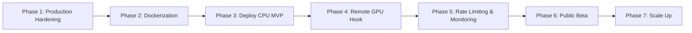

# VIETLEGAL AI — PRODUCTION DEPLOYMENT & CLOUD ARCHITECTURE BLUEPRINT

> **Tài liệu Kỹ thuật & Kế hoạch Triển khai Production**  
> **Dự án**: VietLegal AI — Trợ lý Trí tuệ Nhân tạo & Suy luận Pháp lý Chuyên sâu  
> **Tác giả**: Lê Minh Vương  
> **Mục tiêu**: Đưa hệ thống lên Internet phục vụ người dùng thật (Public Beta / Production), tối ưu hóa chi phí với kiến trúc Serverless GPU on-demand, container hóa bằng Docker, và đảm bảo tính toàn vẹn pháp lý (Zero-Hallucination & Legal Integrity).

---

## A. Đánh Giá Hiện Trạng Kiến Trúc (Current Architecture Assessment)

Dựa trên việc kiểm tra toàn bộ codebase, hệ thống VietLegal AI hiện tại có cấu trúc phân tầng như sau:

1. **Frontend Tier (`frontend/`)**:
   - Ứng dụng Single Page Application (SPA) viết bằng **React 19 + Vite + Tailwind/Modern CSS**.
   - Đã tích hợp Supabase Auth (Google OAuth 2.0 PKCE), giao diện ChatGPT Dark Theme, Interactive Citation Badges, Modal tra cứu toàn văn Điều luật và Sidebar quản lý đa phiên hội thoại.
   - *Hiện trạng triển khai*: Đang chạy local dev server qua Vite (port 5173), proxy cứng `/api` về `http://127.0.0.1:8000`.

2. **Backend API Tier (`backend/app/`)**:
   - Framework **FastAPI (Python 3.10)** chạy qua Uvicorn.
   - Cung cấp các REST endpoints:
     - `POST /api/v1/chat/completions`: Server-Sent Events (SSE) Streaming trả về token thời gian thực.
     - `GET/POST/PATCH/DELETE /api/v1/conversations`: Quản lý danh sách, tạo mới, đổi tên, xóa và xem chi tiết tin nhắn hội thoại.
     - `GET /api/v1/articles/{doc_id}/{article_number}`: Tra cứu toàn văn phục vụ Modal tra cứu nhanh.

3. **Retrieval & Pipeline Layer (`backend/app/services/rag/`)**:
   - **Sparse Retrieval**: Tìm kiếm từ khóa chính xác BM25 trên PostgreSQL Supabase qua PostgreSQL GIN Index (`tsvector`, `simple`). Gọi qua Supabase REST API endpoint.
   - **Dense Semantic Retrieval**: Vector hóa câu hỏi bằng mô hình `BAAI/bge-m3` (1024 chiều) và tìm kiếm HNSW trên Qdrant (`vietlegal_articles`).
   - **Rank Fusion**: Dung hòa thứ hạng bằng Reciprocal Rank Fusion (**RRF**, $k=60$) kèm thuật toán bảo tồn điều luật đích (**Target Article Preservation**).
   - **Deterministic Target Clause Extraction**: Module regex 3 lớp (`clause_parser.py`) bóc tách chính xác Điều $\rightarrow$ Khoản $\rightarrow$ Điểm cho các điều luật chế tài dài (NĐ 168, NĐ 145), giảm 54.6% token context.
   - **Cross-Encoder Reranker**: `BAAI/bge-reranker-v2-m3` tự động chọn CUDA FP16 nếu có GPU, fallback CPU. Đánh giá 14 ứng viên tiềm năng nhất.

4. **Generation & LLM Tier (`generator.py`)**:
   - Hỗ trợ Google Gemini (`gemini-3.5-flash-lite` / `gemini-2.5-flash`) và OpenAI (`gpt-4o-mini`).
   - System Prompt ràng buộc Zero-Hallucination, ép quy tắc làm tròn số học (Điều 8 NĐ 145), nguyên tắc trừ điểm không cộng dồn (Điều 50 NĐ 168), bẫy tuổi hưu (NĐ 135) và trần lãi suất/đặt cọc.

5. **Data Stores**:
   - **Supabase PostgreSQL**: 24 văn bản luật, 2.831 điều luật, bảng `profiles`, `conversations`, `messages`.
   - **Qdrant Vector Database**: Lưu trữ ~6.700 vector chunks (hiện đang dùng storage cục bộ trên đĩa `data/qdrant_storage` khi chạy local).

---

## B. Phân Tích Rủi Ro & Vấn Đề Khi Lên Production (Production Risks)

### 🔴 1. MUST FIX BEFORE DEPLOY (Bắt buộc phải sửa trước khi public)

| Vấn đề | Vị trí trong code | Mức độ nghiêm trọng | Tại sao cần sửa | Đề xuất khắc phục |
| :--- | :--- | :---: | :--- | :--- |
| **Qdrant Embedded Storage Lock** | `backend/app/services/rag/vector_store.py` (L43-L60) | **CRITICAL** | Khi không có Qdrant Server, code tự fallback dùng `QdrantClient(path="data/qdrant_storage")`. SQLite nhúng trên đĩa này **sẽ lock file ngay lập tức** khi chạy nhiều Uvicorn workers hoặc nhiều request đồng thời, gây crash hệ thống (`database is locked`). | Khi deploy production, **bắt buộc trỏ vào Qdrant Server từ xa** (Qdrant Cloud Free Tier 1GB hoặc container Qdrant riêng qua `QDRANT_HOST` + `QDRANT_PORT` + `QDRANT_API_KEY`). Cấm dùng `path=` khi chạy server. |
| **Tràn RAM do nạp cả 2 model nặng vào Backend CPU** | `reranker.py` & `embeddings.py` | **CRITICAL** | `bge-m3` ngốn ~2.2GB RAM, `bge-reranker-v2-m3` ngốn thêm ~2.2GB RAM. Tổng cộng ~4.5GB RAM cho 1 worker. Các cloud server rẻ/free (Render, Railway, Fly.io) chỉ cấp từ 512MB đến 1GB RAM $\rightarrow$ **Sẽ bị OOM (Out Of Memory) Crash ngay lúc startup!** | Tách rời Reranker thành Service riêng (hoặc cho phép tắt Reranker trên CPU backend, chỉ dùng RRF kết hợp BM25 + Qdrant Cloud). Đối với Embedding, sử dụng API hoặc chạy worker độc lập. |
| **CORS bị khóa cứng vào Localhost** | `backend/app/core/config.py` (L14-L19) | **HIGH** | `BACKEND_CORS_ORIGINS` chỉ cho phép `localhost:3000`, `localhost:5173`. Khi deploy Frontend lên domain public (Vercel/Netlify), mọi request gọi về Backend sẽ bị trình duyệt chặn đứng bởi lỗi CORS. | Cho phép nạp `BACKEND_CORS_ORIGINS` từ biến môi trường dạng danh sách hoặc cho phép domain của frontend production. |
| **Thiếu Rate Limiting & Abuse Protection** | `backend/app/api/v1/endpoints/chat.py` (L81-L90) | **HIGH** | Endpoint `/api/v1/chat/completions` không có rate limit. Nếu ai đó dùng tool spam 20 requests/phút sẽ làm cháy sạch quota Gemini (15 RPM) hoặc làm cạn kiệt tài nguyên server. | Tích hợp thư viện `slowapi` (Rate-limiter dựa trên IP/User ID): giới hạn ví dụ 10 req/phút đối với khách vãng lai, 30 req/phút đối với tài khoản Google đã đăng nhập. |
| **Thiếu Endpoint Health Check chuẩn** | `backend/app/main.py` (L47-L54) | **HIGH** | Hiện chỉ có route `@app.get("/")`. Thiếu endpoint `/health` kiểm tra kết nối DB, Qdrant để Docker Compose hoặc Cloud Load Balancer xác định trạng thái sống/chết (Liveness/Readiness Probe). | Bổ sung `/api/v1/health` kiểm tra trạng thái Supabase và Qdrant. |
| **Thiếu Banner Cảnh Báo Miễn Trừ Trách Nhiệm Pháp Lý** | `generator.py` & `App.jsx` | **HIGH** | Đây là bot tư vấn pháp lý. Nếu người dùng áp dụng trực tiếp ngoài đời dẫn đến tranh chấp/thiệt hại mà không có cảnh báo miễn trừ trách nhiệm (Legal Disclaimer), dự án sẽ gặp rủi ro pháp lý lớn. | Ép banner dưới chân trang web và cuối câu trả lời: *"Thông tin chỉ mang tính tham khảo, tra cứu quy định pháp luật; không thay thế ý kiến tư vấn chính thức của Luật sư hoặc cơ quan có thẩm quyền."* |

### 🟡 2. SHOULD FIX (Nên sửa để hệ thống chạy ổn định và chịu tải tốt)

| Vấn đề | Vị trí trong code | Phân tích rủi ro | Đề xuất |
| :--- | :--- | :--- | :--- |
| **Synchronous `requests.get()` trong async route** | `retriever.py`, `conversations.py` | Việc dùng thư viện `requests` đồng bộ để gọi Supabase REST API sẽ block luồng sự kiện (event loop) của Python AsyncIO, làm giảm năng lực phục vụ đồng thời của FastAPI. | Chuyển sang `httpx.AsyncClient` hoặc dùng trực tiếp kết nối async SQLAlchemy (`asyncpg`) khi chịu tải cao. |
| **Vite Proxy hardcoded ở Frontend** | `frontend/vite.config.js` | Frontend chỉ proxy về `127.0.0.1:8000` trong môi trường dev. Khi build production (`npm run build`), frontend không có proxy mà cần gọi thẳng vào URL backend thật. | Tạo file `.env.production` cho frontend với biến `VITE_API_BASE_URL=https://api.yourdomain.com` và cấu hình axios/fetch dùng base URL này. |
| **Xử lý ngắt kết nối Client SSE (Streaming Cancellation)** | `chat.py` | Khi người dùng đóng tab trình duyệt trong lúc AI đang stream câu trả lời, backend vẫn tiếp tục gọi LLM và tốn token vô ích. | Bắt sự kiện `request.is_disconnected()` trong generator để ngắt luồng gọi LLM ngay khi user đóng tab. |

### 🟢 3. NICE TO HAVE (Cải tiến mở rộng khi có lượng user thật)

1. **Semantic Cache bằng Redis**: Cache lại câu trả lời của 50 câu hỏi phổ biến nhất (tuổi hưu, mức lương tối thiểu vùng, thời gian thử việc,...). Giúp phản hồi trong <200ms và tốn 0 đồng tiền LLM.
2. **Observability với Langfuse**: Theo dõi thời gian thực token, latency, chi phí và tỷ lệ feedback thích/không thích của người dùng thật.

---

## C. Kiến Trúc Production Đề Xuất (Recommended Production Architecture)

Thay vì dồn toàn bộ mọi thứ vào một container duy nhất (dẫn đến việc container nặng 10GB và ngốn 8GB RAM), kiến trúc production được phân tách thành các dịch vụ độc lập có ranh giới rõ ràng:

```
[ Người dùng Internet / Mobile / Web ]
                 │ (HTTPS)
                 ▼
     ┌───────────────────────┐
     │   Frontend CDN        │ (Vercel / Cloudflare Pages)
     │   React 19 Vite SPA   │ -> Miễn phí, băng thông toàn cầu, tải chớp nhoáng
     └───────────┬───────────┘
                 │ (REST API / SSE Streaming)
                 ▼
     ┌───────────────────────┐
     │   FastAPI Backend     │ (Docker Container - CPU Cloud: Render/Fly.io/VPS)
     │   - Auth Verification │ -> RAM tối ưu: chỉ cần 1GB - 2GB RAM
     │   - Query Decompose   │ -> Rate Limiting (SlowAPI)
     │   - Clause Extractor  │ -> Multi-Intent & Temporal Routing
     └─────┬─────┬─────┬─────┘
           │     │     │
  ┌────────┘     │     └────────┐
  ▼              ▼              ▼
┌──────────────┐ ┌────────────┐ ┌──────────────────────────────────────┐
│  Supabase    │ │   Qdrant   │ │       Reranker Strategy Service      │
│  PostgreSQL  │ │   Cloud    │ │ ┌──────────────────────────────────┐ │
│  - BM25 GIN  │ │   Cluster  │ │ │ [Ưu tiên] GPU Serverless (Modal) │ │
│  - Profiles  │ │   (1024-d) │ │ └──────────────────┬───────────────┘ │
│  - History   │ │            │ │                    │ (Timeout 2s / Fail)
└──────────────┘ └────────────┘ │ ┌──────────────────▼───────────────┐ │
                                │ │ [Fallback] In-Memory RRF / CPU   │ │
                                │ └──────────────────────────────────┘ │
                                └──────────────────────────────────────┘
                 │
                 ▼
     ┌───────────────────────┐
     │ Google Gemini API     │ (LLM Generation + Streaming SSE)
     │ (Flash-Lite / Flash)  │ -> Đạt 15 RPM / 500 RPD Free Tier
     └───────────────────────┘
```

---

## D. Chiến Lược GPU Serverless / On-Demand (GPU Strategy)

Để giải quyết bài toán: **Cần tốc độ cực nhanh của GPU CUDA FP16 (giảm 93% latency) nhưng KHÔNG có ngân sách thuê GPU chuyên dụng 24/7 (tốn $30 - $100/tháng)**:

### 1. Kiến trúc Reranker Hybrid (Remote GPU on-demand + Local Fallback)

Chúng ta cấu hình Backend gọi Reranker theo nguyên tắc **Graceful Degradation (Tự thích ứng)**:

```python
# Logic vận hành của Reranker Service trên Production:
1. Khi có request cần Rerank:
   Backend kiểm tra biến RERANKER_SERVICE_URL:
   - NẾU có cấu hình (ví dụ: endpoint Modal.com / RunPod Serverless):
       Gửi 14 cặp văn bản qua HTTP POST lên GPU Serverless Worker.
       Đặt Timeout nghiêm ngặt: 2.0 giây.
       NẾU nhận được kết quả trong 2s -> Áp dụng rerank_score của GPU!
       NẾU bị Timeout, lỗi mạng hoặc Worker đang Cold-Start quá lâu:
           -> Tự động log cảnh báo và Fallback ngay sang bước 2.
   - NẾU không cấu hình GPU hoặc GPU lỗi:
       -> Fallback sang RRF Fusion Score (Chế độ Tiêu chuẩn) hoặc CPU Reranker nhẹ.
       -> Request của người dùng VẪN HOÀN THÀNH BÌNH THƯỜNG, không bao giờ bị báo lỗi 500!
```

### 2. So sánh các nhà cung cấp GPU Serverless phù hợp nhất:

| Nhà cung cấp | Mô hình tính phí | Tốc độ Cold Start | Chi phí ước tính (50–200 lượt hỏi/ngày) | Đánh giá |
| :--- | :--- | :---: | :---: | :--- |
| **Modal.com** *(Khuyến nghị số 1)* | Tính theo giây chạy thực tế (Pay-per-second, Scale to 0). Tặng **$30 miễn phí hàng tháng**. | ~2s – 5s | **$0 / tháng** (Dùng trong hạn mức $30 free) | Tích hợp Python native, deploy cực kỳ đơn giản qua 1 file `modal_app.py`. Hết lượt hỏi tự tắt về 0, không tốn 1 xu. |
| **RunPod Serverless** | Tính theo mili-giây khi container chạy. | ~5s – 12s | ~$1 – $3 / tháng | Rẻ, linh hoạt, nhiều loại card (RTX 3090, RTX 4000). |
| **Tự host qua ngrok từ máy cá nhân** *(Dành cho Demo)* | Máy tính cá nhân (RTX 3050) bật khi muốn demo, mở tunnel qua ngrok về backend cloud. | 0s | **$0** | Phù hợp khi muốn demo trực tiếp cho nhà tuyển dụng thấy GPU RTX 3050 của mình đang rerank thời gian thực. |
| **Chạy thuần CPU RRF (Zero GPU)** | Không dùng GPU, dùng thuật toán RRF dung hòa Dense + BM25. | 0s | **$0** | Phương án an toàn tuyệt đối cho giai đoạn public beta ban đầu nếu chưa muốn cấu hình bên thứ 3. |

---

## E. Chiến Lược Docker & Containerization

Hệ thống sẽ được chia thành **2 Dockerfile độc lập** và **1 file docker-compose chuẩn**:

### 1. Phân định ranh giới Image (Service Boundaries):
- **`Dockerfile.backend`**:
  - Base image: `python:3.10-slim`.
  - Cài đặt thư viện: FastAPI, Pydantic, Qdrant Client, Requests, SSE-Starlette.
  - Tối ưu kích thước: Không cài đặt CUDA toolkit nặng nề trong image backend CPU (giúp image giảm từ 8GB xuống chỉ còn **~800MB**, build và deploy cực nhanh).
- **`Dockerfile.frontend`**:
  - Multi-stage build:
    - Stage 1: `node:20-alpine` chạy `npm run build` tạo thư mục `dist/`.
    - Stage 2: `nginx:alpine` siêu nhẹ (~25MB) nhận static assets và cấu hình reverse proxy chuyển tiếp các request `/api` sang backend.

### 2. File `docker-compose.yml` hoàn chỉnh cho Local & Self-Hosted VPS:
- Gồm 4 dịch vụ cốt lõi:
  1. `frontend`: Phục vụ Web giao diện (Port 80/5173).
  2. `backend`: Phục vụ API suy luận (Port 8000), có healthcheck probe.
  3. `qdrant`: Vector Database chính thức (Port 6333), lưu volume ra đĩa bền vững (`qdrant_data`).
  4. `redis`: Bộ đệm semantic cache và rate limit (Port 6379).

---

## F. Lựa Chọn Nền Tảng Triển Khai & Chi Phí (Hosting & Cost Matrix)

Hệ thống được chia làm 3 cấp độ rõ ràng theo từng quy mô:

| Thành phần | 🟢 Cấp độ 1: Demo / Free Tier ($0/tháng) | 🟡 Cấp độ 2: Public Beta (~$5 - $10/tháng) | 🔴 Cấp độ 3: Production Scale (500+ users/day) |
| :--- | :--- | :--- | :--- |
| **Frontend** | **Vercel / Cloudflare Pages** ($0) | **Vercel / Cloudflare Pages** ($0) | Cloudflare Pages + Custom Domain ($0 - $10) |
| **Backend API** | **Render / Fly.io / Railway Free** ($0) | **Hetzner Cloud VPS (CX22)** (2 vCPU, 4GB RAM: ~$4.5/tháng) | AWS ECS / DigitalOcean Droplet ($20 - $40/tháng) |
| **Database** | **Supabase Free Tier** (500MB DB, Auth, Storage: $0) | **Supabase Free Tier** ($0) | Supabase Pro ($25/tháng) |
| **Qdrant Vector** | **Qdrant Cloud Free Tier** (1GB cluster: $0) | **Chạy container trên Hetzner VPS** ($0) | Qdrant Cloud Dedicated ($25/tháng) |
| **GPU Reranker** | **RRF In-Memory Fallback** ($0) | **Modal.com** (Tận dụng $30 free credit: $0) | RunPod Serverless / Modal (~$10 - $20/tháng) |
| **LLM Inference** | **Google Gemini 3.5 Flash-Lite** (Free 500 RPD) | **Gemini Pay-As-You-Go** (~$2 - $5/tháng) | Gemini Flash / OpenAI gpt-4o-mini ($15 - $30/tháng) |
| **TỔNG CHI PHÍ** | **0 ĐỒNG / THÁNG** | **~100.000đ – 250.000đ / THÁNG** | **~1.500.000đ – 2.500.000đ / THÁNG** |

---

## G. Lộ Trình Triển Khai Từng Giai Đoạn (Deployment Roadmap)



### Phase 1 — Production Hardening (Gia cố mã nguồn)
- **Mục tiêu**: Loại bỏ triệt để rủi ro SQLite file lock, fix CORS, tạo endpoint `/health`, bổ sung Legal Disclaimer banner.
- **Files cần sửa**:
  - `backend/app/core/config.py`: Đọc CORS origins linh hoạt từ biến môi trường.
  - `backend/app/services/rag/vector_store.py`: Ngăn chặn fallback file SQLite trên production; buộc cấu hình Qdrant URL/Host.
  - `backend/app/main.py`: Thêm route `GET /api/v1/health` kiểm tra kết nối DB.
  - `frontend/src/App.jsx`: Thêm Legal Disclaimer Footer cố định.
- **Cách test**: Chạy unit test local, kiểm tra `/api/v1/health` trả về `{"status": "healthy", "database": "connected", "qdrant": "connected"}`.
- **Rollback**: Khôi phục lại bản commit trước đó qua `git checkout`.

### Phase 2 — Dockerization (Đóng gói Container)
- **Mục tiêu**: Xây dựng Dockerfile chuẩn cho Backend, Frontend và file `docker-compose.yml` tích hợp.
- **Files tạo mới**:
  - `Dockerfile.backend`
  - `Dockerfile.frontend`
  - `nginx/default.conf`
  - Cập nhật `docker-compose.yml`
- **Cách test**: Chạy `docker compose up --build`, mở trình duyệt truy cập `http://localhost`, kiểm tra luồng hỏi đáp và modal hoạt động bình thường.
- **Rollback**: Chạy server bằng lệnh python local như cũ.

### Phase 3 — Deploy CPU MVP lên Internet (Miễn phí 100%)
- **Mục tiêu**: Đưa website lên internet có URL public (ví dụ: `https://vietlegal.vercel.app` và backend trên `Render/Fly.io`).
- **Infrastructure**:
  - Frontend: Vercel (kết nối repo GitHub, tự động build mỗi khi push code).
  - Backend: Web Service trên Render hoặc Fly.io.
  - Vector: Qdrant Cloud Free Tier 1GB.
  - Database: Supabase Cloud đang có sẵn.
- **Cách test**: Dùng điện thoại 4G (mạng ngoài) truy cập vào link Vercel, đăng nhập Google và chat thử 1 câu.
- **Rollback**: Tắt service trên Render/Vercel.

### Phase 4 — Add Optional Remote GPU Inference (Tích hợp GPU rời)
- **Mục tiêu**: Tăng tốc Reranker bằng Serverless GPU mà không tốn chi phí cố định.
- **Files tạo mới/sửa**:
  - Tạo script worker `pipeline/deploy/modal_reranker.py` trên Modal.com.
  - Cập nhật `backend/app/services/rag/reranker.py`: Thêm client HTTP gọi sang endpoint Modal với timeout 2.0s và fallback tự động về RRF.
- **Cách test**: Bật Chế độ Chuyên sâu trên Web public $\rightarrow$ Kiểm tra log backend ghi nhận Reranker GPU phản hồi trong ~0.8s; sau đó giả lập tắt Modal $\rightarrow$ Backend tự fallback về RRF mà không làm gián đoạn câu trả lời.
- **Rollback**: Gỡ bỏ biến môi trường `RERANKER_SERVICE_URL`.

### Phase 5 — Rate Limiting, Abuse Protection & Monitoring
- **Mục tiêu**: Bảo vệ hệ thống khỏi bị spam hoặc phá hoại quota Gemini.
- **Files cần sửa**:
  - Cài đặt `slowapi`, bọc decorator `@limiter.limit("10/minute")` lên `/api/v1/chat/completions`.
  - Tích hợp logging cấu trúc JSON (request ID, latency, user_id, tokens).
- **Cách test**: Dùng script curl bắn 15 requests liên tục $\rightarrow$ Request thứ 11 trả về mã lỗi HTTP 429 Too Many Requests kèm thông báo rõ ràng.

### Phase 6 — Public Beta & Thu Thập Phản Hồi
- **Mục tiêu**: Mở cho người dùng thật (bạn bè, cộng đồng, người quan tâm pháp lý) sử dụng và thu thập feedback.
- **Hành động**: Đính kèm link Live Demo vào đầu file `README.md`, theo dõi feedback trong bảng `message_feedback`.

### Phase 7 — Scale Khi Lưu Lượng Tăng Cao (500+ users/day)
- **Mục tiêu**: Chuyển đổi sang VPS Hetzner/DigitalOcean cấu hình cao hơn, bật Redis Semantic Cache để giảm 60% chi phí gọi LLM.

---

## H. Các Thay Đổi Cụ Thể Trong Code Cần Thực Hiện

1. **`backend/app/core/config.py`**:
   ```python
   # Chuyển CORS thành dynamic đọc từ .env:
   BACKEND_CORS_ORIGINS: List[str] = [
       origin.strip() for origin in os.getenv(
           "BACKEND_CORS_ORIGINS", 
           "http://localhost:5173,http://localhost:3000"
       ).split(",") if origin.strip()
   ]
   ```

2. **`backend/app/services/rag/vector_store.py`**:
   ```python
   # Thêm cờ môi trường QDRANT_URL hỗ trợ kết nối Qdrant Cloud qua HTTPS:
   qdrant_url = os.getenv("QDRANT_URL")
   if qdrant_url:
       return QdrantClient(url=qdrant_url, api_key=self.api_key)
   ```

3. **`backend/app/services/rag/reranker.py`**:
   ```python
   # Thêm cơ chế gọi Remote Serverless GPU với Fallback:
   remote_url = os.getenv("RERANKER_SERVICE_URL")
   if remote_url:
       try:
           res = requests.post(remote_url, json={"query": query, "candidates": candidates}, timeout=2.0)
           if res.status_code == 200:
               return res.json()["ranked_candidates"]
       except Exception as e:
           print(f"[!] Remote GPU Reranker failed ({e}), falling back to local...")
   ```

4. **Legal Disclaimer Footer (`frontend/src/App.jsx`)**:
   ```jsx
   <div className="text-xs text-gray-500 text-center py-2 border-t border-gray-800">
     ⚠️ <strong>Khuyến cáo:</strong> VietLegal AI là trợ lý tra cứu và phân tích quy định pháp luật tự động. Mọi câu trả lời chỉ mang tính chất tham khảo, không thay thế cho ý kiến tư vấn pháp lý chính thức từ Luật sư hoặc cơ quan có thẩm quyền.
   </div>
   ```

---

## I. Checklist Kiểm Định Trước Khi Public (Testing Checklist)

- [ ] **Data Integrity**: Xác nhận 24 văn bản và 2.831 điều luật trong Supabase có thể tìm kiếm BM25 và tra cứu Modal bình thường.
- [ ] **Vector Search**: Kết nối thành công đến Qdrant Cloud qua HTTPS và API Key; truy vấn trả về vector scores chính xác.
- [ ] **Temporal Version Correctness**: Test case Luật BHXH 2014 vs 2024 (mốc 01/07/2025) và NĐ 168 vs NĐ 100 phân định chuẩn xác.
- [ ] **Zero-Hallucination & Math**: Test case làm tròn tháng lẻ trợ cấp thôi việc (NĐ 145 Đ8) và trừ điểm GPLX không cộng dồn (NĐ 168 Đ50) đưa ra con số đúng 100%.
- [ ] **Google OAuth**: Đăng nhập bằng tài khoản Google mới và tài khoản cũ đều đồng bộ profile và lưu lịch sử chat vào Supabase.
- [ ] **Rate Limiting**: Bắn thử request vượt ngưỡng $\rightarrow$ hệ thống trả về mã lỗi 429 thân thiện, không bị sập server.
- [ ] **GPU Fallback**: Rút phích cắm GPU / tắt service GPU $\rightarrow$ Hệ thống tự động chuyển sang chế độ dự phòng mà không báo lỗi 500 cho người dùng.
- [ ] **Mobile Responsive**: Giao diện hiển thị chuẩn đẹp trên cả màn hình điện thoại và máy tính.

---

## J. Sơ Đồ Kiến Trúc Hoàn Chỉnh (ASCII Diagram)

```
========================================================================================
                       VIETLEGAL AI - PRODUCTION CLOUD ARCHITECTURE
========================================================================================

    [ Khách truy cập Web / Mobile ]
                   │
                   ▼  (HTTPS)
    ┌─────────────────────────────────────────────────────────────┐
    │  FRONTEND: Vercel / Cloudflare Pages CDN (Global Edge)      │
    │  - React 19 + Vite SPA (ChatGPT Dark Theme)                │
    │  - Supabase Google OAuth 2.0 PKCE Session                   │
    │  - Interactive Citation Badges & Document Modals            │
    └──────────────────────────────┬──────────────────────────────┘
                                   │
                                   ▼  (REST + SSE Streaming /api/v1/...)
    ┌─────────────────────────────────────────────────────────────┐
    │  BACKEND API: FastAPI Container (Linux CPU: 1GB-2GB RAM)    │
    │  - SlowAPI Rate Limiter (10 req/min/IP)                     │
    │  - JWT Auth Guard (Supabase Token Verification)             │
    │  - Query Decomposition & Temporal Routing (as_of_date)      │
    │  - Deterministic Target Clause Extractor (Regex RAM)        │
    │  - Health Check Probes (/api/v1/health)                     │
    └──────┬───────────────────────┬───────────────────────┬──────┘
           │                       │                       │
           ▼                       ▼                       ▼
    ┌──────────────┐        ┌──────────────┐        ┌────────────────────────────┐
    │  Supabase    │        │ Qdrant Cloud │        │ GPU Reranker Strategy      │
    │  PostgreSQL  │        │ Vector Store │        │                            │
    │  (pg_trgm)   │        │ (1024-dim)   │        │ ┌────────────────────────┐ │
    │  - BM25 GIN  │        │ - HNSW Index │        │ │ Modal.com (Serverless) │ │
    │  - Profiles  │        │ - Payload    │        │ │ BGE-Reranker-v2-m3     │ │
    │  - Chats     │        │   Filter     │        │ │ CUDA FP16 (RTX/A10G)   │ │
    └──────────────┘        └──────────────┘        │ └───────────┬────────────┘ │
                                                    │             │ (Timeout 2s) │
                                                    │ ┌───────────▼────────────┐ │
                                                    │ │ Graceful Fallback:     │ │
                                                    │ │ In-Memory RRF Scoring  │ │
                                                    │ └────────────────────────┘ │
                                                    └─────────────┬──────────────┘
                                                                  │
                                                                  ▼
                                                    ┌────────────────────────────┐
                                                    │ Google Gemini API          │
                                                    │ (3.5 Flash-Lite / 3.6 Fl.) │
                                                    │ Zero-Hallucination Stream  │
                                                    └────────────────────────────┘
========================================================================================
```

---

## 📋 BẢNG CHECKLIST TRIỂN KHAI RÚT GỌN (Quick Deployment Checklist)

1. [ ] **Bước 1 (Gia cố code)**: Thêm route `/api/v1/health`, dynamic CORS origins trong `config.py`, và banner Disclaimer ở Frontend.
2. [ ] **Bước 2 (Container)**: Viết `Dockerfile.backend` (multi-stage tối ưu) và kiểm thử `docker compose up` trên máy cục bộ.
3. [ ] **Bước 3 (Qdrant Cloud)**: Tạo cluster miễn phí trên Qdrant Cloud (1GB), chạy script đẩy dữ liệu vector lên Cloud và lấy `QDRANT_URL` + `QDRANT_API_KEY`.
4. [ ] **Bước 4 (Deploy Backend)**: Đẩy Backend lên Render / Fly.io / Railway (chọn gói Free hoặc Mini $5), gắn các biến môi trường bí mật (`.env`).
5. [ ] **Bước 5 (Deploy Frontend)**: Đẩy Frontend lên Vercel, trỏ `VITE_API_BASE_URL` về URL của Backend vừa tạo.
6. [ ] **Bước 6 (Hook GPU Serverless)**: Đưa hàm Reranker lên Modal.com (nếu muốn kích hoạt chế độ GPU on-demand miễn phí), gắn URL vào Backend.
7. [ ] **Bước 7 (Nghiệm thu)**: Dùng mạng 4G bên ngoài vào test toàn diện 4 câu hỏi khó, xác nhận 100% chức năng hoạt động hoàn hảo.
