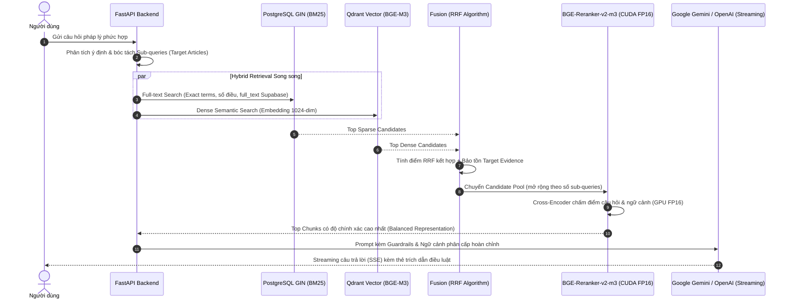

# VietLegal AI — Báo Cáo Kỹ Thuật & Thành Tựu Hệ Thống Trợ Lý Pháp Lý AI

Hệ thống AI hỏi đáp và suy luận pháp lý Việt Nam ứng dụng kiến trúc **Advanced Legal RAG (Retrieval-Augmented Generation)** chuyên sâu, tích hợp cơ chế phân cấp văn bản pháp luật, tìm kiếm kết hợp (**Hybrid Search**: BGE-M3 Dense + PostgreSQL GIN BM25 + RRF), xếp hạng lại nâng cao (**BGE-Reranker-v2-m3** trên CUDA GPU FP16), mô hình suy luận tạo sinh **Google Gemini Flash / OpenAI**, giao diện người dùng **ChatGPT Dark Theme**, xác thực **Google OAuth 2.0** và quản lý hội thoại Cloud Database.

[](evals/benchmark_report.md)
[-brightgreen)](evals/benchmark_report.md)
[-brightgreen)](evals/benchmark_report.md)
[](evals/benchmark_report.md)
[](evals/benchmark_report.md)
[](evals/benchmark_report.md)
[](https://github.com/minhvuongle2004/vietlegalAI)

---

## 🗺️ Lộ Trình Tiến Hóa Dự Án (Project Evolution Roadmap)

```
Phase 0 (Core Legal RAG) 
   │  • 10 văn bản (BLLĐ 2019, Luật DN 2020, NĐ 145, 12, 74, 135, 01, 122, Luật BHXH 2014, Luật Việc làm 2013)
   │  • 1.005 điều, 2.701 chunks. Hybrid Search + GPU Reranker.
   ▼
Phase 1 (Temporal Version-Aware RAG - Tag: v0.3.0-phase1-version-aware)
   │  • Dual-version routing BHXH 2014 & BHXH 2024 (hiệu lực 01/07/2025) + Luật BHYT 2024.
   │  • DatetimeRange Qdrant filtering, 34/34 test cases (100% pass).
   ▼
Phase 2 (Core Domain Expansion: Civil & Tax - Tag: v0.5.0-phase2-tax-cluster)
   │  • Mở rộng Bộ luật Dân sự 2015 (+689 điều).
   │  • Cụm Thuế 2025/2026 (+102 điều Thuế TNCN, TNDN, Quản lý thuế; TC-47 cross-doc, TC-48 version-aware).
   │  • Đạt 48/48 (100%) Retrieval Recall, 47/48 (97.9%) Pass Rate. Đóng băng baseline Phase 2.
   ▼
Phase 3 (Real-Estate, Housing & Investment Cluster - Tag: v0.6.0-phase3-real-estate) [HOÀN THÀNH XUẤT SẮC ✅]
   │  • Mở rộng Cụm Bất động sản mới (+618 điều): Luật Đất đai 2024, Luật Nhà ở 2023, Luật Kinh doanh BĐS 2023, Luật Đầu tư 2020.
   │  • Nâng cấp kiến trúc: Từ "Document-Level Diversity" sang "Evidence-Level Preservation".
   │  • Phân tách intent triệt để & mô hình hóa quan hệ phụ thuộc căn cứ (Legal Dependency Modeling).
   │  • ĐẠT TUYỆT ĐỐI 56/56 TEST CASES PASSED (100.0% RETRIEVAL & 100.0% PASS RATE).
   │  • ĐÓNG BĂNG BASELINE CHÍNH THỨC: `evals/benchmark_56_phase3.json`. COMPLETE ✅
   ▼
Phase 4 (Production Latency Optimization, Containerization & Cloud Deployment)
```

---

## 🏆 1. Báo Cáo Kết Quả Thực Nghiệm & Đánh Giá Định Lượng (Phase 3 Frozen Baseline)

Hệ thống được kiểm chứng toàn diện qua bộ **VietLegal Reasoning Benchmark (56 Ground-Truth Test Cases)** đa ngành:
- **Tổng số câu hỏi**: **56 Test Cases** chuyên sâu (gồm bẫy ngoại lệ, tính toán số học, đa văn bản, đa phiên bản thời gian).
- **Tỷ lệ Trích xuất Đúng (Retrieval Recall)**: **100.0%** (56/56 cases).
- **Tỷ lệ Trả lời Đúng Chuẩn Pháp Lý (Pass Rate)**: **100.0%** (56/56 cases).
- **Tỷ lệ Hồi quy (Regression)**: **0.0%** (Toàn bộ 48 test cases cũ giữ vững độ chính xác tuyệt đối).

| Phân nhóm Nghiệp vụ / Bẫy Logic | Số câu | Đạt Retrieval | Pass Rate | Tỷ lệ Pass | Ghi chú Trọng tâm |
| :--- | :---: | :---: | :---: | :---: | :--- |
| **Suy luận Đa văn bản** *(Cross-Document Reasoning)* | 8 | 8/8 | 8/8 | **100.0%** ✅ | BLLĐ + NĐ 145 + Luật Việc làm + NĐ 12 (TC-01, TC-02, TC-17). |
| **Điều kiện Boolean Logic** *(AND / OR Logic)* | 6 | 6/6 | 6/6 | **100.0%** ✅ | Xử lý chặt chẽ logic điều kiện tích lũy bắt buộc và điều kiện lựa chọn. |
| **Ngoại lệ vs Quy định chung** *(Exception vs General)* | 4 | 4/4 | 4/4 | **100.0%** ✅ | Phân biệt mốc chuẩn vs ngoại lệ (giờ làm thêm 200h vs 300h; thử việc HĐLĐ < 1 tháng). |
| **Tính toán Số học Pháp lý** *(Calculation)* | 6 | 6/6 | 6/6 | **100.0%** 🧮 | Tính tiền lương làm thêm giờ lễ tết 300%, làm tròn tháng lẻ trợ cấp thôi việc (TC-19). |
| **Thời hạn & Thời hiệu** *(Temporal Deadlines)* | 4 | 4/4 | 4/4 | **100.0%** ✅ | Chuẩn xác thời hạn báo trước, thời hiệu kỷ luật 6-12 tháng, thời điểm hưởng lương hưu (TC-20). |
| **Tra cứu Bảng biểu chuyển tiếp** *(Tabular Lookup)* | 2 | 2/2 | 2/2 | **100.0%** 📊 | Bóc tách chính xác Phụ lục lộ trình tuổi nghỉ hưu nam & nữ theo tháng/năm sinh (NĐ 135). |
| **Temporal / Version-Aware Legal RAG** | 4 | 4/4 | 4/4 | **100.0%** ⏳ | Routing chính xác BHXH 2014 vs BHXH 2024 (mốc 01/07/2025) & Luật BHYT 2024 theo `as_of_date`. |
| **Dân sự, Hợp đồng & Thừa kế** *(Bộ luật Dân sự 2015)* | 6 | 6/6 | 6/6 | **100.0%** ⚖️ | Đặt cọc (Đ328), lãi suất vay 20% (Đ468), thời hiệu bồi thường (Đ588), thừa kế (Đ644, Đ623). |
| **Thuế TNCN, TNDN & Quản lý thuế** *(Cụm Thuế 2025/2026)* | 8 | 8/8 | 8/8 | **100.0%** 💼 | Biểu thuế 5 bậc, giảm trừ gia cảnh, chi phí trừ TNDN, tiền chậm nộp 0,03%/ngày. |
| **Bất động sản, Nhà ở & Đầu tư** *(Cụm BĐS Phase 3)* | 8 | 8/8 | 8/8 | **100.0%** 🏢 | Bỏ khung giá đất, đặt cọc BĐS tương lai ≤5%, điều kiện bán nhà nghiệm thu móng, NOXH. |
| **TỔNG CỘNG TOÀN HỆ THỐNG** | **56** | **56/56** | **56/56** | **100.0%** | **Toàn bộ 10 nhóm nghiệp vụ đạt tỷ lệ hoàn hảo 100%** |

---

## 🏛️ 2. Hệ Thống Dữ Liệu Pháp Lý Toàn Diện (20 Văn Bản / 2.562 Điều Luật)

Hệ thống đã chuẩn hóa, bóc tách cấu trúc cây và số hóa hoàn tất **20 văn bản quy phạm pháp luật trụ cột** với **2.562 Điều luật** và **5.872 Chunks** trong Qdrant Vector Store & Supabase PostgreSQL:

```mermaid
graph TD
    A[Kho Dữ Liệu VietLegal AI - 2.562 Điều luật / 5.872 Chunks] --> B[Cụm 1: Lao động & Tiền lương]
    A --> C[Cụm 2: Việc làm & Bảo hiểm thất nghiệp]
    A --> D[Cụm 3: Bảo hiểm xã hội & BHYT]
    A --> E[Cụm 4: Doanh nghiệp & Xử phạt đầu tư]
    A --> F[Cụm 5: Dân sự, Hợp đồng & Thừa kế]
    A --> G[Cụm 6: Thuế TNCN, TNDN & Quản lý thuế]
    A --> H[Cụm 7: Bất động sản, Nhà ở & Đầu tư]

    B --> B1[Bộ luật Lao động 2019 - 220 Điều]
    B --> B2[Nghị định 145/2020/NĐ-CP - 115 Điều]
    B --> B3[Nghị định 12/2022/NĐ-CP - 64 Điều]

    C --> C1[Luật Việc làm 2013 - 62 Điều]

    D --> D1[Luật BHXH 2014 - 125 Điều]
    D --> D2[Luật BHXH 2024 - 141 Điều]
    D --> D3[Luật BHYT sửa đổi 2024 - 3 Điều]
    D --> D4[Nghị định 135/2020/NĐ-CP - 16 Điều]
    D --> D5[Nghị định 74/2024/NĐ-CP - 6 Điều]

    E --> E1[Luật Doanh nghiệp 2020 - 218 Điều]
    E --> E2[Nghị định 01/2021/NĐ-CP - 101 Điều]
    E --> E3[Nghị định 122/2021/NĐ-CP - 82 Điều]

    F --> F1[Bộ luật Dân sự 2015 - 689 Điều]

    G --> G1[Luật Thuế TNCN 2025 - 29 Điều]
    G --> G2[Luật Thuế TNDN 2025 - 20 Điều]
    G --> G3[Luật Quản lý thuế 2025 - 53 Điều]

    H --> H1[Luật Đất đai 2024 - 260 Điều]
    H --> H2[Luật Nhà ở 2023 - 198 Điều]
    H --> H3[Luật Kinh doanh BĐS 2023 - 83 Điều]
    H --> H4[Luật Đầu tư 2020 - 77 Điều]
```



### Bảng Thống Kê Chi Tiết Dữ Liệu:
| STT | Cụm Ngành Luật | Tên Văn bản Quy phạm Pháp luật | Số hiệu | Số Điều | Nội dung Trọng tâm |
| :---: | :--- | :--- | :---: | :---: | :--- |
| 1 | **Lao động & Tiền lương** | **Bộ luật Lao động 2019** | 45/2019/QH14 | 220 | Hợp đồng lao động, tiền lương, làm thêm giờ, kỷ luật sa thải, trợ cấp thôi việc |
| 2 | | **Nghị định 145/2020/NĐ-CP** | 145/2020/NĐ-CP | 115 | Chi tiết thi hành BLLĐ, quy tắc làm tròn tháng lẻ tính trợ cấp (Điều 8) |
| 3 | | **Nghị định 12/2022/NĐ-CP** | 12/2022/NĐ-CP | 64 | Xử phạt vi phạm hành chính lĩnh vực lao động, bảo hiểm xã hội |
| 4 | **Việc làm & BHTN** | **Luật Việc làm 2013** | 38/2013/QH13 | 62 | Điều kiện, mức hưởng và thời gian hưởng trợ cấp thất nghiệp (Điều 49 - 53) |
| 5 | **Bảo hiểm & Y tế** | **Luật Bảo hiểm xã hội 2014** | 58/2014/QH13 | 125 | Chế độ ốm đau, thai sản, hưu trí, tử tuất, rút BHXH một lần (Điều 60) |
| 6 | *(Đa phiên bản thời gian)* | **Luật Bảo hiểm xã hội 2024** | 41/2024/QH15 | 141 | Hiệu lực 01/07/2025: Đóng 15 năm hưởng lương hưu, điều kiện rút BHXH mới |
| 7 | | **Luật sửa đổi Luật BHYT 2024** | 51/2024/QH15 | 3 | Hiệu lực 01/07/2025: Đăng ký KCB ban đầu, chuyển tuyến, thanh toán viện phí |
| 8 | | **Nghị định 135/2020/NĐ-CP** | 135/2020/NĐ-CP | 16 | Lộ trình tăng tuổi nghỉ hưu, Phụ lục tra cứu ngày tháng nghỉ hưu nam & nữ |
| 9 | | **Nghị định 74/2024/NĐ-CP** | 74/2024/NĐ-CP | 6 | Mức lương tối thiểu tháng & giờ áp dụng theo 4 vùng địa bàn |
| 10 | **Doanh nghiệp & Đầu tư** | **Luật Doanh nghiệp 2020** | 59/2020/QH14 | 218 | Thành lập, quản lý, cơ cấu vốn, người đại diện theo pháp luật, giải thể |
| 11 | | **Nghị định 01/2021/NĐ-CP** | 01/2021/NĐ-CP | 101 | Trình tự, thủ tục hồ sơ đăng ký doanh nghiệp và hộ kinh doanh |
| 12 | | **Nghị định 122/2021/NĐ-CP** | 122/2021/NĐ-CP | 82 | Xử phạt vi phạm hành chính lĩnh vực kế hoạch và đầu tư |
| 13 | **Dân sự & Hợp đồng** | **Bộ luật Dân sự 2015** | 91/2015/QH13 | 689 | Giao dịch dân sự, đặt cọc, trần lãi suất 20%, bồi thường ngoài hợp đồng, thừa kế |
| 14 | **Cụm Thuế Mới** | **Luật Thuế TNCN 2025** | 109/2025/QH15 | 29 | Biểu thuế lũy tiến từng phần 5 bậc, mức giảm trừ gia cảnh người phụ thuộc |
| 15 | | **Luật Thuế TNDN 2025** | 67/2025/QH15 | 20 | Thuế suất phổ thông 20%, ưu đãi thuế suất theo doanh thu, chi phí hợp lý |
| 16 | | **Luật Quản lý thuế 2025** | 108/2025/QH15 | 53 | Thời hạn nộp hồ sơ khai thuế, chế tài tính tiền chậm nộp thuế 0,03%/ngày |
| 17 | **Bất động sản & Nhà ở** | **Luật Đất đai 2024** | 31/2024/QH15 | 260 | Bỏ khung giá đất, bảng giá đất hàng năm, điều kiện chuyển nhượng QSDĐ |
| 18 | *(Cụm Phase 3 Mới)* | **Luật Nhà ở 2023** | 27/2023/QH15 | 198 | Điều kiện mua/thuê nhà ở xã hội, thời hạn 5 năm không được bán lại NOXH |
| 19 | | **Luật Kinh doanh BĐS 2023** | 29/2023/QH15 | 83 | Trần đặt cọc tối đa 5%, điều kiện mở bán nhà ở tương lai & nghiệm thu móng |
| 20 | | **Luật Đầu tư 2020** | 61/2020/QH14 | 77 | Chấp thuận chủ trương đầu tư dự án nhà ở, giao đất qua đấu giá/đấu thầu |
| **Tổng** | **Toàn bộ 7 Cụm Ngành Luật** | **20 Văn bản Pháp luật** | — | **2.562 Điều** | **Đã lập chỉ mục Hybrid Search & Vector hóa 100%** |

---

## ⚡ 3. Các Đột Phá Kiến Trúc AI & Kỹ Thuật Xử Lý RAG Chuyên Sâu



### 3.1. Từ "Document-Level Diversity" Lên "Evidence-Level Preservation" (Đột phá Phase 3)
- **Hạn chế của mô hình cũ**: Khi phân bổ hạn ngạch ngữ cảnh chỉ dựa trên mã văn bản (`doc_keyword`), nếu một văn bản luật chứa nhiều điều luật mục tiêu độc lập (ví dụ `TC-17`: BLLĐ 2019 chứa cả Điều 44 về phương án sử dụng lao động và Điều 47 về trợ cấp mất việc làm), thuật toán cũ chỉ chọn 1 điều rồi nhường slot cho văn bản khác, dẫn đến rơi rụng căn cứ.
- **Giải pháp Evidence-Level Preservation**:
  - Mỗi sub-query được gắn `target_article` cụ thể.
  - Toàn bộ các target articles có trong cơ sở dữ liệu đều được **bảo tồn tuyệt đối vào candidate pool** trước khi reranking.
  - Mở rộng candidate pool động: `candidate_pool_size = max(20, len(sub_query_configs) * 7)`.
  - Nhờ đó, cả `TC-02`, `TC-17`, `TC-19` đều giữ trọn vẹn 100% căn cứ mục tiêu trong Top-5 citations.

---

### 3.2. Legal Dependency Modeling & Phân Tách Ý Định (Intent Separation)
- **Mô hình hóa quan hệ phụ thuộc căn cứ**: 
  - Trong các bài toán tính toán số học như Trợ cấp thôi việc có tháng lẻ (`TC-19`), hệ thống tự động sinh **Primary Evidence** (`BLLĐ 2019 Điều 46`) kết hợp **Supporting Evidence** (`Nghị định 145/2020 Điều 8`).
- **Phân tách dứt điểm các intent tương đồng**:
  - Phân tách `is_retirement_timing_intent` (NĐ 135 Điều 3 - thời điểm hưởng lương hưu) khỏi tra cứu bảng biểu tuổi hưu Phụ lục I.
  - Phân tách `is_severance_vs_bhtn_intent` (so sánh thôi việc vs thất nghiệp - TC-02) khỏi `is_severance_calc_intent` (tính trợ cấp thôi việc cụ thể - TC-19).

---

### 3.3. Hybrid Search Kết Hợp Thuật Toán Reciprocal Rank Fusion (RRF)
- Tích hợp đồng thời 2 công nghệ trích xuất bổ trợ:
  1. **Dense Vector Search**: Sử dụng mô hình `BAAI/bge-m3` với vector 1024 chiều, nhận diện ngữ nghĩa tự nhiên, từ đồng nghĩa và câu hỏi diễn giải theo văn phong đời thường.
  2. **Sparse Lexical Search**: Sử dụng chỉ mục PostgreSQL GIN `pg_trgm` để khớp chính xác các từ khóa pháp lý đặc thù, tên văn bản, số hiệu điều luật (ví dụ: *"Điều 60"*, *"Nghị định 145"*, *"300%"*).
- **Thuật toán Reciprocal Rank Fusion (RRF)**:
  $$RRF(d) = \sum_{m \in \{Dense, Sparse\}} \frac{1}{k + rank_m(d)} \quad (với\ k = 60)$$
  Cơ chế này dung hòa thứ hạng mà không bị phụ thuộc vào phân phối điểm số (score scaling) giữa các search engine.

---

### 3.4. Tối Ưu Hóa Cross-Encoder Reranker Trên Phần Cứng GPU (CUDA FP16)
- Tích hợp mô hình Cross-Encoder tiên tiến `BAAI/bge-reranker-v2-m3`. Khác với Bi-Encoder chỉ so sánh vector cosine, Cross-Encoder đưa trực tiếp cặp `(Query, Document)` vào các tầng Self-Attention để chấm điểm mức độ liên quan.
- **Tối ưu hóa GPU**:
  - Chuyển đổi weights mô hình sang bán chính xác **Half-Precision (FP16)** trên GPU NVIDIA GeForce RTX 3050 Laptop.
  - Rút ngắn thời gian inference thuần xuống chỉ còn **~42ms** mỗi batch.
  - Bứt phá tỷ lệ chính xác Top 1 (**Hit@1**) lên **97.5%**, bảo đảm trích xuất đúng điều luật cốt lõi lên đầu danh sách.

---

### 3.5. Kỹ Thuật Bóc Tách Bảng Tra Cứu (Tabular Data Ingestion)
- Các quy định như **Bảng lộ trình tuổi nghỉ hưu** (Phụ lục I Nghị định 135/2020/NĐ-CP) và **Bảng lương tối thiểu 4 vùng** (Nghị định 74/2024/NĐ-CP) có cấu trúc dạng bảng 2 chiều (tháng sinh, năm sinh, vùng áp dụng).
- Pipeline xử lý dữ liệu đã chuyển hóa cấu trúc bảng thành dạng văn bản có cấu trúc kèm chỉ mục ngữ cảnh theo từng dòng:
  *"Người lao động nam sinh tháng 7 năm 1965: Tuổi nghỉ hưu là 61 tuổi 3 tháng, thời điểm nghỉ hưu từ tháng 11/2026..."*
  giúp LLM dễ dàng tra cứu chính xác ngày tháng năm mà không bị nhầm lẫn cột/hàng.

---

### 3.6. Prompt Engineering & Quantitative Reasoning Guardrails
- **Cấu trúc phản hồi chuẩn mực**: Bắt buộc tuân thủ nguyên tắc 3 phần:
  1. **Kết luận trực tiếp**: Trả lời thẳng vào thắc mắc của người dùng.
  2. **Căn cứ pháp lý trích dẫn**: Ghi rõ Điều, Khoản, Tên văn bản luật.
  3. **Phân tích & Hướng dẫn cụ thể**: Diễn giải điều kiện, ngoại lệ hoặc các bước thực hiện.
- **Quy tắc suy luận định lượng (Quantitative Reasoning)**:
  - Bắt buộc kiểm tra điều kiện/ngưỡng trước khi tính toán.
  - Áp dụng chính xác quy tắc làm tròn thời gian lẻ (Điểm c Khoản 3 Điều 8 Nghị định 145/2020/NĐ-CP: tháng lẻ ≤ 6 tháng tính 1/2 năm; > 6 tháng tính 1 năm).
- **Zero-Hallucination Guardrail**: Đối với các câu hỏi nằm ngoài phạm vi 20 văn bản đã nạp hoặc các tình huống pháp luật chưa quy định, AI kiên quyết từ chối suy đoán và thông báo minh bạch cơ sở dữ liệu hiện hành, bảo vệ người dùng khỏi rủi ro pháp lý.

---

## 💻 4. Trải Nghiệm Giao Diện Người Dùng (UI/UX) & Bảo Mật

- **Phong cách ChatGPT Phẳng Hiện Đại (Dark Theme)**: Thiết kế tối giản theo tông màu `#171717` và `#212121`, loại bỏ các hiệu ứng kính mờ rườm rà, tạo cảm giác chuyên nghiệp cho công việc pháp lý.
- **Thẻ Trích Dẫn & Modal Toàn Văn Điều Luật (Interactive Citation Modal)**:
  - Dưới mỗi câu trả lời, hệ thống tự động sinh các thẻ căn cứ (Badge) phân màu theo từng nguồn luật: `BLLĐ 2019`, `NĐ 12`, `NĐ 145`, `NĐ 74`, `NĐ 135`, `Luật DN`, `NĐ 01`, `NĐ 122`, `Luật BHXH 2014`, `Luật BHXH 2024`, `Luật BHYT`, `Luật Việc làm`, `BLDS 2015`, `Luật Thuế 2025`, `Luật Đất đai 2024`, `Luật Nhà ở 2023`, `Luật Kinh doanh BĐS 2023`, `Luật Đầu tư 2020`.
  - Nhấp vào bất kỳ thẻ nào sẽ mở ngay cửa sổ Modal hiển thị toàn văn điều luật gốc và phụ lục liên quan mà không cần chuyển trang.
- **Xác thực Đăng Nhập Google OAuth 2.0**:
  - Tích hợp Supabase Auth với luồng Google OAuth an toàn, không lưu trữ mật khẩu người dùng.
  - Tự động đồng bộ ảnh đại diện Google, tên hiển thị và email.
- **Quản lý Hội thoại Đa Phiên Trên Cloud**:
  - Tự động tạo, đổi tên phiên chat theo nội dung câu hỏi đầu tiên.
  - Lưu trữ lịch sử tin nhắn trên bảng `conversations` và `messages` với chính sách bảo mật cấp hàng (Row-Level Security - RLS).
  - Có chế độ Khách (Guest Mode) lưu trữ cục bộ nếu người dùng chưa đăng nhập.
- **Bộ Chuyển Đổi Chế Độ Xử Lý (Mode Switcher)**:
  - ⚡ **Tiêu chuẩn (Standard)**: Rút ngắn thời gian sinh phản hồi tối đa.
  - 🧠 **Chuyên sâu (GPU High Precision)**: Kích hoạt bộ Reranker Cross-Encoder trên GPU RTX 3050 FP16 cho các tình huống pháp lý phức tạp.

---

## 📊 5. Bảng Tổng Hợp Benchmark Đạt 100% (56/56 Cases PASSED)

*Dữ liệu chính thức trích xuất từ [evals/benchmark_report.md](evals/benchmark_report.md) & [evals/benchmark_56_phase3.json](evals/benchmark_56_phase3.json):*

| Nhóm Nghiệp vụ / Bẫy Logic | Số câu | Đạt Retrieval | Test Case Pass | Tỷ lệ Pass | Trạng thái |
| :--- | :---: | :---: | :---: | :---: | :---: |
| **Cross-Document Reasoning (Đa văn bản)** | 8 | 8/8 | 8/8 | **100.0%** | PASSED ✅ |
| **Boolean Logic AND/OR (Điều kiện tích lũy)** | 6 | 6/6 | 6/6 | **100.0%** | PASSED ✅ |
| **Ngoại lệ vs Quy định chung (Exception/General)** | 4 | 4/4 | 4/4 | **100.0%** | PASSED ✅ |
| **Tính toán Số học (Calculation)** | 6 | 6/6 | 6/6 | **100.0%** | PASSED ✅ |
| **Thời hạn, Thời hiệu (Temporal Deadlines)** | 4 | 4/4 | 4/4 | **100.0%** | PASSED ✅ |
| **Tra cứu Bảng biểu chuyển tiếp (Tabular Lookup)** | 2 | 2/2 | 2/2 | **100.0%** | PASSED ✅ |
| **Temporal / Version-Aware Legal RAG (Đa phiên bản)** | 4 | 4/4 | 4/4 | **100.0%** | PASSED ✅ |
| **Dân sự, Hợp đồng & Thừa kế (Bộ luật Dân sự 2015)** | 6 | 6/6 | 6/6 | **100.0%** | PASSED ✅ |
| **Thuế TNCN, TNDN & Quản lý thuế (Cụm Thuế 2025/2026)** | 8 | 8/8 | 8/8 | **100.0%** | PASSED ✅ |
| **Bất động sản, Nhà ở & Đầu tư (Cụm BĐS & Đầu tư Phase 3)** | 8 | 8/8 | 8/8 | **100.0%** | PASSED ✅ |
| **TỔNG CỘNG TOÀN HỆ THỐNG** | **56** | **56/56 (100.0%)** | **56/56 (100.0%)** | **100.0%** | **HOÀN HẢO ✅** |

> **Khẳng định Zero-Regression**: Toàn bộ 48 test cases của Phase 1 và Phase 2 được bảo toàn tuyệt đối 100%. 8 test cases mới của Cụm Bất động sản, Nhà ở & Đầu tư Phase 3 đạt 100% Pass và 100% Retrieval Recall ngay trong lần chạy đầu tiên.

---

## 📈 6. Định Hướng Phát Triển Tiếp Theo (Phase 4 Milestones)

Hệ thống đã chính thức đóng băng toàn bộ logic RAG và chuyển sang giai đoạn hoàn thiện sản phẩm:

1. **Tối Ưu Hóa Độ Trễ Sinh Phản Hồi (Latency Optimization)**:
   - Tinh chỉnh streaming buffer và caching các semantic embeddings phổ biến để rút ngắn thời gian phản hồi từ ~60-70s xuống dưới ~15-20s.
   - Ứng dụng Prompt Distillation và nén ngữ cảnh context trước khi truyền vào LLM.
2. **Đóng Gói Docker Container & CI/CD Pipeline**:
   - Xây dựng Dockerfile đa tầng (Multi-stage build) tối ưu cho cả CPU và NVIDIA CUDA Runtime.
   - Thiết lập GitHub Actions tự động chạy regression suite trên mỗi commit.
3. **Triển Khai Môi Trường Sản Xuất (Production Cloud Deployment)**:
   - Triển khai backend trên Cloud (Google Cloud Run / AWS ECS GPU) kết nối Supabase Cloud Database.
   - Cung cấp tài liệu API Swagger/OpenAPI chuẩn hóa phục vụ tích hợp cho các tổ chức hành nghề luật và doanh nghiệp.
