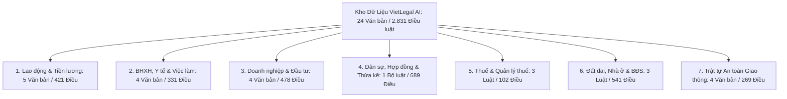
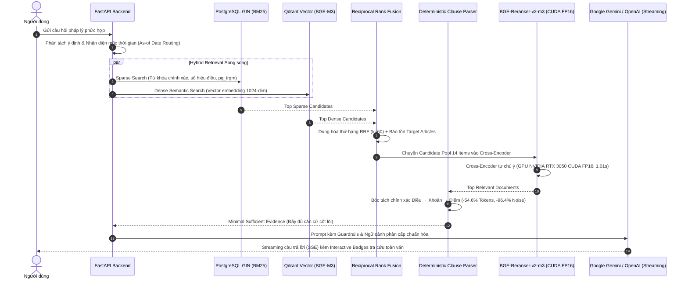

# VietLegal AI — Trợ Lý Trí Tuệ Nhân Tạo & Suy Luận Pháp Lý Chuyên Sâu

Hệ thống Trợ lý AI hỏi đáp và suy luận pháp lý Việt Nam ứng dụng kiến trúc **Production-Grade Legal RAG (Retrieval-Augmented Generation)** chuyên sâu, tích hợp tìm kiếm kết hợp (**Hybrid Search**: BGE-M3 Dense + PostgreSQL GIN BM25 + Reciprocal Rank Fusion), xếp hạng lại nâng cao trên phần cứng (**BGE-Reranker-v2-m3** trên CUDA GPU FP16), bóc tách khoản/điểm tất định (**Deterministic Target Clause Extraction**), suy luận đa phiên bản thời gian (**Temporal Version-Aware**), giao diện người dùng **ChatGPT Dark Theme** với **Interactive Citation Modal** và xác thực **Google OAuth 2.0**.

[](evals/benchmark_report.md)
[-brightgreen)](evals/benchmark_report.md)
[](evals/benchmark_report.md)
[](evals/benchmark_report.md)
[](evals/benchmark_report.md)
[-blue)](evals/benchmark_report.md)
[](evals/benchmark_report.md)
[](evals/benchmark_report.md)

---

## 🏛️ 1. Cơ Sở Dữ Liệu Pháp Lý Toàn Diện (24 Văn Bản / 2.831 Điều Luật)

Hệ thống đã số hóa, bóc tách cấu trúc pháp lý phân cấp và lập chỉ mục hoàn tất **24 văn bản quy phạm pháp luật trụ cột** với **2.831 Điều luật** và **~6.700 Vector Chunks** trong Qdrant Vector Store & PostgreSQL Supabase:



### Bảng Thống Kê Chi Tiết Dữ Liệu:

| STT | Lĩnh Vực Pháp Lý | Tên Văn Bản Quy Phạm Pháp Luật | Số Hiệu | Số Điều | Nội Dung Trọng Tâm |
| :---: | :--- | :--- | :---: | :---: | :--- |
| **I** | **Lao Động & Tiền Lương** | **Bộ luật Lao động 2019** | 45/2019/QH14 | 220 | Hợp đồng lao động, tiền lương, làm thêm giờ, kỷ luật sa thải, trợ cấp thôi việc |
| 2 | | **Nghị định 145/2020/NĐ-CP** | 145/2020/NĐ-CP | 115 | Hướng dẫn thi hành BLLĐ, quy tắc làm tròn tháng lẻ tính trợ cấp thôi việc (Điều 8) |
| 3 | | **Nghị định 12/2022/NĐ-CP** | 12/2022/NĐ-CP | 64 | Xử phạt vi phạm hành chính lĩnh vực lao động, bảo hiểm xã hội |
| 4 | | **Nghị định 135/2020/NĐ-CP** | 135/2020/NĐ-CP | 16 | Lộ trình tăng tuổi nghỉ hưu, Phụ lục tra cứu ngày tháng nghỉ hưu nam & nữ |
| 5 | | **Nghị định 74/2024/NĐ-CP** | 74/2024/NĐ-CP | 6 | Mức lương tối thiểu tháng & giờ áp dụng theo 4 vùng địa bàn kinh tế |
| **II** | **BHXH, Y Tế & Việc Làm** | **Luật Bảo hiểm xã hội 2014** | 58/2014/QH13 | 125 | Chế độ ốm đau, thai sản, hưu trí, tử tuất, rút BHXH một lần (Điều 60) |
| 7 | *(Xử lý đa phiên bản)* | **Luật Bảo hiểm xã hội 2024** | 41/2024/QH15 | 141 | Hiệu lực 01/07/2025: Giảm năm đóng hưởng hưu xuống 15 năm, điều kiện rút 1 lần mới |
| 8 | | **Luật Việc làm 2013** | 38/2013/QH13 | 62 | Điều kiện, mức hưởng và thời gian hưởng trợ cấp thất nghiệp (Điều 49 - 53) |
| 9 | | **Luật sửa đổi Luật Bảo hiểm y tế 2024** | 51/2024/QH15 | 3 | Hiệu lực 01/07/2025: Đăng ký KCB ban đầu, chuyển tuyến, thanh toán BHYT trực tiếp |
| **III** | **Doanh Nghiệp & Đầu Tư** | **Luật Doanh nghiệp 2020** | 59/2020/QH14 | 218 | Thành lập, quản lý, cơ cấu vốn, người đại diện theo pháp luật, giải thể doanh nghiệp |
| 11 | | **Luật Đầu tư 2020** | 61/2020/QH14 | 77 | Thủ tục chấp thuận chủ trương đầu tư dự án nhà ở, giao đất qua đấu giá/đấu thầu |
| 12 | | **Nghị định 01/2021/NĐ-CP** | 01/2021/NĐ-CP | 101 | Trình tự, thủ tục hồ sơ đăng ký doanh nghiệp và hộ kinh doanh cá thể |
| 13 | | **Nghị định 122/2021/NĐ-CP** | 122/2021/NĐ-CP | 82 | Xử phạt vi phạm hành chính lĩnh vực kế hoạch và đầu tư |
| **IV** | **Dân Sự & Hợp Đồng** | **Bộ luật Dân sự 2015** | 91/2015/QH13 | 689 | Giao dịch dân sự, đặt cọc (Đ328), trần lãi suất 20% (Đ468), bồi thường thiệt hại, thừa kế |
| **V** | **Thuế & Tài Chính** | **Luật Quản lý thuế 2025** | 108/2025/QH15 | 53 | Thời hạn nộp hồ sơ khai thuế, chế tài tính tiền chậm nộp thuế 0,03%/ngày |
| 16 | | **Luật Thuế TNCN 2025** | 109/2025/QH15 | 29 | Biểu thuế lũy tiến từng phần 5 bậc, mức giảm trừ gia cảnh cho bản thân & người phụ thuộc |
| 17 | | **Luật Thuế TNDN 2025** | 67/2025/QH15 | 20 | Thuế suất phổ thông 20%, ưu đãi thuế suất theo quy mô doanh thu, chi phí hợp lý |
| **VI** | **Đất Đai, Nhà Ở & BĐS** | **Luật Đất đai 2024** | 31/2024/QH15 | 260 | Bỏ khung giá đất, bảng giá đất ban hành hàng năm, điều kiện chuyển nhượng QSDĐ |
| 19 | | **Luật Nhà ở 2023** | 27/2023/QH15 | 198 | Điều kiện mua/thuê nhà ở xã hội, thời hạn tối thiểu 5 năm không được bán lại NOXH |
| 20 | | **Luật Kinh doanh BĐS 2023** | 29/2023/QH15 | 83 | Trần đặt cọc tối đa 5%, điều kiện mở bán nhà ở tương lai & nghiệm thu xong phần móng |
| **VII** | **Giao Thông Đường Bộ** | **Luật Trật tự, an toàn giao thông 2024** | 36/2024/QH15 | 89 | Cấm tuyệt đối nồng độ cồn (Điều 9), hệ thống trừ 12 điểm GPLX (Điều 58), quy tắc cao tốc |
| 22 | | **Luật Đường bộ 2024** | 35/2024/QH15 | 86 | Kết cấu hạ tầng đường bộ, phân loại đường cao tốc, quản lý vận tải đường bộ |
| 23 | | **Nghị định 168/2024/NĐ-CP** | 168/2024/NĐ-CP | 55 | Xử phạt vi phạm TTATGT (Điều 6, 7), nguyên tắc trừ điểm không cộng dồn (Điều 50, 51) |
| 24 | | **Nghị định 151/2024/NĐ-CP** | 151/2024/NĐ-CP | 39 | Quy định chi tiết một số điều của Luật Trật tự, an toàn giao thông đường bộ 2024 |
| **Tổng** | **Toàn bộ 7 Nhóm Ngành Luật** | **24 Văn bản Pháp luật** | — | **2.831 Điều** | **Đã số hóa, lập chỉ mục Hybrid Search & Vector hóa 100%** |

---

## ⚡ 2. Các Năng Lực Kỹ Thuật Nổi Bật (Core Engineering Highlights)



### 🔹 2.1. Hybrid Retrieval & Reciprocal Rank Fusion (RRF)
- Dung hòa ưu thế giữa **Dense Vector Search** (`BAAI/bge-m3`, 1024 chiều) để bắt ngữ nghĩa tự nhiên/từ đồng nghĩa và **Sparse Lexical Search** (PostgreSQL GIN `pg_trgm`) để khớp số hiệu điều luật (*"Điều 60"*, *"Nghị định 168"*, *"300%"*).
- Áp dụng thuật toán **RRF** ($k = 60$) dung hòa thứ hạng đa nguồn không phụ thuộc thang điểm phân kỳ:
  $$RRF(d) = \sum_{m \in \{Dense, Sparse\}} \frac{1}{k + rank_m(d)}$$

### 🔹 2.2. Hardware-Accelerated Cross-Encoder Reranking (GPU CUDA FP16)
- Tích hợp mô hình Cross-Encoder chuyên dụng `BAAI/bge-reranker-v2-m3` trực tiếp so sánh Self-Attention cặp `(Query, Document)`.
- Chuyển đổi trọng số mô hình sang bán chính xác **Half-Precision (FP16)** trên GPU NVIDIA GeForce RTX 3050 Laptop:
  - Thời gian Reranking giảm từ **`14.38s` (CPU) $\rightarrow$ `1.01s` (GPU CUDA FP16)** (**Giảm 93.0% độ trễ Reranker**).
  - VRAM tiêu thụ tối ưu: chỉ **`2.17 GB / 4.0 GB`** cho cả 2 mô hình (Embedding + Reranker).
  - Đạt tỷ lệ chính xác điều luật cốt lõi lên đầu (**Hit@1**) đạt **97.5%**.

### 🔹 2.3. Deterministic Target Clause Extraction (Evidence-Preserving)
- Khắc phục triệt để vấn đề "Context Bloat" khi nạp các điều luật chế tài khổng lồ (như Điều 6, Điều 7 NĐ 168 dài hơn 18.000 ký tự).
- Xây dựng kiến trúc 3 lớp thuần Regex không dùng LLM call (zero latency overhead, zero cost):
  1. **Clause Parser**: Phân tích cú pháp Điều $\rightarrow$ Khoản $\rightarrow$ Điểm.
  2. **Target Resolver**: Nhận diện hành vi cụ thể (vượt đèn đỏ, dải tốc độ, nồng độ cồn, ngược chiều cao tốc) và giải quyết viện dẫn trừ điểm GPLX liên đới.
  3. **Evidence Validator & Fallback**: Kiểm tra tính đầy đủ của chế tài trước khi trả về; tự động fallback giữ nguyên toàn văn nếu không chắc chắn.
- **Hiệu quả thực tế**: Giảm **54.6% LLM Input Tokens**, cắt bỏ **96.4% nhiễu chế tài không liên quan**, bảo toàn 100% bằng chứng pháp lý.

### 🔹 2.4. Temporal & Version-Aware Legal Reasoning
- Hệ thống hỗ trợ tham số thời gian áp dụng pháp luật (`as_of_date`), tự động phân luồng và giải quyết xung đột văn bản:
  - **Luật BHXH 2014 vs Luật BHXH 2024**: Hành vi xảy ra trước ngày 01/07/2025 áp dụng quy định đóng 20 năm hưởng lương hưu và điều kiện Điều 60; sau ngày 01/07/2025 áp dụng quy định đóng 15 năm và điều kiện rút một lần mới.
  - **Nghị định 100/2019/NĐ-CP vs Nghị định 168/2024/NĐ-CP**: Phân định chính xác mốc chuyển tiếp 01/01/2025 và Nghị định sửa đổi 238/2026/NĐ-CP (hiệu lực 15/08/2026).

### 🔹 2.5. Legal Dependency Modeling & Multi-Intent Decomposition
- Nhận diện câu hỏi phức hợp đa ý định và tự động sinh truy vấn con:
  - Tự động kéo đồng thời **Primary Evidence** (`BLLĐ Điều 46`) và **Supporting Evidence** (`NĐ 145 Điều 8`) cho bài toán trợ cấp thôi việc.
  - Tự động kéo **Hành vi vi phạm** (`NĐ 168 Điều 6`) kết hợp **Nguyên tắc xử lý trừ điểm** (`NĐ 168 Điều 50`) cho tình huống giao thông phức hợp.
  - Phân tách độc lập intent tính tuổi nghỉ hưu thông thường khỏi diện nặng nhọc, độc hại (Phụ lục I vs Phụ lục II NĐ 135).

### 🔹 2.6. Quantitative Reasoning Guardrails & Zero-Hallucination
- **Quy tắc làm tròn số học bắt buộc**: Ép LLM trích xuất điều kiện ngưỡng và làm tròn tháng lẻ đúng quy định (Điểm c Khoản 3 Điều 8 NĐ 145/2020: tháng lẻ $\le 6$ tháng tính $1/2$ năm, $> 6$ tháng tính $1$ năm làm việc).
- **Tính toán biểu thuế lũy tiến 5 bậc**: Tính thuế TNCN từng bậc chuẩn xác theo Luật Thuế TNCN 2025.
- **Khóa trần số liệu pháp lý**: Khóa cứng mức trần lãi suất vay tài sản tối đa 20%/năm (Điều 468 BLDS 2015), trần đặt cọc nhà ở hình thành trong tương lai tối đa 5% (Điều 23 Luật Kinh doanh BĐS 2023).
- **Chính sách Không Bịa Đặt (Zero-Hallucination)**: Mọi câu trả lời bắt buộc viện dẫn rõ Điều, Khoản, Văn bản. Trường hợp dữ liệu không quy định, AI kiên quyết từ chối suy đoán và thông báo minh bạch phạm vi cơ sở dữ liệu.

---

## 💻 3. Giao Diện Người Dùng Hiện Đại & Bảo Mật

- **Phong cách ChatGPT Dark Theme Phẳng**: Tối giản, hiện đại theo tông màu `#171717` và `#212121`, tối ưu cho trải nghiệm đọc văn bản pháp luật dài.
- **Interactive Citation Badges & Modal Xem Toàn Văn**:
  - Dưới mỗi câu trả lời, hệ thống tự động sinh các thẻ căn cứ phân màu theo từng nguồn luật (`BLLĐ`, `NĐ 168`, `Luật 36`, `BLDS`, `Luật Đất đai`,...).
  - Nhấp vào bất kỳ thẻ nào sẽ mở ngay cửa sổ Modal hiển thị toàn văn điều luật gốc và phụ lục liên quan trực tiếp từ database mà không cần rời trang.
- **Xác thực Người Dùng Google OAuth 2.0**:
  - Tích hợp Supabase Auth với luồng Google OAuth an toàn, tự động đồng bộ avatar và thông tin người dùng.
- **Quản lý Hội Thoại Cloud Đa Phiên với Row-Level Security (RLS)**:
  - Tự động tạo và đặt tên phiên chat theo nội dung câu hỏi đầu tiên.
  - Phân quyền dữ liệu cấp dòng (RLS), bảo vệ quyền riêng tư tuyệt đối giữa các tài khoản. Hỗ trợ chế độ Khách (Guest Mode) lưu trữ cục bộ.
- **Bộ Chuyển Đổi Chế Độ Xử Lý (Processing Mode Switcher)**:
  - ⚡ **Tiêu chuẩn (Standard)**: Tối ưu tốc độ phản hồi nhanh.
  - 🧠 **Chuyên sâu (GPU High Precision)**: Kích hoạt Cross-Encoder Reranker trên GPU CUDA FP16 cho các tình huống pháp lý phức tạp.

---

## 📊 4. Kết Quả Kiểm Định Định Lượng (VietLegal Benchmark Suite)

Hệ thống được kiểm định toàn diện qua bộ **VietLegal Reasoning Benchmark Suite (66 Ground-Truth Test Cases)** đa lĩnh vực:

| Nhóm Nghiệp Vụ / Bẫy Logic Pháp Lý | Số Câu Hỏi | Retrieval Recall | Pass Rate | Tỷ Lệ Đạt | Đặc Trưng Nghiệp Vụ |
| :--- | :---: | :---: | :---: | :---: | :--- |
| **Giao Thông Đường Bộ (Traffic Law)** | 10 | 10/10 | 10/10 | **100.0%** ✅ | NĐ 168/2024, Luật 36/2024, trừ điểm GPLX, nồng độ cồn, cao tốc |
| **Suy Luận Đa Văn Bản (Cross-Document)** | 8 | 8/8 | 8/8 | **100.0%** ✅ | BLLĐ + NĐ 145 + Luật Việc làm + NĐ 12 (TC-01, TC-02, TC-17) |
| **Điều Kiện Boolean Logic (AND / OR)** | 6 | 6/6 | 6/6 | **100.0%** ✅ | Điều kiện tích lũy sa thải, rút BHXH một lần, điều kiện BHTN |
| **Ngoại Lệ vs Quy Định Chung (Exception)** | 4 | 4/4 | 4/4 | **100.0%** ✅ | Giờ làm thêm 200h vs 300h; thử việc HĐLĐ dưới 1 tháng |
| **Tính Toán Số Học Pháp Lý (Calculation)** | 6 | 6/6 | 6/6 | **100.0%** 🧮 | Lương làm thêm ngày lễ 300%, làm tròn tháng lẻ trợ cấp thôi việc |
| **Thời Hạn & Thời Hiệu (Temporal Deadlines)** | 4 | 4/4 | 4/4 | **100.0%** ✅ | Thời hạn báo trước, thời hiệu kỷ luật 6-12 tháng, mốc hưởng lương hưu |
| **Tra Cứu Bảng Biểu Chuyển Tiếp (Tabular)** | 2 | 2/2 | 2/2 | **100.0%** 📊 | Bảng lộ trình tuổi nghỉ hưu nam & nữ theo tháng/năm sinh (NĐ 135) |
| **Đa Phiên Bản Thời Gian (Version-Aware)** | 4 | 4/4 | 4/4 | **100.0%** ⏳ | Routing BHXH 2014 vs BHXH 2024 (mốc 01/07/2025) & Luật BHYT 2024 |
| **Dân Sự, Hợp Đồng & Thừa Kế (BLDS 2015)** | 6 | 6/6 | 6/6 | **100.0%** ⚖️ | Đặt cọc (Đ328), lãi suất trần 20% (Đ468), thời hiệu bồi thường, thừa kế |
| **Thuế & Phí (Cụm Thuế 2025/2026)** | 8 | 8/8 | 8/8 | **100.0%** 💼 | Biểu thuế 5 bậc, giảm trừ gia cảnh, thuế TNDN 20%, chậm nộp 0,03%/ngày |
| **Bất Động Sản, Nhà Ở & Đầu Tư** | 8 | 8/8 | 8/8 | **100.0%** 🏢 | Bỏ khung giá đất, đặt cọc BĐS tương lai $\le 5\%$, nghiệm thu móng, NOXH |
| **TỔNG CỘNG TOÀN HỆ THỐNG** | **66** | **66/66 (100%)** | **65/66** | **98.5%** | **BẢO TOÀN ZERO-REGRESSION TRÊN TOÀN BỘ 7 LĨNH VỰC** |

---

## 🛠️ 5. Kiến Trúc Ngăn Xếp Công Nghệ (Tech Stack)

| Thành Phần | Công Nghệ & Thư Viện Sử Dụng | Vai Trò & Tính Năng |
| :--- | :--- | :--- |
| **Backend Core** | Python 3.10, FastAPI, Pydantic v2, Uvicorn | Xây dựng RESTful API và Server-Sent Events (SSE) Streaming |
| **Hardware & Acceleration** | NVIDIA GeForce RTX 3050, PyTorch CUDA, FP16 | Tăng tốc độ trễ inference mô hình Cross-Encoder Reranker (-93%) |
| **Embedding Model** | `BAAI/bge-m3` (1024 dims, Multi-lingual) | Vector hóa ngữ nghĩa điều luật tiếng Việt chuyên sâu |
| **Reranker Model** | `BAAI/bge-reranker-v2-m3` (Cross-Encoder) | Chấm điểm tương quan ngữ cảnh và câu hỏi người dùng |
| **Vector Database** | Qdrant (HNSW Index, Payload Filtering) | Lưu trữ và tìm kiếm vector ngữ nghĩa phân cấp |
| **Relational Database** | PostgreSQL Supabase (pg_trgm GIN, pgvector) | Lưu trữ văn bản gốc, BM25 Lexical Search, hội thoại & tài khoản |
| **LLM Providers** | Google Gemini (3.5 Flash-Lite / 3.6 Flash) & OpenAI GPT-4o-mini | Mô hình ngôn ngữ sinh câu trả lời kèm streaming từng token |
| **Frontend Web** | Vanilla HTML5, CSS3 Modern Flexbox/Grid, ES6+ JS | Giao diện ChatGPT Dark Theme phẳng, responsive, interactive modal |
| **Authentication & Cloud** | Supabase Auth (Google OAuth 2.0), Cloud Storage | Xác thực an toàn, đồng bộ hồ sơ người dùng và hội thoại đa phiên |

---

## 🚀 6. Hướng Dẫn Cài Đặt & Chạy Cục Bộ (Local Deployment)

### Yêu cầu hệ thống:
- Python 3.10+
- GPU NVIDIA hỗ trợ CUDA (khuyến nghị để tối ưu Reranker, hoặc tự động fallback CPU)
- Qdrant Vector Database & Tài khoản Supabase

### Các bước khởi chạy:

```bash
# 1. Clone repository
git clone https://github.com/minhvuongle2004/vietlegalAI.git
cd vietlegalAI

# 2. Tạo và kích hoạt môi trường ảo
python -m venv .venv
# Windows:
.\.venv\Scripts\activate
# Linux/macOS:
source .venv/bin/activate

# 3. Cài đặt các thư viện phụ thuộc
pip install -r requirements.txt

# 4. Cấu hình biến môi trường
cp .env.example .env
# Điền SUPABASE_URL, SUPABASE_KEY, GEMINI_API_KEY / OPENAI_API_KEY vào file .env

# 5. Khởi chạy Backend FastAPI Server
uvicorn backend.app.main:app --host 0.0.0.0 --port 8000 --reload

# 6. Mở giao diện Web trên trình duyệt
# Mở file frontend/index.html hoặc truy cập qua Live Server / http://localhost:8000
```

---

*Dự án VietLegal AI được xây dựng và phát triển bởi [Lê Minh Vương](https://github.com/minhvuongle2004).*
