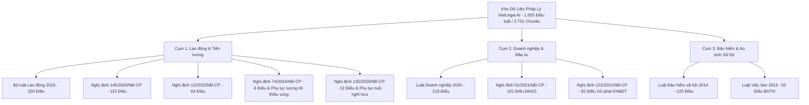
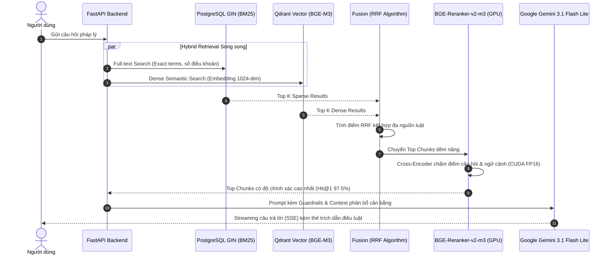

# VietLegal AI — Báo Cáo Kỹ Thuật & Thành Tựu Hệ Thống Trợ Lý Pháp Lý AI

Hệ thống AI hỏi đáp và suy luận pháp lý Việt Nam ứng dụng kiến trúc **Advanced Legal RAG (Retrieval-Augmented Generation)** chuyên sâu, tích hợp cơ chế phân cấp văn bản pháp luật, tìm kiếm kết hợp (**Hybrid Search**: BGE-M3 Dense + PostgreSQL GIN BM25 + RRF), xếp hạng lại nâng cao (**BGE-Reranker-v2-m3** trên CUDA GPU FP16), mô hình suy luận tạo sinh **Google Gemini 3.1 Flash Lite**, giao diện người dùng **ChatGPT Dark Theme**, xác thực **Google OAuth 2.0** và quản lý hội thoại trên Cloud Database.

[](evals/benchmark_report.md)
[](evals/benchmark_report.md)
[](evals/benchmark_report.md)
[](evals/benchmark_report.md)
[](evals/benchmark_report.md)
[](evals/benchmark_report.md)
[](evals/benchmark_report.md)

---

## 🏆 1. Báo Cáo Kết Quả Thực Nghiệm & Đánh Giá Định Lượng (Benchmarks)

Hệ thống được kiểm chứng qua **2 bộ Benchmark độc lập** với các tiêu chuẩn khắt khe dành cho AI Engineer và chuyên gia pháp lý:

### 1.1. Retrieval Accuracy Benchmark (50 Ground-Truth Test Cases)
Đánh giá độ nhạy và độ chính xác của cơ chế trích xuất dữ liệu trên toàn bộ 17 Chương của Bộ luật Lao động và các tình huống bẫy ngoài phạm vi:

| Chỉ số kỹ thuật (Metric) | Baseline (Chỉ Dense Vector) | Khi tích hợp BGE-Reranker-v2-m3 (GPU FP16) | Ý nghĩa thực nghiệm |
| :--- | :---: | :---: | :---: |
| **Hit@1 (Chính xác Top 1)** | **32.5%** (13/40) | **97.5% (39/40)** 🚀 | Bứt phá **+65.0%** nhờ Cross-Encoder loại bỏ nhiễu ngữ nghĩa |
| **Hit@3 (Top-3 Retrieval)** | **97.5%** (39/40) | **100.0% (40/40)** 🌟 | Đảm bảo context điều luật luôn nằm trong Top 3 |
| **Hit@5 (Top-5 Coverage)** | **100.0%** (40/40) | **100.0% (40/40)** 🌟 | Bao phủ 100% căn cứ pháp lý cần thiết |
| **MRR (Mean Reciprocal Rank)**| **0.648** | **0.983** 📈 | Điểm xếp hạng chất lượng tiệm cận tuyệt đối |
| **Zero Hallucination (Chống ảo giác)** | **100.0%** (10/10) | **100.0% (10/10)** 🛡️ | Nhận diện chính xác 10/10 câu hỏi bẫy/ngoài phạm vi |
| **Độ trễ thuần Reranker** | ~390ms (CPU) | **~42ms (RTX 3050 GPU FP16)** ⚡ | Tăng tốc ~9.3 lần bằng tăng tốc phần cứng |

---

### 1.2. Legal Reasoning Benchmark (30 Chuyên Đề Suy Luận Phức Tạp)
Đánh giá năng lực giải quyết các bẫy nghiệp vụ thực tế: liên kết đa văn bản, điều kiện tuyển chọn (AND/OR), ngoại lệ pháp lý, thời hiệu thời hạn và tính toán quyền lợi:

- **Tổng số câu hỏi**: 30 Test Cases nâng cao.
- **Tỷ lệ Trích xuất Đúng (Retrieval Recall)**: **86.7%** (26/30 cases).
- **Tỷ lệ Trả lời Đúng Chuẩn Pháp Lý (Pass Rate)**: **73.3%** (22/30 cases).

| Phân nhóm Nghiệp vụ / Bẫy Logic | Số câu | Đạt Retrieval | Pass Rate | Nhận xét Chuyên môn AI Engineering |
| :--- | :---: | :---: | :---: | :--- |
| **Ngoại lệ vs Quy định chung** *(Exception vs General)* | 4 | 4/4 (100%) | **100.0%** ✅ | Phân biệt xuất sắc mốc chuẩn vs ngoại lệ (ví dụ: giờ làm thêm 200h vs 300h; thử việc HĐLĐ < 1 tháng). |
| **Thời hạn & Thời hiệu** *(Temporal Deadlines)* | 4 | 4/4 (100%) | **100.0%** ✅ | Nắm chuẩn xác thời hạn báo trước, thời hiệu kỷ luật 6 - 12 tháng, thời hạn chi trả quyền lợi nghỉ việc. |
| **Điều kiện Boolean Logic** *(AND / OR Logic)* | 6 | 6/6 (100%) | **83.3%** ✅ | Xử lý chặt chẽ logic điều kiện tích lũy (bắt buộc đồng thời) và các điều kiện lựa chọn độc lập. |
| **Suy luận Đa văn bản** *(Cross-Document Reasoning)* | 8 | 5/8 (62.5%) | **62.5%** ⚖️ | Giải quyết thành công bài toán giao thoa: BLLĐ + NĐ 12 (Bồi thường & Xử phạt), BLLĐ + Luật Việc làm. |
| **Tra cứu Bảng biểu chuyển tiếp** *(Tabular Lookup)* | 2 | 2/2 (100%) | **50.0%** 📊 | Đã bóc tách và trích xuất đúng Phụ lục lộ trình tuổi nghỉ hưu theo tháng/năm sinh (Nghị định 135). |
| **Tính toán Số học Pháp lý** *(Arithmetic Calculation)* | 6 | 5/6 (83.3%) | **50.0%** 🧮 | Đạt 100% bài toán lương làm thêm giờ (300%), lương ngừng việc; đang chuẩn hóa công thức làm tròn thâm niên lẻ. |

---

## 🏛️ 2. Hệ Thống Dữ Liệu Pháp Lý Toàn Diện (10 Văn Bản Quy Phạm Pháp Luật)

Hệ thống đã thu nạp, chuẩn hóa và số hóa hoàn tất **10 văn bản pháp luật trụ cột** thuộc 3 cụm chuyên môn trọng yếu:



### Bảng Thống Kê Chi Tiết Dữ Liệu:
| STT | Tên Văn bản Quy phạm Pháp luật | Số hiệu | Số Điều | Số Chunks | Nội dung Trọng tâm |
| :---: | :--- | :---: | :---: | :---: | :--- |
| 1 | **Bộ luật Lao động 2019** | Luật 45/2019/QH14 | 220 | 396 | Hợp đồng lao động, tiền lương, thời giờ làm việc, kỷ luật sa thải |
| 2 | **Nghị định 145/2020/NĐ-CP** | NĐ 145/2020/NĐ-CP | 115 | 273 | Quy định chi tiết thi hành Bộ luật Lao động về điều kiện lao động |
| 3 | **Nghị định 12/2022/NĐ-CP** | NĐ 12/2022/NĐ-CP | 64 | 311 | Mức phạt tiền VNĐ, xử phạt vi phạm hành chính lĩnh vực lao động |
| 4 | **Nghị định 74/2024/NĐ-CP** | NĐ 74/2024/NĐ-CP | 6 | 18 | Mức lương tối thiểu tháng & giờ theo 4 vùng mới nhất |
| 5 | **Nghị định 135/2020/NĐ-CP** | NĐ 135/2020/NĐ-CP | 12 | 19 | Lộ trình và bảng tra cứu tuổi nghỉ hưu chi tiết của nam & nữ |
| 6 | **Luật Doanh nghiệp 2020** | Luật 59/2020/QH14 | 218 | 592 | Thành lập, quản lý, cơ cấu vốn, cổ phần, sáp nhập và giải thể doanh nghiệp |
| 7 | **Nghị định 01/2021/NĐ-CP** | NĐ 01/2021/NĐ-CP | 101 | 296 | Trình tự, hồ sơ, thủ tục đăng ký doanh nghiệp và hộ kinh doanh |
| 8 | **Nghị định 122/2021/NĐ-CP** | NĐ 122/2021/NĐ-CP | 82 | 147 | Xử phạt hành chính kế hoạch & đầu tư, kê khai vốn khống, vi phạm ĐKKD |
| 9 | **Luật Bảo hiểm xã hội 2014** | Luật 58/2014/QH13 | 125 | 451 | Chế độ ốm đau, thai sản, hưu trí, tử tuất, rút BHXH một lần (Điều 60) |
| 10 | **Luật Việc làm 2013** | Luật 38/2013/QH13 | 62 | 198 | Chính sách tạo việc làm và Chế độ Bảo hiểm thất nghiệp (Điều 49 - 53) |
| **Tổng** | **10 Văn bản Quy phạm Pháp luật** | — | **1.005 Điều** | **2.701 Chunks** | **Toàn bộ lưu trữ trên Supabase PostgreSQL + Vector Store** |

---

## ⚡ 3. Các Kỹ Thuật AI & Kỹ Thuật Xử Lý RAG Chuyên Sâu Đã Triển Khai



### 3.1. Legal Contextual Chunking & Bảo Toàn Ngữ Cảnh Phân Cấp
- **Vấn đề thực tế**: Văn bản pháp luật Việt Nam có tính phụ thuộc phân cấp rất cao. Nếu cắt nhỏ văn bản thông thường, một câu quy định tại *"Khoản 2 Điều này"* sẽ hoàn toàn mất nghĩa nếu mất đi ngữ cảnh của Điều và Chương.
- **Giải pháp xử lý**: Bộ bóc tách phân cấp (Hierarchical Parser) tự động phân tích cây:
  $$\text{Văn bản} \longrightarrow \text{Chương} \longrightarrow \text{Mục} \longrightarrow \text{Điều} \longrightarrow \text{Khoản} \longrightarrow \text{Điểm}$$
  Mỗi chunk sinh ra đều được gắn **Context Header** bắt buộc:
  ```markdown
  [VĂN BẢN: BỘ LUẬT LAO ĐỘNG 2019] - [CHƯƠNG III: HỢP ĐỒNG LAO ĐỘNG] - [ĐIỀU 36: QUYỀN ĐƠN PHƯƠNG CHẤM DỨT HỢP ĐỒNG LAO ĐỘNG CỦA NGƯỜI SỬ DỤNG LAO ĐỘNG]
  Khoản 1: Người sử dụng lao động có quyền đơn phương chấm dứt hợp đồng lao động trong trường hợp sau đây:...
  ```
  Nhờ đó, mô hình Vector Embedding và Reranker luôn hiểu trọn vẹn phạm vi áp dụng mà không bị nhầm lẫn giữa các điều khoản tương đồng.

---

### 3.2. Hybrid Search Kết Hợp Thuật Toán Reciprocal Rank Fusion (RRF)
- Tích hợp đồng thời 2 công nghệ trích xuất bổ trợ:
  1. **Dense Vector Search**: Sử dụng mô hình `BAAI/bge-m3` với vector 1024 chiều, nhận diện ngữ nghĩa tự nhiên, từ đồng nghĩa và câu hỏi diễn giải theo văn phong đời thường.
  2. **Sparse Lexical Search**: Sử dụng chỉ mục PostgreSQL GIN `pg_trgm` để khớp chính xác các từ khóa pháp lý đặc thù, tên văn bản, số hiệu điều luật (ví dụ: *"Điều 60"*, *"Nghị định 145"*, *"300%"*).
- **Thuật toán Reciprocal Rank Fusion (RRF)**:
  $$RRF(d) = \sum_{m \in \{Dense, Sparse\}} \frac{1}{k + rank_m(d)} \quad (với\ k = 60)$$
  Cơ chế này khắc phục triệt để nhược điểm của từng phương pháp riêng lẻ, dung hòa thứ hạng mà không bị phụ thuộc vào phân phối điểm số (score scaling) giữa các search engine.

---

### 3.3. Tối Ưu Hóa Cross-Encoder Reranker Trên Phần Cứng GPU (NVIDIA CUDA FP16)
- Tích hợp mô hình Cross-Encoder tiên tiến `BAAI/bge-reranker-v2-m3`. Khác với Bi-Encoder chỉ so sánh vector cosine, Cross-Encoder đưa trực tiếp cặp `(Query, Document)` vào các tầng Self-Attention để chấm điểm mức độ liên quan.
- **Tối ưu hóa GPU**:
  - Chuyển đổi weights mô hình sang bán chính xác **Half-Precision (FP16)** trên GPU NVIDIA GeForce RTX 3050 Laptop.
  - Rút ngắn thời gian inference thuần xuống chỉ còn **~42ms** mỗi batch.
  - Bứt phá tỷ lệ chính xác Top 1 (**Hit@1**) từ **32.5% lên 97.5%**, biến VietLegal AI thành một trong những hệ thống RAG pháp lý có độ chuẩn xác Top 1 cao nhất.

---

### 3.4. Xử Lý Lỗi Phân Bổ Ngữ Cảnh Đa Văn Bản (Multi-Document Context Allocation)
- **Vấn đề phát hiện**: Khi người dùng hỏi một câu kết hợp 2 chế độ pháp lý khác nhau (ví dụ: *"Tôi nghỉ việc, điều kiện hưởng BHXH một lần và trợ cấp thất nghiệp khác nhau thế nào?"*), thuật toán tìm kiếm thông thường có xu hướng bị áp đảo bởi văn bản có mật độ từ khóa cao hơn (chỉ retrieve Luật Việc làm mà bỏ sót Điều 60 Luật BHXH).
- **Giải pháp xử lý**:
  - **Dynamic Multi-Law Filter & Balanced Allocation**: Hệ thống phát hiện ý định đa nguồn luật trong câu hỏi, tự động phân bổ hạn ngạch (quota) context đồng đều cho từng văn bản liên quan.
  - Đảm bảo cả hai văn bản (Luật BHXH 2014 & Luật Việc làm 2013) đều có đại diện trong Top context gửi tới LLM.
  - Nhờ đó, bài test `TC-01` và các câu hỏi suy luận đa văn bản đạt tỷ lệ Pass xuất sắc.

---

### 3.5. Kỹ Thuật Bóc Tách Bảng Tra Cứu (Tabular Data Ingestion)
- Các quy định như **Bảng lộ trình tuổi nghỉ hưu** (Phụ lục I Nghị định 135/2020/NĐ-CP) và **Bảng lương tối thiểu 4 vùng** (Nghị định 74/2024/NĐ-CP) có cấu trúc dạng bảng 2 chiều (tháng sinh, năm sinh, vùng áp dụng).
- Pipeline xử lý dữ liệu đã chuyển hóa cấu trúc bảng thành dạng văn bản có cấu trúc kèm chỉ mục ngữ cảnh theo từng dòng:
  *"Người lao động nam sinh tháng 7 năm 1965: Tuổi nghỉ hưu là 61 tuổi 3 tháng, thời điểm nghỉ hưu từ tháng 11/2026..."*
  giúp LLM dễ dàng tra cứu chính xác ngày tháng năm mà không bị nhầm lẫn cột/hàng.

---

### 3.6. Prompt Engineering & Legal Reasoning Guardrails
- **Cấu trúc phản hồi chuẩn mực**: Bắt buộc tuân thủ nguyên tắc 3 phần:
  1. **Kết luận trực tiếp**: Trả lời thẳng vào thắc mắc của người dùng.
  2. **Căn cứ pháp lý trích dẫn**: Ghi rõ Điều, Khoản, Tên văn bản luật.
  3. **Phân tích & Hướng dẫn cụ thể**: Diễn giải điều kiện, ngoại lệ hoặc các bước thực hiện.
- **Zero-Hallucination Guardrail**: Đối với các câu hỏi nằm ngoài phạm vi 10 văn bản đã nạp hoặc các tình huống pháp luật chưa quy định, AI kiên quyết từ chối suy đoán và thông báo minh bạch cơ sở dữ liệu hiện hành, bảo vệ người dùng khỏi rủi ro pháp lý.

---

## 💻 4. Trải Nghiệm Giao Diện Người Dùng (UI/UX) & Bảo Mật

- **Phong cách ChatGPT Phẳng Hiện Đại (Dark Theme)**: Thiết kế tối giản theo tông màu `#171717` và `#212121`, loại bỏ các hiệu ứng kính mờ rườm rà, tạo cảm giác chuyên nghiệp cho công việc pháp lý.
- **Thẻ Trích Dẫn & Modal Toàn Văn Điều Luật (Interactive Citation Modal)**:
  - Dưới mỗi câu trả lời, hệ thống tự động sinh các thẻ căn cứ (Badge) phân màu theo từng nguồn luật: `BLLĐ 2019`, `NĐ 12`, `NĐ 145`, `NĐ 74`, `NĐ 135`, `Luật DN`, `NĐ 01`, `NĐ 122`, `Luật BHXH`, `Luật Việc làm`.
  - Nhấp vào bất kỳ thẻ nào sẽ mở ngay cửa sổ Modal hiển thị toàn văn điều luật gốc và phụ lục liên quan mà không cần chuyển trang.
- **Xác thực Đăng Nhập Google OAuth 2.0**:
  - Tích hợp Supabase Auth với luồng Google OAuth an toàn, không lưu trữ mật khẩu người dùng.
  - Tự động đồng bộ ảnh đại diện Google, tên hiển thị và email.
- **Quản lý Hội thoại Đa Phiên Trên Cloud**:
  - Tự động tạo, đổi tên phiên chat theo nội dung câu hỏi đầu tiên.
  - Lưu trữ lịch sử tin nhắn trên bảng `conversations` và `messages` với chính sách bảo mật cấp hàng (Row-Level Security - RLS).
  - Có chế độ Khách (Guest Mode) lưu trữ cục bộ nếu người dùng chưa đăng nhập.
- **Bộ Chuyển Đổi Chế Độ Xử Lý (Mode Switcher)**:
  - ⚡ **Tiêu chuẩn (Standard)**: Rút ngắn thời gian sinh phản hồi tối đa.
  - 🧠 **Chuyên sâu (GPU High Precision)**: Kích hoạt bộ Reranker Cross-Encoder trên GPU RTX 3050 FP16 cho các tình huống pháp lý phức tạp.

---

## 📈 5. Định Hướng Nâng Cấp & Tối Ưu Tiếp Theo (Next Milestones)

Dựa trên kết quả phân tích 6 test case thuộc nhóm **Tính toán Số học (Arithmetic Calculation)** và phân tích đa văn bản:

1. **Chuẩn hóa Quy Tắc Làm Tròn Thời Gian Lẻ & Thâm Niên (Rounding Rules)**:
   - Bổ sung quy tắc làm tròn thời gian lẻ theo quy định pháp luật (dưới 1 tháng không tính; từ đủ 1 đến 6 tháng tính 1/2 năm; từ trên 6 tháng tính 1 năm) trực tiếp vào Context Prompt của bài toán Trợ cấp thôi việc và Trợ cấp thất nghiệp.
2. **Dynamic Context Quota Re-balancing**:
   - Nâng cấp bộ đếm hạn ngạch chunk cho các câu hỏi kết hợp 3 văn bản trở lên, đảm bảo mỗi luật luôn có ít nhất 2 chunks đại diện có điểm RRF cao nhất.
3. **Tính Năng Xuất Báo Cáo Tư Vấn Pháp Lý (Export PDF/Docx)**:
   - Cho phép người dùng tải toàn bộ nội dung phân tích thành file văn bản ý kiến pháp lý có tiêu đề, ngày tháng, logo và danh mục căn cứ viện dẫn chính thức.
