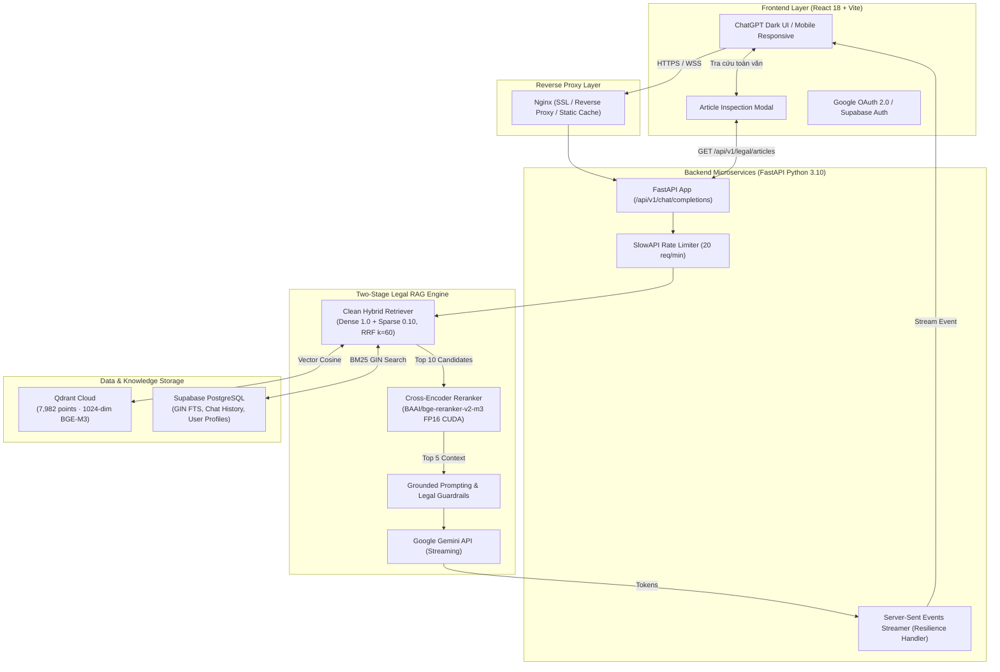

# VietLegal AI — Trợ Lý Trí Tuệ Nhân Tạo & Suy Luận Pháp Lý Chuyên Sâu (Production-Grade Legal RAG)

[](https://www.python.org/)
[](https://fastapi.tiangolo.com/)
[](https://react.dev/)
[-red.svg)](https://qdrant.tech/)
[](https://supabase.com/)
[-orange.svg)](https://developer.nvidia.com/cuda-zone)
[](https://www.docker.com/)

VietLegal AI là hệ thống Trợ lý Trí tuệ Nhân tạo tư vấn và tra cứu pháp luật Việt Nam theo kiến trúc **Two-Stage Production Legal RAG**. Dự án được xây dựng với mục tiêu giải quyết triệt để các bài toán khó nhất của AI pháp lý: **tìm đúng căn cứ quy phạm giữa hàng ngàn điều luật**, **nhận thức hiệu lực văn bản theo dòng thời gian (Temporal-Aware)**, **xếp hạng lại siêu tốc bằng Cross-Encoder trên GPU rời (CUDA FP16)**, **trích dẫn chuẩn xác có thể tương tác tra cứu toàn văn**, và **tuyệt đối không bịa đặt (Zero-Hallucination Guardrails)**.

---

## 📌 Bảng Điều Hướng Nhanh (Quick Navigation)

- 📑 **[Tài liệu CV / Portfolio Highlights](docs/CV_HIGHLIGHTS.md)** — *Các dòng mô tả chuẩn Google XYZ & Bộ câu hỏi phỏng vấn kỹ thuật*
- 🏗️ **[Bản Tả Kiến Trúc Kỹ Thuật (Architecture Spec)](docs/ARCHITECTURE.md)** — *Mermaid diagrams, sequence flows, database schemas*
- 📚 **[Danh Mục Toàn Bộ Báo Cáo Nghiệm Thu (Docs Master Index)](docs/README.md)** — *31 báo cáo thực nghiệm & kiểm định chất lượng*
- 🧠 **[Báo Cáo Chất Lượng Sinh LLM (Step 3.0 Report)](docs/reports/generation/GENERATION_QUALITY_EVALUATION_REPORT.md)** — *Độ đúng 86.67%, Citation 100%, Hallucination 0%*
- 🎯 **[Báo Cáo Đánh Giá Cross-Encoder Reranker (Step 2.2 Report)](docs/reports/reranker/RERANKER_GOLD_EVALUATION_REPORT.md)** — *Hit@1 40.89%, Tăng tốc 17.7x GPU FP16*
- 🛡️ **[Báo Cáo Kiểm Thử Thực Tế & Độ Bền Backend (Step 3.1 Report)](docs/reports/qa/PRODUCTION_POLISH_REAL_WORLD_QA_REPORT.md)** — *8/8 test Backend PASS, vá lỗi ngắt stream*

---

## 🎯 1. Bài Toán & Giải Pháp Kỹ Thuật (Problem Statement & Solution)

### Vấn đề thực tế của AI trong lĩnh vực Pháp lý:
1. **Nhiễu từ vựng & Ranh giới ngữ nghĩa mong manh**: Các điều luật có cấu trúc câu phức, nhiều dẫn chiếu chéo (*"theo quy định tại Khoản 2 Điều này..."*). Nếu chỉ dùng Vector Search (Dense) đơn thuần, mô hình dễ nhầm lẫn các hành vi vi phạm có câu chữ gần giống nhau. Nếu chỉ dùng từ khóa (BM25), mô hình hoàn toàn bất lực trước cách hỏi tự nhiên bằng ngôn ngữ đời sống của người dân.
2. **Vấn đề Hiệu lực Thời gian (Temporal & Amendment Lineage)**: Pháp luật liên tục sửa đổi, bãi bỏ. Một chatbot thông thường sẽ trích dẫn nhầm văn bản đã hết hiệu lực (ví dụ: áp dụng BLLĐ 2012 thay vì 2019, áp dụng Nghị định 100/2019 thay vì Nghị định 168/2024 có hiệu lực từ 01/01/2025).
3. **Ảo giác số liệu (Hallucination)**: Sai lệch dù chỉ một con số (mức phạt tiền, thời hạn thông báo, số năm làm việc tính trợ cấp) đều dẫn đến hậu quả pháp lý nghiêm trọng.
4. **Độ trễ suy luận của Reranker**: Cross-Encoder rất mạnh nhưng chạy CPU mất tới 10–14 giây/câu hỏi, làm tê liệt trải nghiệm đàm thoại thời gian thực.

### Giải pháp của VietLegal AI:
- **Clean Hybrid Search**: Kết hợp Dense (`BAAI/bge-m3` 1024-dim) và Sparse (PostgreSQL GIN Full-Text Search) thông qua **Reciprocal Rank Fusion (RRF $k=60$)**, cân bằng tối ưu giữa ngữ nghĩa và từ khóa số hiệu.
- **Cross-Encoder Tăng tốc GPU CUDA FP16**: Mô hình `BAAI/bge-reranker-v2-m3` được nạp vào GPU NVIDIA GeForce RTX 3050 ở dạng bán chính xác (Half-Precision FP16), giảm thời gian từ **10.06s xuống 569.7ms (nhanh gấp 17.7 lần)**.
- **Bộ lọc Nhận thức Thời gian (Temporal Validity Resolution)**: Ràng buộc tham số `as_of_date` và sổ đăng ký hiệu lực `LEGAL_DOCUMENT_TEMPORAL_REGISTRY` loại trừ dứt điểm văn bản chưa có hiệu lực hoặc đã bị thay thế.
- **Hệ thống Trích dẫn Tương tác (Interactive Citation Modal)**: Cho phép click vào từng Citation Pill để mở `ArticleModal`, đọc toàn văn điều luật gốc mà không rời màn hình chat.
- **Chính sách Không Bịa Đặt & Từ Chối Trung Thực (Honest Abstention)**: System prompt nghiêm ngặt ép mô hình chỉ trả lời khi có căn cứ trong Top-5 Reranked Context và thẳng thắn từ chối lịch sự khi câu hỏi nằm ngoài cơ sở dữ liệu.

---

## ⚡ 2. Các Điểm Sáng Kỹ Thuật Có Số Liệu Thực Nghiệm (Verified Highlights)

*Toàn bộ các số liệu dưới đây đều được đo lường tự động và lưu trữ telemetry tại kho dữ liệu thực nghiệm [`data/`](data/):*

| Hạng mục Đo lường | Kết quả Thực nghiệm | Ý nghĩa & Bối cảnh kỹ thuật |
| :--- | :---: | :--- |
| **Gold V2 Retrieval Benchmark** | **Hit@1 = 40.89%** (92/225)<br>**Hit@5 = 58.22%** (131/225) | Đo lường trên 225 test cases chuẩn hóa đa lĩnh vực pháp luật. Reranker đẩy Hit@1 tăng từ 32.44% lên 40.89%. |
| **Clean Hybrid Candidate Pool** | **Hit@5 = 58.67%** (132/225) | Tăng độ phủ Top-5 thêm +4.0% so với Dense-only (54.67%), hoàn thành xuất sắc vai trò mở rộng ứng viên cho Reranker. |
| **Frozen Regression Benchmark** | **Hit@3 = 100% · Hit@5 = 100%** | Duy trì 100% độ chuẩn xác trên 25 ca kiểm thử hồi quy bất biến mảng giao thông (P0.5/P3). |
| **Tốc độ GPU vs CPU Reranker** | **569.7 ms vs 10,061.6 ms** | GPU RTX 3050 CUDA FP16 chạy nhanh hơn CPU **17.7 lần**, biến Cross-Encoder thành tính năng khả thi trên production. |
| **Độ chính xác câu trả lời (LLM)** | **86.67% (52/60 cases)** | Đánh giá Tầng 2 (Step 3.0) trên 60 cases phủ 10 danh mục nghiệp vụ pháp lý khắt khe. |
| **Độ chuẩn xác trích dẫn pháp lý** | **100.00% (177/177 căn cứ)** | 100% các điều luật được LLM trích dẫn đều có nguồn gốc vững chắc từ ngữ cảnh được cung cấp. |
| **Tỷ lệ bịa đặt (Hallucination)** | **0.00% (0/60 cases)** | Kiểm soát triệt để hiện tượng tự bịa điều luật hoặc suy đoán số tiền phạt. |
| **Từ chối chuẩn khi ngoài dữ liệu** | **100.00% (6/6 cases)** | 100% các câu hỏi thuộc nhóm ngoài cơ sở dữ liệu (hàng hải quốc tế, vũ trụ,...) đều được chatbot từ chối trung thực. |
| **Độ trễ phản hồi toàn trình** | **~4.92 giây / câu hỏi** | Bao gồm: Retrieval (~1.7s) + GPU Reranker (~0.6s) + LLM Token Streaming (~2.6s). |
| **Độ bền Backend (Stability)** | **8/8 bài kiểm tra PASS 100%** | Đã kiểm chứng Liveness `/health`, Readiness `/api/v1/health`, Schema Validation, Auth Security và Rate Limiter 20 req/min. |

---

## 🏛️ 3. Cơ Sở Dữ Liệu Pháp Quy Số Hóa (Legal Corpus Scope)

VietLegal AI đã số hóa, phân tích cú pháp phân cấp và lập chỉ mục **42 văn bản quy phạm pháp luật** (bao gồm 24 đạo luật/nghị định trụ cột và 18 văn bản mở rộng chuyên sâu) với **3.254 Điều luật** và **7.982 Vector Chunks** trong Qdrant Cloud & PostgreSQL Supabase:

```text
Kho Dữ Liệu Pháp Lý VietLegal AI (42 Văn bản · 3.254 Điều luật · 7.982 Chunks)
├── 1. Lao Động & Tiền Lương (5 văn bản · 421 Điều)
│   ├── Bộ luật Lao động 2019 (45/2019/QH14)
│   ├── Nghị định 145/2020/NĐ-CP (Hướng dẫn thi hành BLLĐ, làm tròn tháng lẻ Điều 8)
│   ├── Nghị định 12/2022/NĐ-CP (Xử phạt vi phạm hành chính lao động, BHXH)
│   ├── Nghị định 135/2020/NĐ-CP (Lộ trình tuổi nghỉ hưu nam & nữ đến 2035)
│   └── Nghị định 74/2024/NĐ-CP (Mức lương tối thiểu 4 vùng kinh tế)
├── 2. Bảo Hiểm Xã Hội, Y Tế & Việc Làm (4 văn bản · 331 Điều)
│   ├── Luật Bảo hiểm xã hội 2014 (58/2014/QH13)
│   ├── Luật Bảo hiểm xã hội 2024 (41/2024/QH15 - Hiệu lực 01/07/2025)
│   ├── Luật Việc làm 2013 (38/2013/QH13 - Trợ cấp thất nghiệp Điều 49 - 53)
│   └── Luật sửa đổi Luật Bảo hiểm y tế 2024 (51/2024/QH15 - Hiệu lực 01/07/2025)
├── 3. Doanh Nghiệp & Đầu Tư (4 văn bản · 478 Điều)
│   ├── Luật Doanh nghiệp 2020 (59/2020/QH14)
│   ├── Luật Đầu tư 2020 (61/2020/QH14)
│   ├── Nghị định 01/2021/NĐ-CP (Đăng ký doanh nghiệp & hộ kinh doanh)
│   └── Nghị định 122/2021/NĐ-CP (Xử phạt hành chính kế hoạch & đầu tư)
├── 4. Dân Sự, Hợp Đồng & Thừa Kế (1 bộ luật · 689 Điều)
│   └── Bộ luật Dân sự 2015 (91/2015/QH13 - Đặt cọc Đ328, trần lãi suất 20% Đ468, thừa kế)
├── 5. Thuế & Tài Chính (3 luật · 102 Điều)
│   ├── Luật Quản lý thuế 2025 (108/2025/QH15)
│   ├── Luật Thuế Thu nhập cá nhân 2025 (109/2025/QH15 - Biểu thuế 5 bậc)
│   └── Luật Thuế Thu nhập doanh nghiệp 2025 (67/2025/QH15)
├── 6. Đất Đai, Nhà Ở & Bất Động Sản (3 luật · 541 Điều)
│   ├── Luật Đất đai 2024 (31/2024/QH15 - Bỏ khung giá đất, bảng giá hàng năm)
│   ├── Luật Nhà ở 2023 (27/2023/QH15 - Điều kiện mua NOXH, thời hạn 5 năm cấm bán lại)
│   └── Luật Kinh doanh Bất động sản 2023 (29/2023/QH15 - Trần đặt cọc tối đa 5%)
└── 7. Trật Tự An Toàn Giao Thông & Đường Bộ (22 văn bản · 692 Điều)
    ├── Luật Trật tự, an toàn giao thông đường bộ 2024 (36/2024/QH15) & Luật Đường bộ 2024 (35/2024/QH15)
    ├── Nghị định 168/2024/NĐ-CP (Xử phạt TTATGT & trừ điểm GPLX) & NĐ 151/2024/NĐ-CP
    ├── Nghị định sửa đổi: NĐ 238/2026/NĐ-CP, NĐ 218/2026/NĐ-CP, NĐ 241/2026/NĐ-CP, NĐ 94/2026/NĐ-CP
    ├── Nghị định quản lý chuyên ngành: NĐ 89/2026, NĐ 165/2024, NĐ 130/2024, NĐ 158/2024, NĐ 161/2024
    └── Thông tư hướng dẫn & tuần tra: TT 45/2026, TT 51/2024, TT 30/2026, TT 65/2024, TT 28/2024, TT 73/2024, TT 19/2026, VBHN 26/2026, TT 12/2025
```

---

## 🏗️ 4. Kiến Trúc Hệ Thống (System Architecture)



*Xem bản vẽ chi tiết các luồng đàm thoại, trích dẫn và xử lý thời gian tại [docs/ARCHITECTURE.md](docs/ARCHITECTURE.md).*

---

## 💻 5. Trải Nghiệm Giao Diện Người Dùng (UI/UX Showcase)

Giao diện được thiết kế theo phong cách phẳng hiện đại **ChatGPT Dark Theme** (`#171717` và `#212121`), tối ưu hóa hiển thị cho các đoạn tư vấn pháp lý chuyên sâu:

```text
+-----------------------------------------------------------------------------------------+
| [☰] [⚡ Tiêu chuẩn | 🧠 Chuyên sâu GPU]                          [👤 Lê Minh Vương]    |
+-----------------------------------------------------------------------------------------+
| [Thanh Bên Sidebar]     |  Hội thoại: "Trợ cấp mất việc làm khi công ty thu hẹp..."     |
|                         |                                                               |
| ➕ Đoạn chat mới        |  👤 Người dùng:                                               |
| 📖 Tra cứu điều luật    |  Tôi làm việc 4 năm 8 tháng lương 12 triệu/tháng thì được     |
|                         |  nhận bao nhiêu tiền trợ cấp mất việc?                        |
| LỊCH SỬ CLOUD:          |                                                               |
| • Lương tối thiểu vùng 1|  ⚖️ VietLegal AI:                                            |
| • Trừ điểm GPLX cao tốc |  Chào bạn, căn cứ theo Điều 47 Bộ luật Lao động 2019 và      |
| • Đặt cọc mua bán NOXH  |  Điều 8 Nghị định 145/2020/NĐ-CP:                             |
|                         |  1. Làm tròn tháng lẻ: 4 năm 8 tháng được tính là 05 năm.    |
|                         |  2. Mức trợ cấp: Mỗi năm làm việc trả 01 tháng tiền lương.   |
|                         |  => Tổng tiền trợ cấp = 5 × 12.000.000 = 60.000.000 đồng.    |
|                         |                                                               |
|                         |  Căn cứ: [BLLĐ 2019 Điều 47] [NĐ 145 Điều 8]                 |
|                         |          (Click để mở ArticleModal đọc toàn văn)             |
|                         |                                                               |
|                         |  *Khuyến cáo: Mọi câu trả lời chỉ mang tính chất tham khảo...*|
+-------------------------+---------------------------------------------------------------+
|                         |  [ Hỏi bất kỳ quy định pháp luật nào...                   ⬆ ] |
|                         |  ⚠️ Khuyến cáo pháp lý: VietLegal AI là trợ lý tự động...     |
+-----------------------------------------------------------------------------------------+
```

### 5 Cảnh Nghiệm Thu Trải Nghiệm Chính:
1. **Welcome Screen**: Ô nhập liệu trung tâm, gợi ý câu hỏi mẫu thông minh, hiển thị nổi bật cảnh báo miễn trừ trách nhiệm pháp lý (*Legal Disclaimer*).
2. **Streaming Chat Response**: Từng token được truyền thời gian thực mượt mà kèm con trỏ nhấp nháy; render Markdown bảng biểu, danh sách và in đậm rõ ràng.
3. **Interactive Citation Modal**: Nhấp vào bất kỳ thẻ căn cứ nào (`BLLĐ Điều 47`, `NĐ 168 Điều 50`) để mở ngay cửa sổ tra cứu toàn văn điều luật gốc mà không phải tải lại trang.
4. **Cloud Conversation History**: Tích hợp Google OAuth 2.0 lưu lịch sử đa phiên vào Supabase, hỗ trợ đổi tên và xóa đoạn chat.
5. **Mobile Responsive**: Thanh công cụ thu gọn chuẩn ChatGPT iOS với Slide-over Drawer trên điện thoại thông minh.

---

## 🛠️ 6. Ngăn Xếp Công Nghệ (Tech Stack)

| Lớp Kiến Trúc | Công Nghệ Sử Dụng | Vai Trò & Tính Năng Nổi Bật |
| :--- | :--- | :--- |
| **Backend Core** | Python 3.10, FastAPI, Pydantic v2, Uvicorn | RESTful API hiệu năng cao, bất đồng bộ, Server-Sent Events (SSE) streaming |
| **Vector Database** | Qdrant Cloud | HNSW Index Cosine Distance, lưu trữ 7.982 vector chunks pháp quy |
| **Relational Database** | Supabase PostgreSQL | Quản lý Full-Text Search qua GIN index `tsvector`, lưu lịch sử chat và Google OAuth |
| **Dense Embedding** | `BAAI/bge-m3` (1024 dims) | Trích xuất đặc trưng ngữ nghĩa câu hỏi và văn bản tiếng Việt chuyên sâu |
| **Cross-Encoder Reranker**| `BAAI/bge-reranker-v2-m3` | Chấm điểm tương quan sâu `(query, doc)` với Self-Attention đa chiều |
| **Hardware Acceleration** | NVIDIA GeForce RTX 3050 Laptop GPU, CUDA 12.1, PyTorch FP16 | Tăng tốc suy luận Reranker gấp 17.7 lần, giảm độ trễ từ 10.06s xuống 569.7ms |
| **LLM Generation** | Google Gemini (3.5 Flash-Lite / 3.6 Flash) & OpenAI GPT-4o-mini | Mô hình ngôn ngữ lớn sinh phản hồi kèm Guardrails Zero-Hallucination |
| **Frontend UI** | React 18, Vite, Lucide Icons, React-Markdown | ChatGPT Dark Theme phẳng, responsive, interactive modal, zero UI bloat |
| **DevOps & Container** | Docker, Docker Compose, Nginx Reverse Proxy | Đóng gói production-ready, phân luồng reverse proxy và chứng chỉ bảo mật |

---

## 🚀 7. Hướng Dẫn Cài Đặt & Chạy Cục Bộ (Local Quickstart)

### Yêu cầu tiên quyết:
- Python 3.10+
- Node.js 18+ (khuyên dùng Node 20+)
- GPU NVIDIA hỗ trợ CUDA (tùy chọn; nếu không có GPU hệ thống tự động fallback CPU an toàn)

### 1. Clone repository & Tạo môi trường ảo:
```bash
git clone https://github.com/minhvuongle2004/vietlegalAI.git
cd vietlegalAI

# Khởi tạo venv Python
python -m venv .venv

# Kích hoạt trên Windows:
.\.venv\Scripts\activate
# Kích hoạt trên Linux / macOS:
source .venv/bin/activate

# Cài đặt thư viện Python
pip install -r requirements.txt
```

### 2. Cấu hình biến môi trường:
Tạo file `.env` tại thư mục root dự án (tham khảo mẫu `.env.example`):
```env
ENVIRONMENT=development
PROJECT_NAME="VietLegal AI"
RATE_LIMIT_PER_MINUTE=20

# Qdrant Vector Store
QDRANT_URL=https://your-qdrant-cluster.cloud.qdrant.io:6333
QDRANT_API_KEY=your_qdrant_api_key
QDRANT_COLLECTION=vietlegal_articles

# Supabase Database & Auth
SUPABASE_URL=https://your-project.supabase.co
SUPABASE_KEY=your_supabase_anon_or_service_key

# LLM Providers (ít nhất 1 key)
GEMINI_API_KEY=your_google_gemini_api_key
GEMINI_MODEL=gemini-3.5-flash-lite
OPENAI_API_KEY=your_openai_api_key
```

### 3. Chạy Backend FastAPI:
```bash
uvicorn backend.app.main:app --host 0.0.0.0 --port 8000 --reload
```
Kiểm tra sức khỏe hệ thống:
- Liveness Probe: `http://localhost:8000/health` (HTTP 200 `status: alive`)
- Readiness Probe: `http://localhost:8000/api/v1/health` (Trạng thái Qdrant, Supabase, CUDA GPU)
- Swagger Docs: `http://localhost:8000/docs`

### 4. Chạy Frontend Web UI:
Mở một terminal mới:
```bash
cd frontend
npm install
npm run dev
```
Truy cập giao diện tại: `http://localhost:5173`.

---

## 🐳 8. Triển Khai Bằng Docker Compose & Vercel (Production Deployment)

> 📖 **Xem hướng dẫn vận hành chi tiết tại:** [HƯỚNG DẪN TRIỂN KHAI & VẬN HÀNH (DEPLOYMENT & RUNBOOK)](docs/DEPLOYMENT_GUIDE.md) — Chi tiết cách deploy Frontend Vercel, Docker Backend, cấu hình Tunnel công khai và quy trình 3 bước mở server demo cho người dùng bên ngoài truy cập.

Hệ thống được đóng gói trọn gói qua Docker Compose gồm các services Backend FastAPI, Qdrant, Nginx Reverse Proxy và kết nối Vercel Edge:

```bash
# Build và khởi chạy toàn bộ cụm container
docker compose up -d --build

# Xem log các dịch vụ
docker compose logs -f

# Dừng hệ thống
docker compose down
```

---

## ⚠️ 9. Giới Hạn Dự Án & Tuyên Bố Miễn Trừ Trách Nhiệm (Limitations & Disclaimer)

### Giới hạn kỹ thuật hiện tại:
1. **Phạm vi dữ liệu (Corpus Coverage)**: Hệ thống hiện bao phủ 24 văn bản quy phạm pháp luật trụ cột về Lao động, BHXH, Doanh nghiệp, Dân sự, Thuế, Đất đai và Giao thông. Hệ thống chưa bao phủ toàn văn toàn bộ hệ thống văn bản quy phạm pháp luật quốc gia (như Hình sự, Tố tụng, Hải quan,...).
2. **Truy vấn tiếng Việt không dấu**: Tìm kiếm từ khóa chính xác (Sparse BM25) đạt hiệu quả cao nhất với tiếng Việt có dấu. Đối với câu hỏi không dấu gõ nhanh, Sparse Search bị giảm độ phủ từ khóa và phụ thuộc chính vào Dense Semantic Search.
3. **Tính chất phức tạp của điều khoản chuyển tiếp**: Các quan hệ sửa đổi chồng chéo nhiều tầng (Luật sửa 10 Luật, Nghị định sửa nhiều Nghị định) đòi hỏi tiếp tục mở rộng quy tắc liên kết văn bản phụ thuộc (*Amendment Lineage*).

### Khuyến cáo pháp lý quan trọng (Legal Disclaimer):
> **VietLegal AI là sản phẩm nghiên cứu và ứng dụng trí tuệ nhân tạo phục vụ mục đích học thuật, tra cứu và tham khảo quy định pháp luật.** Mọi thông tin do hệ thống cung cấp **không phải và không thay thế cho ý kiến tư vấn pháp lý chính thức** từ Luật sư hoặc quyết định giải quyết của Cơ quan Nhà nước có thẩm quyền.

---

## 🗺️ 10. Lộ Trình Phát Triển Tương Lai (Future Roadmap)

- [ ] **Vietnamese Diacritic Restoration**: Tích hợp mô hình khôi phục dấu tiếng Việt tự động ở tầng tiền xử lý câu hỏi trước khi đưa vào Sparse BM25.
- [ ] **PDF Consultation Export**: Bổ sung tính năng kết xuất văn bản tư vấn tóm tắt sang định dạng PDF chuẩn thể thức pháp lý.
- [ ] **Mở rộng Corpus Pháp luật**: Tích hợp thêm Bộ luật Hình sự, Luật Thương mại và các Thông tư chuyên ngành.
- [ ] **Fine-tuning Embedding / Reranker trên Legal Domain**: Huấn luyện adapter chuyên biệt trên tập dữ liệu hỏi đáp pháp lý Việt Nam.

---

## 👨‍💻 Tác Giả & Liên Hệ (Author & Contact)

- **Tác giả**: **Lê Minh Vương**
- **Vị trí định hướng**: AI Engineer / Generative AI Engineer / LLM Engineer
- **GitHub**: [@minhvuongle2004](https://github.com/minhvuongle2004)
- **Repository**: [https://github.com/minhvuongle2004/vietlegalAI](https://github.com/minhvuongle2004/vietlegalAI)
