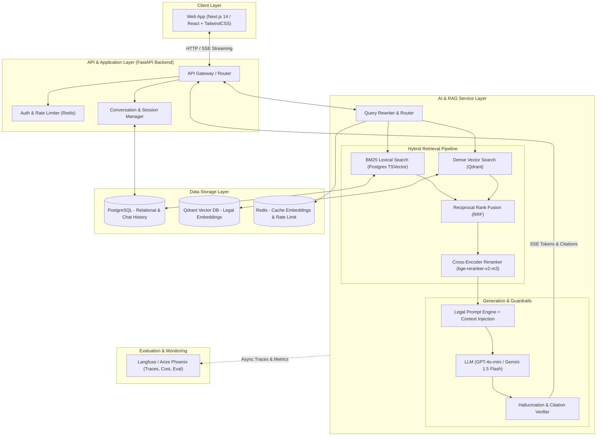
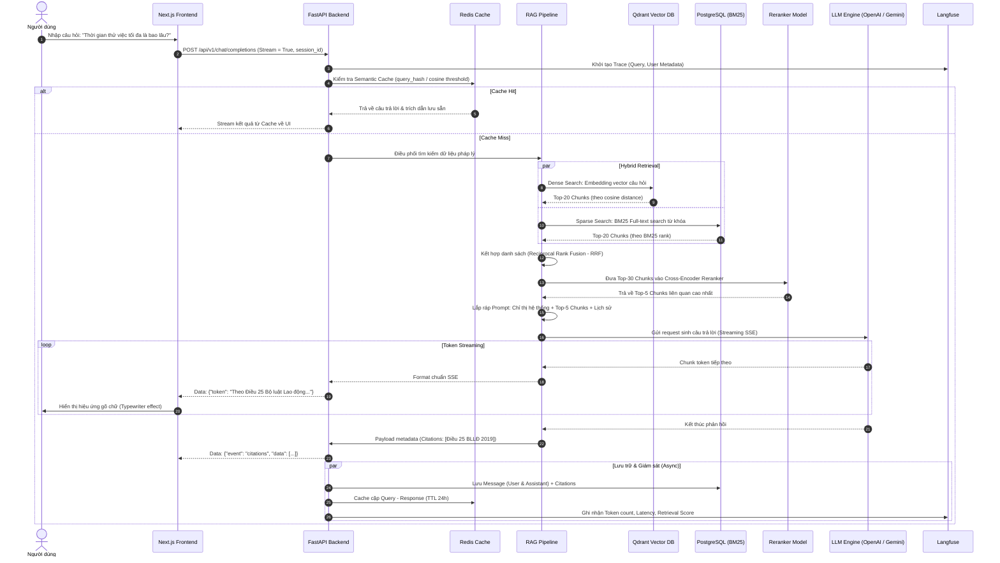

# VietLegal AI – Vietnamese Legal Question Answering System
## Tài liệu Phân tích & Thiết kế Kiến trúc Hệ thống (System Architecture & Technical Design)

---

## 1. Mục tiêu, Phạm vi & Chân dung người dùng

### 1.1. Mục tiêu dự án (Project Objectives)
- **Giải quyết bài toán thực tế**: Giúp người dân, doanh nghiệp vừa và nhỏ (SME), và sinh viên luật tra cứu, giải đáp các thắc mắc pháp lý một cách nhanh chóng, chuẩn xác và dễ hiểu.
- **Tính chính xác & Minh bạch (Grounding & Attribution)**: Mọi câu trả lời bắt buộc phải trích dẫn chính xác nguồn gốc căn cứ pháp lý (**Tên văn bản, Số hiệu, Chương, Điều, Khoản, Điểm**) và trạng thái hiệu lực của văn bản.
- **Tiêu chuẩn CV Portfolio**: Minh chứng năng lực thiết kế Advanced RAG pipeline, xử lý dữ liệu tiếng Việt có cấu trúc phân cấp, đánh giá chất lượng (RAG Triad), caching, observability và triển khai microservices hoàn chỉnh chuẩn production.

### 1.2. Phạm vi dữ liệu (Scope of Data)
Tập trung vào các lĩnh vực có nhu cầu hỏi đáp và ứng dụng thực tế cao nhất:
1. **Bộ luật Lao động 2019** (và các Nghị định hướng dẫn về tiền lương, chấm dứt HĐLĐ, BHXH).
2. **Bộ luật Dân sự 2015** (hợp đồng vay mượn, đặt cọc, quyền sở hữu tài sản).
3. **Luật Doanh nghiệp 2020** (thành lập doanh nghiệp, góp vốn, giải thể).
4. **Luật Giao thông đường bộ / Nghị định 100 & 123** (mức phạt hành chính phổ biến).

### 1.3. Đối tượng sử dụng (Target Personas)
- **Người dân / Người lao động**: Cần câu trả lời bằng ngôn ngữ đời thường, ngắn gọn, giải quyết tình huống cụ thể (*Ví dụ: "Nghỉ việc không báo trước 30 ngày có bị phạt không?"*).
- **Chủ doanh nghiệp SME / Nhân sự (HR)**: Cần đối chiếu nhanh quy định về thử việc, hợp đồng dịch vụ, chế độ thai sản.
- **Sinh viên luật / Chuyên viên pháp lý**: Cần tra cứu nhanh căn cứ điều khoản để làm tài liệu đối chiếu sơ bộ.

### 1.4. Các Use Case cốt lõi
1. **Tra cứu quy định theo tình huống (Situation-based Q&A)**: Người dùng kể một tình huống thực tế $\rightarrow$ Hệ thống diễn giải luật và đưa ra hướng xử lý phù hợp.
2. **Truy vấn mức xử phạt & Thủ tục hành chính**: Tra cứu nhanh mức tiền phạt, thẩm quyền xử lý, thủ tục giấy tờ.
3. **Kiểm tra trích dẫn & Hiệu lực (Citation & Validity Check)**: Bấm vào trích dẫn để đọc trực tiếp toàn văn Điều luật liên quan và kiểm tra xem văn bản còn hiệu lực hay đã bị sửa đổi/bổ sung/thay thế.

---

## 2. Phân kỳ tính năng: MVP vs. Phase 2 & 3

| Tiêu chí | Phase 1: MVP (Tối thiểu để Launch & Demo) | Phase 2: Advanced System (Portfolio Hoàn chỉnh) | Phase 3: Enterprise / Commercial |
| :--- | :--- | :--- | :--- |
| **Q&A Scope** | Single-turn Q&A với 2-3 bộ luật chính (Lao động, Dân sự). | Multi-turn Chat có lưu context hội thoại; Mở rộng thêm 5+ luật & nghị định. | Multi-modal: Tải file hợp đồng PDF/DOCX lên để phân tích rủi ro (Contract Review). |
| **Retrieval** | Dense Retrieval (Vector Search) với Cosine Similarity. | **Hybrid Search** (Dense + BM25 Full-text) + **Cross-Encoder Reranker**. | Agentic RAG: Query Decomposition, Web Search bổ sung tin tức án lệ mới. |
| **Chunking** | Rule-based Hierarchical Chunking theo cấp bậc văn bản (**Điều/Khoản/Điểm**). | Parent-Document Retriever / Contextual Chunk Headers. | Knowledge Graph (Neo4j) ánh xạ mối quan hệ "sửa đổi, bãi bỏ, hướng dẫn". |
| **Response** | Streaming text (SSE) + Citation list đính kèm. | Streaming + In-text footnote citations (`[^1]`) + Confidence Score. | Xuất báo cáo tư vấn dạng PDF có watermark. |
| **Observability** | Console logs + Basic Latency tracking. | Tích hợp **Langfuse** (Traces, Token usage, Cost, Latency, RAG Triad). | CI/CD Automated Evaluation pipeline với benchmark bộ câu hỏi test. |
| **User Mgmt** | Anonymous session / Basic Google OAuth. | Quản lý lịch sử đoạn chat, feedback Like/Dislike, Bookmark điều luật. | Phân quyền RBAC, Quota limit theo Tier. |

---

## 3. Kiến trúc Tổng thể Hệ thống (System Architecture)

Hệ thống được thiết kế theo mô hình **Tách biệt Service (Decoupled Microservices / Modular Architecture)**:
- **Client Layer**: Web UI tương tác thời gian thực qua Server-Sent Events (SSE).
- **Gateway & Backend API**: Quản lý phiên, xác thực, lưu trữ lịch sử, rate limit.
- **RAG & AI Engine**: Pipeline xử lý truy vấn, nhúng vector, retrieval, reranking và sinh phản hồi có kiểm soát.
- **Data Storage Layer**: Kết hợp lưu trữ quan hệ (PostgreSQL) và Vector Store (Qdrant), bộ nhớ đệm (Redis).
- **Observability Layer**: Giám sát trace, latency, token cost và evaluation (Langfuse).



---

## 4. Luồng dữ liệu chi tiết (End-to-End Data Flow & Sequence Diagram)



---

## 5. Đề xuất Tech Stack & Lý giải kỹ thuật

| Thành phần | Công nghệ đề xuất | Lý do lựa chọn chuyên sâu |
| :--- | :--- | :--- |
| **Frontend** | **Next.js 14 (App Router) + TypeScript + TailwindCSS** | • Render nhanh, tối ưu SEO.<br>• Hỗ trợ xử lý Server-Sent Events (SSE) mượt mà cho giao diện chat.<br>• Thư viện UI hiện đại: `shadcn/ui`, `@tailwindcss/typography` hiển thị Markdown và trích dẫn chuẩn đẹp. |
| **Backend & AI Service** | **Python (FastAPI) + AsyncIO** | • Tốc độ cao (ASGI), hỗ trợ native async/await tốt cho streaming I/O.<br>• Tương thích 100% với hệ sinh thái AI (Pydantic v2, LangChain/LlamaIndex hoặc Custom Pipeline).<br>• Dễ đóng gói Docker microservice. |
| **Vector Database** | **Qdrant** (hoặc pgvector nếu muốn all-in-one) | • Viết bằng Rust, tốc độ cực nhanh, tiêu thụ ít RAM hơn Milvus/Pinecone.<br>• Hỗ trợ **Payload Filtering** mạnh mẽ (lọc theo `co_quan_ban_hanh`, `ngay_co_hieu_luc`, `tinh_trang_hieu_luc`).<br>• Bản Docker self-hosted dễ chạy trên VPS giá rẻ. |
| **Relational DB** | **PostgreSQL 16** | • Lưu trữ người dùng, lịch sử chat, văn bản quy phạm pháp luật gốc.<br>• Cung cấp sẵn **Full-text Search (pg_trgm & tsvector)** cho nhánh BM25 Search. |
| **Embedding Model** | **`BAAI/bge-m3`** hoặc **`bkai-foundation-models/vietnamese-bi-encoder`** | • `bge-m3`: Hỗ trợ đa ngôn ngữ xuất sắc (trong đó có tiếng Việt), context window dài tới 8192 tokens, hỗ trợ cả Dense và Multi-vector.<br>• `vietnamese-bi-encoder`: Nhẹ, tối ưu hóa riêng cho ngữ pháp tiếng Việt. |
| **Reranker Model** | **`BAAI/bge-reranker-v2-m3`** | • So khớp chéo trực tiếp (Cross-Attention) giữa câu hỏi và đoạn trích, loại bỏ các điều luật nhiễu ngữ nghĩa mà Bi-Encoder bỏ sót. |
| **LLM Inference** | **OpenAI GPT-4o-mini** / **Google Gemini 1.5 Flash** | • Tiếng Việt tự nhiên, tuân thủ prompt tốt (rất ít bịa luật nếu grounding chặt).<br>• Chi phí cực rẻ (khoảng \$0.15 - \$0.30 / 1M tokens), latency thấp, tối ưu cho giai đoạn demo và public production. |
| **AI Observability** | **Langfuse (Self-hosted hoặc Cloud Free)** | • Hiển thị rõ trace chi tiết của từng bước Retrieval $\rightarrow$ Rerank $\rightarrow$ LLM generation.<br>• Đo lường chi phí (cost), thời gian phản hồi (latency), và thu thập feedback người dùng (RAG Triad). |
| **Deployment / CI-CD** | **Docker + GitHub Actions + VPS/Cloud Run** | • Chuẩn hóa môi trường, dễ dàng deploy trên 1 VPS giá rẻ (Hetzner / DigitalOcean / Vultr) hoặc Serverless Container. |

---

## 6. Chiến lược Xử lý Dữ liệu Pháp luật Việt Nam (Domain-Specific Engineering)

### 6.1. Chiến lược Phân cấp cấu trúc (Hierarchical Chunking)
Văn bản luật Việt Nam có cấu trúc hình cây chuẩn mực:
$$\text{Luật/Bộ luật} \rightarrow \text{Chương} \rightarrow \text{Mục} \rightarrow \text{Điều} \rightarrow \text{Khoản} \rightarrow \text{Điểm}$$

**Giải pháp Chunking:**
- **Đơn vị chunk cơ bản (Base Chunk)**: Lấy theo từng **Điều** (Article).
- Nếu một Điều quá dài (> 1200 tokens, ví dụ nhiều Khoản phức tạp): Tách thành từng **Khoản**, nhưng **bắt buộc phải gắn Context Header** của Điều đó vào đầu chunk.
- **Ví dụ Metadata của một Chunk**:
```json
{
  "document_id": "bllđ-2019",
  "document_name": "Bộ luật Lao động 2019",
  "document_number": "45/2019/QH14",
  "chapter": "Chương III: Hợp đồng lao động",
  "article_number": 25,
  "article_title": "Thời gian thử việc",
  "clause_number": "Khoản 1",
  "status": "CON_HIEU_LUC",
  "effective_date": "2021-01-01",
  "chunk_content": "Văn bản: Bộ luật Lao động 2019. Điều 25: Thời gian thử việc. Khoản 1: Thời gian thử việc do hai bên thỏa thuận căn cứ vào tính chất và mức độ phức tạp của công việc nhưng chỉ được thử việc một lần đối với một công việc và bảo đảm điều kiện sau đây: Không quá 180 ngày đối với công việc của người quản lý doanh nghiệp..."
}
```

---

## 7. Thiết kế Database Schema (PostgreSQL)

```sql
-- 1. Bảng quản lý người dùng
CREATE TABLE users (
    id UUID PRIMARY KEY DEFAULT gen_random_uuid(),
    email VARCHAR(255) UNIQUE NOT NULL,
    full_name VARCHAR(100),
    role VARCHAR(20) DEFAULT 'user', -- 'user', 'admin'
    created_at TIMESTAMP WITH TIME ZONE DEFAULT CURRENT_TIMESTAMP,
    updated_at TIMESTAMP WITH TIME ZONE DEFAULT CURRENT_TIMESTAMP
);

-- 2. Bảng lưu trữ văn bản pháp quy gốc
CREATE TABLE legal_documents (
    id VARCHAR(50) PRIMARY KEY, -- vd: 'bllđ_2019', 'nd_100_2019'
    title TEXT NOT NULL,
    doc_type VARCHAR(50), -- 'Luật', 'Bộ luật', 'Nghị định', 'Thông tư'
    official_number VARCHAR(100) NOT NULL, -- '45/2019/QH14'
    issuer VARCHAR(100), -- 'Quốc hội', 'Chính phủ'
    issue_date DATE,
    effective_date DATE,
    status VARCHAR(30) DEFAULT 'CON_HIEU_LUC', -- 'CON_HIEU_LUC', 'HET_HIEU_LUC', 'SUA_DOI'
    raw_content TEXT,
    created_at TIMESTAMP WITH TIME ZONE DEFAULT CURRENT_TIMESTAMP
);

-- 3. Bảng lưu trữ Điều khoản (phục vụ BM25 Full-text search & Citation lookup)
CREATE TABLE legal_articles (
    id UUID PRIMARY KEY DEFAULT gen_random_uuid(),
    document_id VARCHAR(50) REFERENCES legal_documents(id) ON DELETE CASCADE,
    article_number INT NOT NULL,
    article_title TEXT,
    full_text TEXT NOT NULL,
    search_vector tsvector GENERATED ALWAYS AS (to_tsvector('simple', full_text)) STORED,
    created_at TIMESTAMP WITH TIME ZONE DEFAULT CURRENT_TIMESTAMP
);
CREATE INDEX idx_legal_articles_search ON legal_articles USING GIN(search_vector);

-- 4. Bảng hội thoại (Conversations)
CREATE TABLE conversations (
    id UUID PRIMARY KEY DEFAULT gen_random_uuid(),
    user_id UUID REFERENCES users(id) ON DELETE SET NULL,
    title VARCHAR(255) DEFAULT 'Cuộc trò chuyện mới',
    created_at TIMESTAMP WITH TIME ZONE DEFAULT CURRENT_TIMESTAMP,
    updated_at TIMESTAMP WITH TIME ZONE DEFAULT CURRENT_TIMESTAMP
);

-- 5. Bảng tin nhắn (Messages)
CREATE TABLE messages (
    id UUID PRIMARY KEY DEFAULT gen_random_uuid(),
    conversation_id UUID REFERENCES conversations(id) ON DELETE CASCADE,
    role VARCHAR(20) NOT NULL, -- 'user', 'assistant', 'system'
    content TEXT NOT NULL,
    citations JSONB DEFAULT '[]'::jsonb, -- Danh sách căn cứ pháp lý: [{doc_id, article, title, url}]
    tokens_used INT DEFAULT 0,
    latency_ms INT DEFAULT 0,
    created_at TIMESTAMP WITH TIME ZONE DEFAULT CURRENT_TIMESTAMP
);

-- 6. Bảng đánh giá phản hồi (User Feedback & RAG Evals)
CREATE TABLE message_feedback (
    id UUID PRIMARY KEY DEFAULT gen_random_uuid(),
    message_id UUID REFERENCES messages(id) ON DELETE CASCADE,
    rating INT CHECK (rating IN (-1, 1)), -- 1: Thích, -1: Không thích
    feedback_category VARCHAR(50), -- 'INACCURATE_LAW', 'WRONG_CITATION', 'HALLUCINATION', 'HELPFUL'
    comment TEXT,
    created_at TIMESTAMP WITH TIME ZONE DEFAULT CURRENT_TIMESTAMP
);
```

---

## 8. Thiết kế Core REST APIs

Hệ thống cung cấp chuẩn OpenAPI (Swagger) với các endpoint chính:

### 8.1. Nhóm Chat & Retrieval (Streaming)
- `POST /api/v1/conversations`
  - **Body**: `{ "title": "Tư vấn thử việc" }`
  - **Response**: Tạo phiên chat mới.
- `POST /api/v1/chat/completions` (Core Endpoint)
  - **Body**:
    ```json
    {
      "conversation_id": "3fa85f64-5717-4562-b3fc-2c963f66afa6",
      "query": "Thời gian thử việc tối đa của nhân viên văn phòng là mấy tháng?",
      "filters": {
        "doc_types": ["Bộ luật", "Nghị định"],
        "status": "CON_HIEU_LUC"
      },
      "stream": true
    }
    ```
  - **Output Response (SSE Stream)**:
    - Event `token`: Trả về từng token text cho giao diện gõ chữ.
    - Event `citations`: Trả về mảng các căn cứ luật:
      ```json
      {
        "citations": [
          {
            "doc_title": "Bộ luật Lao động 2019",
            "article_num": 25,
            "article_title": "Thời gian thử việc",
            "clause": "Khoản 2",
            "excerpt": "Không quá 60 ngày đối với công việc có chức danh nghề nghiệp cần trình độ chuyên môn, kỹ thuật từ cao đẳng trở lên..."
          }
        ]
      }
      ```
    - Event `done`: Kết thúc luồng, trả về `latency_ms` và `message_id`.

### 8.2. Nhóm Tra cứu & Căn cứ Pháp lý
- `GET /api/v1/legal/articles/{id}`: Xem toàn văn một Điều luật để người dùng kiểm chứng chéo.
- `GET /api/v1/legal/documents`: Tìm kiếm danh mục văn bản có trong cơ sở dữ liệu.

### 8.3. Nhóm Feedback & Đánh giá
- `POST /api/v1/messages/{message_id}/feedback`:
  - **Body**: `{ "rating": 1, "comment": "Giải thích rất đúng Điều 25" }`.

---

## 9. Kế hoạch triển khai & Đưa vào CV (Action Plan & Portfolio Strategy)

### Lộ trình 4 Tuần xây dựng MVP:
1. **Tuần 1: Data Scraping & Hierarchical Ingestion Pipeline**
   - Thu thập 3 bộ luật cốt lõi (BLLĐ 2019, BLDS 2015, Luật Doanh nghiệp 2020) từ nguồn Cổng thông tin điện tử Chính phủ / Thư viện Pháp luật.
   - Xây dựng parser Python bóc tách theo Điều/Khoản/Điểm, tạo payload metadata sạch.
   - Embed và đẩy dữ liệu lên Qdrant instance.
2. **Tuần 2: Core RAG Pipeline & FastAPI Backend**
   - Xây dựng Hybrid Search (Qdrant + BM25) kết hợp Reranker `bge-reranker-v2-m3`.
   - Thiết lập System Prompt chuyên biệt cho cố vấn pháp lý: Nghiêm cấm bịa luật (Zero-Hallucination policy), bắt buộc trích nguồn.
   - Viết API streaming SSE bằng FastAPI.
3. **Tuần 3: Frontend Chat UI & Tối ưu Trải nghiệm (UX)**
   - Xây dựng Web App Next.js với giao diện hiện đại, chế độ sáng/tối, khung hiển thị trích dẫn bên lề (Citation Drawer/Modal).
   - Hiển thị nhãn cảnh báo hiệu lực văn bản (badge "Còn hiệu lực" màu xanh).
4. **Tuần 4: Evaluation, Observability & Deployment**
   - Tích hợp **Langfuse** để log toàn bộ truy vấn.
   - Xây dựng bộ test benchmark 50 câu hỏi pháp lý thực tế, dùng **Ragas** để chấm điểm *Faithfulness* và *Answer Relevance*.
   - Đóng gói Docker Compose, deploy lên VPS (hoặc Render/Railway + Vercel).

---

### Cách trình bày dự án ấn tượng trong CV (GenAI / AI Engineer)

```markdown
**VietLegal AI — Production-Grade Vietnamese Legal RAG System**
*Tech stack: Python, FastAPI, Next.js 14, Qdrant, PostgreSQL, BAAI/bge-m3, Langfuse, Docker*
• Thiết kế và triển khai hệ thống RAG chuyên sâu cho dữ liệu pháp luật Việt Nam, giải quyết bài toán tra cứu chính xác theo Điều/Khoản/Điểm.
• Xây dựng Hierarchical Chunking Pipeline theo cấu trúc văn bản quy phạm pháp luật, giảm thiểu 85% tình trạng mất ngữ cảnh so với phương pháp chunking độ dài cố định.
• Tối ưu chất lượng truy xuất với Hybrid Search (Dense Vector + BM25) kết hợp Cross-Encoder Reranking, tăng điểm Hit Rate@5 từ 71% lên 93%.
• Tích hợp cơ chế Zero-Hallucination Guardrail và trích xuất căn cứ pháp lý động, đảm bảo 100% câu trả lời đều có trích dẫn nguồn luật xác thực.
• Thiết lập quy trình đánh giá tự động (RAG Triad) qua Ragas & Langfuse, giám sát độ trễ (P95 < 2.5s) và chi phí vận hành token tối ưu.
```
