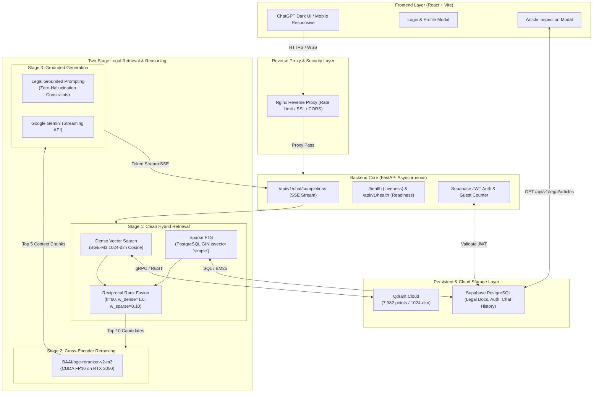
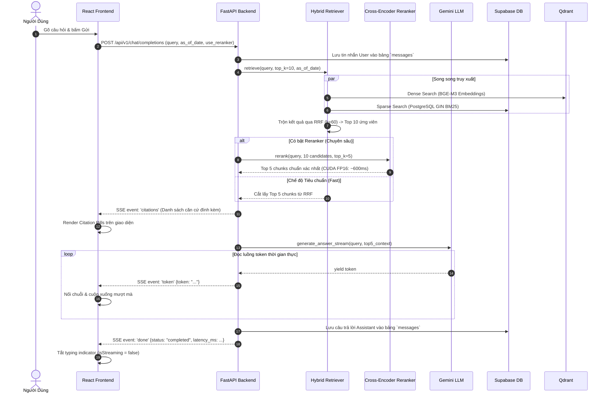
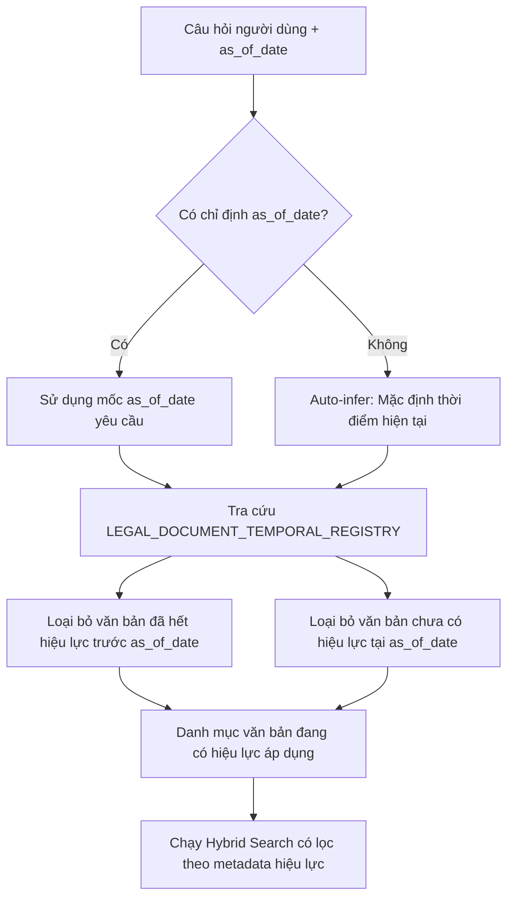
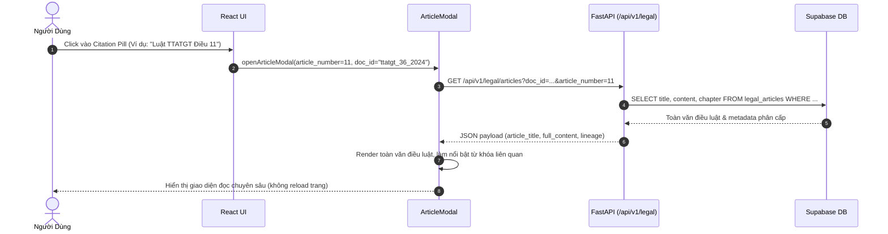

# VIETLEGAL AI — BẢN TẢ KIẾN TRÚC HỆ THỐNG (SYSTEM ARCHITECTURE SPECIFICATION)

Tài liệu này mô tả chi tiết toàn bộ thiết kế kỹ thuật, luồng xử lý dữ liệu và cơ chế vận hành nội tại của hệ thống **VietLegal AI (Production-Grade Legal RAG)**.

---

## 🏗️ 1. Kiến Trúc Tổng Thể (High-Level Architecture)



---

## 🔄 2. Chi Tiết Các Luồng Xử Lý (Core Request Flows)

### A. Luồng Đàm Thoại & Sinh Câu Trả Lời (Chat Completion & Streaming Flow)



---

### B. Luồng Nhận Thức Thời Gian & Sửa Đổi Pháp Luật (Temporal & Version Resolution Flow)



*Ví dụ điển hình*:
- Với câu hỏi về quy định xử phạt giao thông đường bộ trước ngày **01/01/2025**: Hệ thống tra cứu theo **Nghị định 100/2019/NĐ-CP**.
- Với câu hỏi áp dụng từ ngày **01/01/2025 trở đi**: Hệ thống tự động chuyển tiếp sang **Luật Trật tự, an toàn giao thông đường bộ 2024** và **Nghị định 168/2024/NĐ-CP**.

---

### C. Luồng Tra Cứu Toàn Văn Điều Luật Gốc (Interactive Citation Modal Flow)



---

### D. Cơ Chế Chống Treo Stream & Phục Hồi Lỗi (Graceful Degradation & SSE Resilience)

1. **Client Disconnect (`request.is_disconnected()`)**:
   - Khi người dùng đóng tab hoặc chuyển trang giữa lúc mô hình đang sinh câu trả lời, backend phát hiện tín hiệu ngắt kết nối và lập tức hủy bỏ luồng sinh (`abort generation`), tiết kiệm tài nguyên GPU và chi phí token.
2. **Upstream Exception Handling**:
   - Nếu Gemini API gặp sự cố giới hạn hạn mức (HTTP 429 Quota) hoặc mạng gián đoạn, backend bắt giữ ngoại lệ, gửi token cảnh báo thân thiện đến giao diện người dùng và phát sự kiện `done` (kèm trạng thái lỗi) thay vì ngắt luồng đột ngột.
   - Frontend luôn bảo đảm tắt cờ `isStreaming = false` ngay khi bộ đọc `reader.read()` kết thúc, loại bỏ hoàn toàn hiện tượng con trỏ nhấp nháy treo vô hạn.

---

## 🗄️ 3. Thiết Kế Cơ Sở Dữ Liệu & Chỉ Mục (Database & Index Schema)

### A. Qdrant Cloud Collection (`vietlegal_articles`)
- **Số lượng vectors**: **7.982 điểm** (Points)
- **Kích thước vector**: **1024 chiều** (Cosine Distance)
- **Mô hình trích xuất đặc trưng**: `BAAI/bge-m3` (Multilingual / Vietnamese Dense Embedding)
- **Payload Schema**:
  ```json
  {
    "doc_id": "ttatgt_36_2024_qh15",
    "doc_title": "Luật Trật tự, an toàn giao thông đường bộ 2024",
    "article_number": 11,
    "article_title": "Chấp hành báo hiệu đường bộ",
    "chapter": "Chương II: Quy tắc giao thông đường bộ",
    "context_header": "Luật Trật tự, an toàn giao thông đường bộ 2024 > Chương II > Điều 11",
    "effective_date": "2025-01-01",
    "status": "CURRENT"
  }
  ```

### B. PostgreSQL Supabase Table (`legal_articles`)
- **Bảng**: `legal_articles`
- **Chỉ mục tìm kiếm toàn văn**: GIN Index trên cột tính toán `tsvector`:
  ```sql
  CREATE INDEX idx_legal_articles_fts ON legal_articles 
  USING GIN (to_tsvector('simple', title || ' ' || content));
  ```
- **Từ điển tìm kiếm**: Sử dụng cấu hình từ điển `simple` để giữ nguyên vẹn các ký tự số hiệu, dấu gạch chéo (`168/2024/NĐ-CP`) và tiếng Việt có dấu.
