# BÁO CÁO NGHIÊN CỨU & KHẢO SÁT: TRAFFIC P1 — LEGAL COVERAGE EXPANSION DISCOVERY
## (BẢN PHÊ DUYỆT CHÍNH THỨC: 6 CURRENT CORE + PROVISION-LEVEL MODELING + FULL-DOCUMENT SCOPE)

**Dự án**: VietLegal AI — Trợ lý Pháp lý Số Thông minh & Temporal Version-Aware  
**Giai đoạn**: Traffic P1 — Khảo sát, Current-Law Audit & Phê duyệt Danh mục Ingestion  
**Ngày thực hiện**: 10/09/2026  
**Trạng thái Thẩm định**: 🟢 **OFFICIALLY APPROVED FOR STEP 1: RAW COLLECTION & SHA-256 MANIFEST**  
**Tôn chỉ Kỹ thuật Cốt lõi (North Star)**:  
> *“Legal coverage trước, retrieval optimization sau; nhưng mọi current / historical / amendment status phải được mô hình hóa ở provision-level, không suy diễn bằng document-level status.”*

---

## I. AUDIT HIỆN TRẠNG CORPUS TRAFFIC (16 VĂN BẢN ĐÃ CÓ TRONG HỆ THỐNG)

Hệ thống VietLegal AI hiện đang bảo toàn nguyên vẹn **16 văn bản quy phạm pháp luật** mảng Giao thông đường bộ (7.170 points trên Qdrant Cloud Cluster, `Hit@1 = 92.0%`, `Hit@2 = 100%` trên bộ 25 benchmark cases):

### 1. Phân nhóm Traffic P0 (9 văn bản — Khung Luật & Nghị định sửa đổi 2024–2026)
1. **Luật Trật tự, an toàn giao thông đường bộ số 36/2024/QH15** (Hiệu lực: 01/01/2025): Trụ cột an toàn giao thông, quy tắc đi đường, trừ điểm GPLX, biển số định danh.
2. **Luật Đường bộ số 35/2024/QH15** (Hiệu lực: 01/01/2025): Trụ cột kết cấu hạ tầng, phân cấp quản lý đường bộ, vận tải đường bộ.
3. **Nghị định 168/2024/NĐ-CP** (Hiệu lực: 01/01/2025): Xử phạt vi phạm hành chính TTATGT đường bộ và cơ chế trừ điểm GPLX.
4. **Nghị định 151/2024/NĐ-CP** (Hiệu lực: 01/01/2025): Hướng dẫn thi hành một số điều của Luật 36/2024 (xe ưu tiên, tín hiệu ưu tiên, CSDL).
5. **Luật số 118/2025/QH15** (Hiệu lực: 01/07/2026): Sửa đổi 10 luật an ninh trật tự, sửa Điều 10 Luật 36 (bảo đảm an toàn trẻ em trên ô tô) và Điều 8 Luật 35.
6. **Nghị định 238/2026/NĐ-CP** (Hiệu lực: 15/08/2026): Sửa đổi NĐ 168 (tăng phạt che/dán biển số ô tô lên 20–26 triệu, phạt chở trẻ em ngồi ghế trước).
7. **Nghị định 236/2026/NĐ-CP** (Hiệu lực: 01/07/2026): Sửa đổi NĐ 151 (cấp phép xe ưu tiên qua VNeID trong 01 ngày làm việc, liên thông CSDL dùng chung).
8. **Nghị định 158/2024/NĐ-CP** (Hiệu lực: 01/01/2025): Quy định về kinh doanh vận tải đường bộ.
9. **Nghị định 218/2026/NĐ-CP** (Hiệu lực: 10/08/2026): Sửa đổi NĐ 158 (siết chặt xe hợp đồng trá hình, cấm đón trả khách tại văn phòng đại diện, thu hồi GPKD).

### 2. Phân nhóm Traffic P0.5 (7 văn bản — Thông tư Sát hạch GPLX, Đăng ký xe, Tốc độ)
10. **Thông tư 108/2026/TT-BCA** (Hiệu lực: 01/07/2026): Sát hạch, cấp GPLX 2026 (bãi bỏ thi mô phỏng từ 01/07/2026, thứ tự lý thuyết trước thực hành).
11. **Thông tư 12/2025/TT-BCA** (Hiệu lực: 01/03/2025): Sát hạch GPLX 2025 (thi mô phỏng, miễn lý thuyết A1 khi có bằng ô tô, áp dụng chuyển tiếp đến 28/02/2027).
12. **Thông tư 79/2024/TT-BCA** (Hiệu lực: 01/01/2025): Đăng ký, cấp thu hồi biển số xe cơ giới.
13. **Thông tư 13/2025/TT-BCA** (Hiệu lực: 01/03/2025): Sửa TT 79 (đăng ký xe toàn trình trên VNeID, cắt giảm chứng từ thuế/nguồn gốc).
14. **Thông tư 51/2025/TT-BCA** (Hiệu lực: 01/07/2025): Sửa TT 79 (đăng ký xe máy tại mọi xã trong tỉnh, đăng ký xe trúng đấu giá linh hoạt).
15. **Thông tư 38/2024/TT-BGTVT** (Hiệu lực: 01/01/2025): Tốc độ tối đa (đường đôi 60, đường 2 chiều 50, ngoài KDC 90/80) & khoảng cách an toàn (35m, 55m, 70m, 100m, mưa sương mù).
16. **Thông tư 105/2026/TT-BCA** (Hiệu lực: 01/07/2026): Phục hồi 12 điểm GPLX qua VNeID sau 6 tháng (sửa TT 65/2024/TT-BCA).

---

## II. KẾT QUẢ CURRENT-LAW RESOLUTION AUDIT (CHUẨN HÓA ĐẾN THÁNG 09/2026)

Đối chiếu chính thức với Cơ sở dữ liệu Quốc gia về Văn bản Pháp luật và Công báo Chính phủ tính đến tháng 09/2026:

### 🚨 1. Cụm CSGT: TT 73/2024 thay thế TT 32 và Bãi bỏ Granular Điều 1 TT 28/2024
- **Căn cứ pháp lý chính thức**:
  - **Thông tư số 73/2024/TT-BCA** (có hiệu lực từ **01/01/2025**) quy định về công tác tuần tra, kiểm soát của CSGT.
  - **Khoản bãi bỏ (Điều 32 TT 73/2024)**:
    + Bãi bỏ toàn bộ **Thông tư số 32/2023/TT-BCA**.
    + Bãi bỏ **Điều 1 Thông tư số 28/2024/TT-BCA** (phần sửa đổi TT 32).
  - **Khoản bãi bỏ liên quan (Điều 39 TT 79/2024)**:
    + Bãi bỏ **Điều 2 Thông tư số 28/2024/TT-BCA** (phần sửa đổi TT 24/2023 về đăng ký xe).
- **Mô hình hóa Provision-Level chuẩn mực cho TT 28/2024**:
  - Nguyên tắc dữ liệu: Tách biệt tuyệt đối trạng thái nguyên văn từ cơ quan có thẩm quyền với trạng thái chuẩn hóa nội bộ của VietLegal AI:
    + `source_status`: `"Còn hiệu lực"` (nguyên văn ghi nhận từ CSDL Quốc gia về VBPL)
    + `source_status_authority`: `"CSDL Quốc gia về VBPL"`
    + `normalized_status`: `"PARTIALLY_AFFECTED"` (Hệ thống VietLegal AI chuẩn hóa: các điều khoản nghiệp vụ cốt lõi Điều 1, 2 đã bị bãi bỏ bởi TT 73 và TT 79; Điều 3, 4 là điều khoản thi hành chung).
  - Quản lý chính xác ở cấp Điều khoản (Provision-Level) & Tách biệt Legal Status khỏi Retrieval Pool:
    ```json
    {
      "official_number": "28/2024/TT-BCA",
      "source_status": "Còn hiệu lực",
      "source_status_authority": "CSDL Quốc gia về VBPL",
      "normalized_status": "PARTIALLY_AFFECTED",
      "provisions": {
        "Điều 1": {
          "legal_status": "REPEALED",
          "repealed_by": "73/2024/TT-BCA",
          "effective_until": "2025-01-01",
          "current_retrieval_eligible": false,
          "primary_current_core": false
        },
        "Điều 2": {
          "legal_status": "REPEALED",
          "repealed_by": "79/2024/TT-BCA",
          "effective_until": "2025-01-01",
          "current_retrieval_eligible": false,
          "primary_current_core": false
        },
        "Điều 3": {
          "legal_status": "ACTIVE",
          "current_retrieval_eligible": true,
          "primary_current_core": false
        },
        "Điều 4": {
          "legal_status": "ACTIVE",
          "current_retrieval_eligible": true,
          "primary_current_core": false
        }
      }
    }
    ```
  - **Nguyên tắc Retrieval Pool**: Không thuộc Current Core $\neq$ Không được truy xuất. Các điều khoản còn hiệu lực (Điều 3, 4) vẫn được giữ `current_retrieval_eligible: true` (đáp ứng truy vấn cụ thể về TT 28), nhưng đánh dấu `primary_current_core: false` để tránh gây nhiễu ranking cho các truy vấn về tuần tra CSGT (vốn thuộc độc quyền TT 73).

---

### 🚨 2. Cụm Đăng kiểm Xe cơ giới: Lineage TT 16 $\rightarrow$ TT 47 $\rightarrow$ TT 30 & NĐ 89
- **Căn cứ pháp lý chính thức**:
  - `Thông tư 16/2021/TT-BGTVT` (sửa bởi TT 02/2023, TT 08/2023) đã hết hiệu lực từ 01/01/2025 và bị thay thế bởi `Thông tư 47/2024/TT-BGTVT`.
  - Từ ngày **01/07/2026**:
    + **Nghị định số 89/2026/NĐ-CP** (Hiệu lực: 01/07/2026): Khung pháp lý về điều kiện kinh doanh dịch vụ kiểm định xe cơ giới, tổ chức hoạt động cơ sở đăng kiểm và niên hạn sử dụng xe cơ giới.
    + **Thông tư số 30/2026/TT-BXD** (Hiệu lực: 01/07/2026): Quy định thủ tục kiểm định số hóa, cấp giấy chứng nhận kiểm định điện tử, miễn kiểm định lần đầu xe mới, các trường hợp thay đổi thông tin (đổi biển số, sang tên, lắp phụ kiện chính hãng không thuộc diện cải tạo) **không phải kiểm định lại**.
    + **Điều khoản thay thế (Điều 32 TT 30/2026)**: **Thay thế trực tiếp `Thông tư 47/2024/TT-BGTVT`** *(không thay thế trực tiếp TT 16/2021)*.
- **Lineage Đăng kiểm Chuẩn mực**:
  $$\text{TT 16/2021} \xrightarrow{\text{sửa bởi 02/2023}} \text{TT 47/2024} \xrightarrow{\text{thay thế trực tiếp (01/07/2026)}} \mathbf{TT\ 30/2026/TT-BXD\ \&\ NĐ\ 89/2026/NĐ-CP\ (CURRENT)}$$

---

### 🚨 3. Cụm Cải tạo Xe: Chuẩn hóa Trạng thái TT 43/2023 theo Nguồn CSDL Quốc gia
- **Căn cứ pháp lý chính thức**:
  - CSDL Quốc gia về Văn bản Pháp luật ghi rõ:
    `status = EXPIRED`, `effective_until = 2025-01-01`, `status_source = official_legal_database`.
  - Hệ thống ghi nhận trạng thái này trực tiếp từ nguồn CSDL Quốc gia, **không dùng suy luận gián tiếp**.
  - Toàn bộ quy định về xe cải tạo, các trường hợp lắp đặt phụ kiện không cần lập hồ sơ thiết kế hiện hành được quy định trực tiếp trong **`Thông tư số 30/2026/TT-BXD`** (hiệu lực từ 01/07/2026).
- **Kết luận**: Chuyển `TT 43/2023/TT-BGTVT` vào **Historical Layer**, toàn bộ nội dung cải tạo hiện hành được nạp từ **`TT 30/2026/TT-BXD`**.

---

### 🚨 4. Cụm Tải trọng & Khổ giới hạn: Chain TT 12/2025 $\rightarrow$ TT 19/2026 $\rightarrow$ 26/VBHN-BXD
- **Căn cứ pháp lý chính thức**:
  - **Thông tư số 12/2025/TT-BXD** (Hiệu lực: 01/07/2025): Quy định tải trọng, khổ giới hạn đường bộ và lưu hành xe quá khổ, quá tải, xe bánh xích.
  - **Thông tư số 19/2026/TT-BXD** (Ban hành 08/05/2026, Hiệu lực: **01/07/2026**): Sửa đổi, bổ sung một số điều của Thông tư 12/2025/TT-BXD.
  - **Văn bản hợp nhất số 26/VBHN-BXD** (ngày 02/06/2026): Hợp nhất toàn diện TT 12/2025 và TT 19/2026.
- **Kết luận**: Đưa cả `TT 12/2025/TT-BXD` (Gốc) và `TT 19/2026/TT-BXD` (Sửa đổi) vào **Current Core**, lưu `26/VBHN-BXD` trong **Consolidated Reference Layer**.

---

### 🔍 5. Cụm Phục hồi Điểm GPLX: Chuỗi TT 65/2024 $\rightarrow$ TT 105/2026
- **Thông tư 65/2024/TT-BCA** (Hiệu lực: 01/01/2025): Quy định kiểm tra kiến thức phục hồi 12 điểm GPLX sau ít nhất 6 tháng.
- **Thông tư 105/2026/TT-BCA** (Hiệu lực: 01/07/2026, đã có trong P0.5): Sửa Điều 1 TT 65 về nộp hồ sơ qua VNeID và phục hồi tự động.
- Chuỗi `65/2024` (GỐC) $\xrightarrow{\text{sửa đổi}}$ `105/2026` (SỬA ĐỔI) hoàn toàn đồng bộ.

---

## III. MÔ HÌNH PHÂN LOẠI 3 CHIỀU ĐỘC LẬP (MULTI-DIMENSIONAL CLASSIFICATION)

Theo yêu cầu chuẩn hóa kiến trúc dữ liệu của Mentor, hệ thống **không gộp các thuộc tính thành các "layer" chồng lấn/loại trừ lẫn nhau** (ví dụ: TT 19 vừa là văn bản hiện hành cốt lõi, vừa là nguồn sửa đổi). Thay vào đó, mọi văn bản được mô hình hóa theo **3 chiều phân loại trực giao (Orthogonal Dimensions)** để scale mở rộng tới hàng nghìn văn bản:

```text
DIMENSION 1: LEGAL STATUS (Hiệu lực Pháp lý)
├── CURRENT               (Đang có hiệu lực toàn bộ)
├── HISTORICAL            (Đã hết hiệu lực toàn bộ)
└── PROVISION-HISTORICAL  (Một phần điều khoản bị bãi bỏ, phần còn lại còn hiệu lực)

DIMENSION 2: INGESTION STATUS (Trạng thái Nạp Vector DB)
├── CORE                  (Nạp full-document trong đợt hiện tại)
├── KNOWN_GAP             (Hiện hành nhưng thuộc backlog đợt sau, chưa nạp đợt này)
└── REFERENCE_ONLY        (Chỉ lưu đối chiếu, không đưa vào vector retrieval pool)

DIMENSION 3: DOCUMENT ROLE (Vai trò Văn bản trong Hệ thống)
├── PRIMARY               (Văn bản gốc / quy định chính)
├── AMENDMENT_SOURCE      (Văn bản sửa đổi, dùng để reconstruct effective state)
└── CONSOLIDATED_REFERENCE(Văn bản hợp nhất dùng làm đối chứng kiểm định)
```

### Bảng Định danh Toàn bộ Văn bản theo Mô hình 3 Chiều:

| Ký hiệu Văn bản | Legal Status | Ingestion Status | Document Role | Trạng thái Nạp & Hành động Kỹ thuật |
| :--- | :--- | :--- | :--- | :--- |
| **TT 73/2024/TT-BCA** | `CURRENT` | `CORE` | `PRIMARY` | Ingest Full 33 Điều (Tuần tra CSGT, 4 trường hợp dừng xe, VNeID) |
| **NĐ 89/2026/NĐ-CP** | `CURRENT` | `CORE` | `PRIMARY` | Ingest Full 27 Điều (Khung điều kiện đăng kiểm, niên hạn) |
| **TT 30/2026/TT-BXD** | `CURRENT` | `CORE` | `PRIMARY` | Ingest Full 32 Điều (Thủ tục kiểm định số hóa, cải tạo xe) |
| **TT 65/2024/TT-BCA** | `CURRENT` | `CORE` | `PRIMARY` | Ingest Full 11 Điều (Kiểm tra phục hồi điểm GPLX gốc) |
| **TT 12/2025/TT-BXD** | `CURRENT` | `CORE` | `PRIMARY` | Ingest Full 31 Điều (Tải trọng, khổ giới hạn gốc) |
| **TT 19/2026/TT-BXD** | `CURRENT` | `CORE` | `AMENDMENT_SOURCE` | Ingest Full 3 Điều (Sửa TT 12 về tải trọng trục xe) |
| **26/VBHN-BXD** | `CURRENT` | `REFERENCE_ONLY` | `CONSOLIDATED_REFERENCE` | Lưu đối chiếu, không nạp vector pool |
| **NĐ 241/2026/NĐ-CP** | `CURRENT` | `KNOWN_GAP` | `AMENDMENT_SOURCE` | Backlog P1.2 (Sửa NĐ 165/2024 về Luật Đường bộ) |
| **TT 45/2026/TT-BXD** | `CURRENT` | `KNOWN_GAP` | `AMENDMENT_SOURCE` | Backlog P1.2 (Sửa các thông tư đăng kiểm cơ sở) |
| **TT 28/2024/TT-BCA** | `PROVISION-HISTORICAL` | `CORE` (Provision) | `PRIMARY` | Đ1-Đ2 bãi bỏ (`eligible: false`); Đ3-Đ4 giữ (`eligible: true`) |
| **TT 32/2023/TT-BCA** | `HISTORICAL` | `REFERENCE_ONLY` | `PRIMARY` | Hết hiệu lực (bị bãi bỏ bởi TT 73); lưu quan hệ `replaces` |
| **TT 47/2024/TT-BGTVT**| `HISTORICAL` | `REFERENCE_ONLY` | `PRIMARY` | Hết hiệu lực từ 01/07/2026 (bị thay thế bởi TT 30); lưu `replaces` |
| **TT 43/2023/TT-BGTVT**| `HISTORICAL` | `REFERENCE_ONLY` | `PRIMARY` | Hết hiệu lực từ 01/01/2025 (nguồn CSDL QG); lưu quan hệ kế thừa |
| **TT 16/2021 & 02/2023**| `HISTORICAL` | `REFERENCE_ONLY` | `PRIMARY` | Hết hiệu lực; lưu quan hệ thay thế kế tiếp qua TT 47 |

---

## IV. BẢN ĐỒ VERSION & AMENDMENT GRAPH ĐÃ CHUẨN HÓA

```mermaid
graph TD
    subgraph CSGT_Chain ["Cụm Tuần tra CSGT & Giấy tờ VNeID (Granular Provision Repeal)"]
        TT32["Thông tư 32/2023/TT-BCA<br>(Historical Layer - Hết hiệu lực toàn bộ)"]
        TT28["Thông tư 28/2024/TT-BCA<br>(Provision-Historical Layer - Bị bãi bỏ Đ1 & Đ2)"]
        TT73["Thông tư 73/2024/TT-BCA<br>⭐ CURRENT CORE (từ 01/01/2025)<br>• 4 trường hợp được dừng xe<br>• Kiểm tra & tạm giữ qua VNeID"]
        TT32 -- "Sửa đổi bởi Điều 1" --> TT28
        TT73 -- "Bãi bỏ toàn bộ" --> TT32
        TT73 -- "Bãi bỏ Điều 1 (Granular Repeal)" --> TT28
    end

    subgraph Inspection_Chain ["Cụm Đăng kiểm & Cải tạo Xe (Current 2026 Lineage)"]
        TT16["Thông tư 16/2021 & 02/2023<br>(Historical Layer - Hết hiệu lực)"]
        TT47["Thông tư 47/2024/TT-BGTVT<br>(Historical Layer - Hết hiệu lực từ 01/07/2026)"]
        TT43["Thông tư 43/2023/TT-BGTVT<br>(Historical Layer - Hết hiệu lực từ 01/01/2025)"]
        ND89["Nghị định 89/2026/NĐ-CP<br>⭐ CURRENT FRAMEWORK (01/07/2026)<br>• Điều kiện kinh doanh đăng kiểm<br>• Niên hạn sử dụng xe cơ giới"]
        TT30["Thông tư 30/2026/TT-BXD<br>⭐ CURRENT PROCEDURES (01/07/2026)<br>• Chứng nhận kiểm định điện tử<br>• Cải tạo xe & miễn đăng kiểm lại"]
        TT16 -- "Thay thế bởi" --> TT47
        TT30 -- "Thay thế trực tiếp (Replaces)" --> TT47
        TT43 -. "Kế thừa quy định cải tạo vào" .-> TT30
        ND89 --- TT30
    end

    subgraph Weight_Chain ["Cụm Tải trọng & Khổ giới hạn Đường bộ (Full Amendment Chain)"]
        TT12["Thông tư 12/2025/TT-BXD<br>⭐ CURRENT GỐC (01/07/2025)<br>• Tải trọng trục xe, khổ giới hạn cầu đường"]
        TT19["Thông tư 19/2026/TT-BXD<br>⭐ CURRENT AMENDMENT (01/07/2026)<br>• Sửa đổi, bổ sung TT 12/2025"]
        VBHN26["26/VBHN-BXD (02/06/2026)<br>🟡 CONSOLIDATED REFERENCE LAYER"]
        TT19 -- "Amends" --> TT12
        TT12 -. "Hợp nhất vào" .-> VBHN26
        TT19 -. "Hợp nhất vào" .-> VBHN26
    end

    subgraph Points_Chain ["Cụm Phục hồi Điểm GPLX"]
        TT65["Thông tư 65/2024/TT-BCA<br>⭐ CURRENT GỐC (01/01/2025)<br>• Điều kiện sau 6 tháng, nội dung kiểm tra"]
        TT105["Thông tư 105/2026/TT-BCA<br>⭐ ĐÃ CÓ TRONG P0.5 (01/07/2026)<br>• Nộp hồ sơ VNeID, tự động phục hồi"]
        TT105 -- "Amends" --> TT65
    end
```



---

## V. CẤU TRÚC NGUỒN VÀ NGUYÊN TẮC CHUNKING (FULL-DOCUMENT SCOPE)

### 1. Thống kê Cấu trúc 6 Văn bản Nguồn:
> **Lưu ý**: *Con số 137 Điều là tổng số Điều thuộc 6 văn bản nguồn trước khi áp dụng amendment graph / version resolution, không đồng nghĩa với 137 quy định hiện hành độc lập (bởi TT 19 sửa đổi trực tiếp TT 12).*

| STT | Văn bản Nguồn | Số hiệu | CQBH & Ban hành | Số Chương | Số Điều Nguồn | Phụ lục Kèm theo | Dự kiến Chunks (Ước tính sơ bộ) |
| :---: | :--- | :---: | :---: | :---: | :---: | :---: | :---: |
| 1 | TT Tuần tra CSGT | `73/2024/TT-BCA` | Bộ Công an (15/11/2024) | 5 Chương | **33 Điều** | Mẫu biểu tuần tra | ~40 – 55 chunks |
| 2 | NĐ Khung Đăng kiểm | `89/2026/NĐ-CP` | Chính phủ (30/03/2026) | 5 Chương | **27 Điều** | Tiêu chuẩn cơ sở | ~35 – 45 chunks |
| 3 | TT Thủ tục Đăng kiểm | `30/2026/TT-BXD` | Bộ Xây dựng (15/06/2026) | 6 Chương | **32 Điều** | Bảng chu kỳ & mẫu sổ | ~50 – 65 chunks |
| 4 | TT Phục hồi Điểm GPLX | `65/2024/TT-BCA` | Bộ Công an (15/11/2024) | 3 Chương | **11 Điều** | Danh mục đề sát hạch | ~15 – 20 chunks |
| 5 | TT Tải trọng (Gốc) | `12/2025/TT-BXD` | Bộ Xây dựng (2025) | 4 Chương | **31 Điều** | Bảng tải trọng trục xe | ~45 – 60 chunks |
| 6 | TT Tải trọng (Sửa đổi) | `19/2026/TT-BXD` | Bộ Xây dựng (08/05/2026) | 1 Chương | **3 Điều** | Biểu mẫu sửa đổi | ~6 – 8 chunks |
| **TỔNG** | **6 Văn bản Nguồn** | | | **24 Chương** | **137 Điều Nguồn** | **Đầy đủ Phụ lục** | **~190 – 250 chunks (Dự kiến)** |

### 2. Nguyên tắc Chunking Pháp lý Chuẩn hóa:
1. **~75 words/chunk là SOFT TARGET ONLY**: Không bao giờ biến 75 từ thành hard constraint để cắt cụt câu hoặc vỡ ngữ cảnh pháp lý.
2. **Không cắt giữa Điểm**: Một Điểm (a, b, c...) là đơn vị nghĩa tối thiểu, phải nằm trọn vẹn trong một chunk.
3. **Không cắt giữa Khoản**: Nếu Khoản là một mệnh đề pháp lý hoàn chỉnh (quy định chung + điều kiện áp dụng), phải giữ nguyên vẹn Khoản.
4. **Exception / Loại trừ phải đi kèm Context**: Các cụm "trừ trường hợp...", "ngoại trừ quy định tại..." bắt buộc phải ở cùng chunk với mệnh đề chính.
5. **Table / Annex xử lý theo cấu trúc chuyên biệt**: Các bảng chu kỳ kiểm định, bảng tải trọng trục xe được phân tích thành các semantic structured units có context header rõ ràng.
6. **Con số chunks thực tế chỉ được chốt sau parser**: Dự kiến khoảng 190–250 chunks chỉ là ước tính sơ bộ.

---

## VI. QUY TRÌNH THỰC HIỆN BƯỚC 1: OFFICIAL SOURCE ACQUISITION & SHA-256 MANIFEST

Quy trình thu thập RAW đã được chuẩn hóa thành **Official Source Acquisition**:

```text
[BƯỚC 1] OFFICIAL SOURCE ACQUISITION
         • Thu thập artifact gốc trực tiếp từ Cổng TTĐT Chính phủ / Bộ Công an / Bộ Xây dựng.
         • Không giả định chỉ có HTML; tiếp nhận cả file gốc PDF / DOC / HTML chính thức.
         • Lưu trữ mỗi văn bản với metadata niêm phong:
           - source_document_id
           - source_url
           - retrieved_at
           - content_type
           - SHA-256 (tính trực tiếp trên raw bytes)
         • Lưu trữ tại: `data/01_raw/traffic_p1_batch/` kèm `manifest.json`.

[BƯỚC 2] FULL-DOCUMENT CLAUSE PARSER & PROVISION-LEVEL METADATA
         • Parse toàn bộ 137 Điều nguồn + Phụ lục.
         • Gắn metadata phân tầng provision:
           - TT 73: `replaces: [{"target": "32/2023", "scope": "ALL"}, {"target": "28/2024", "target_provision": "Điều 1", "operation": "repeal"}]`
           - TT 30: `replaces: [{"target": "47/2024", "scope": "ALL"}]`
           - TT 19: `amends: [{"target": "12/2025", "scope": "TT 12/2025"}]`
           - TT 105: `amends: [{"target": "65/2024", "target_provision": "Điều 1"}]`

[BƯỚC 3] VALIDATION DRY-RUN
         • Kiểm tra schema, kiểm tra ngữ nghĩa chunks, không vi phạm các nguyên tắc chunking.
         • Lập Báo cáo Thẩm định Chunks & Metadata trước khi ghi dữ liệu.

[BƯỚC 4] INGESTION VÀO QDRANT STAGING COLLECTION (TÁCH BIỆT PRODUCTION)
         • KHÔNG upsert trực tiếp vào Production Collection (`vietlegal_articles`).
         • Tạo/Sử dụng Staging Collection (`vietlegal_articles_staging`) chứa baseline bản sao hoặc cấu hình tương thích.
         • Nạp có kiểm soát các points Traffic P1 vào Staging Collection với tiền tố UUID duy nhất `traffic_p1_`.
         • Xác minh 100% points và payload integrity qua client.retrieve().

[BƯỚC 5] NEW BENCHMARK & 25-CASE REGRESSION TEST TRÊN STAGING -> PROMOTE HOẶC ROLLBACK
         • Chạy bộ câu hỏi benchmark mới kiểm chứng độ phủ mở rộng (CSGT dừng xe, VNeID, Đăng kiểm, Cải tạo xe, Tải trọng).
         • Chạy regression benchmark bắt buộc trên 25 cases baseline cũ.
         • Cơ chế thăng cấp an toàn:
           - PASS (Hit@1 >= 92%, Hit@2 = 100%, không hồi quy): PROMOTE points P1 vào Production Collection (`vietlegal_articles`).
           - FAIL: ROLLBACK Staging, giữ nguyên Production Collection 7.170 points tuyệt đối an toàn.
```

---

## VII. CAM KẾT ENGINEERING TUÂN THỦ TUYỆT ĐỐI THEO CHỈ ĐẠO MENTOR

1. **Tuân thủ đúng các nguyên tắc mô hình hóa pháp lý**:
   - `source_status ≠ normalized_status`: CSDL Quốc gia ghi nhận thế nào lưu nguyên văn (`"source_status": "Còn hiệu lực"`), diễn giải nội bộ của VietLegal AI lưu riêng (`"normalized_status": "PARTIALLY_AFFECTED"`).
   - `TT 28/2024`: Tách biệt Legal Status khỏi Retrieval Pool; Điều 1-2 bãi bỏ (`eligible: false`), Điều 3-4 còn hiệu lực (`eligible: true`, `primary_current_core: false`) để bảo đảm truy xuất chính xác khi được hỏi đích danh.
   - `Mô hình 3 Chiều Độc lập`: Phân loại theo `Legal Status` (Current/Historical/Provision-Historical) $\times$ `Ingestion Status` (Core/Known Gap/Reference) $\times$ `Document Role` (Primary/Amendment Source/Consolidated Reference).
   - `TT 43/2023`: Căn cứ trực tiếp nguồn CSDL Quốc gia (`status = EXPIRED`), không suy diễn gián tiếp.
   - `NĐ 241/2026` & `TT 45/2026`: Định danh rõ là `CURRENT_KNOWN_GAP`, không đánh đồng với backlog hết hiệu lực.
   - `~75 words/chunk`: Soft target only, bảo đảm toàn vẹn cấu trúc Khoản, Điểm, Exception, Annex.
   - `137 Điều`: Là tổng số 137 Điều thuộc 6 văn bản nguồn trước khi thực hiện amendment/version resolution.
2. **Kỹ thuật Staging & Zero-Regression**: Ingest vào Staging Collection trước $\rightarrow$ chạy regression benchmark 25 cases $\rightarrow$ chỉ promote vào Production khi PASS 100%.
3. **Bảo toàn nguyên vẹn baseline hiện tại**: 7.170 points và 25 cases benchmark (`Hit@1 = 92.0%`, `Hit@2 = 100%`) trên Production Collection được đóng băng hoàn toàn.
4. **Sẵn sàng thực thi**: Ngay khi nhận lệnh, hệ thống bắt đầu **Bước 1: Official Source Acquisition (6 văn bản Core + 1 Reference) và niêm phong SHA-256 Manifest**!
